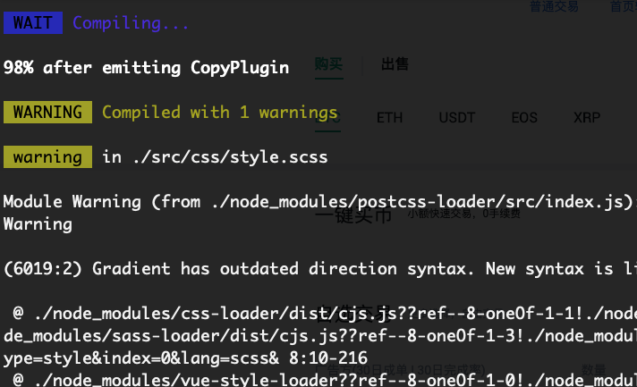
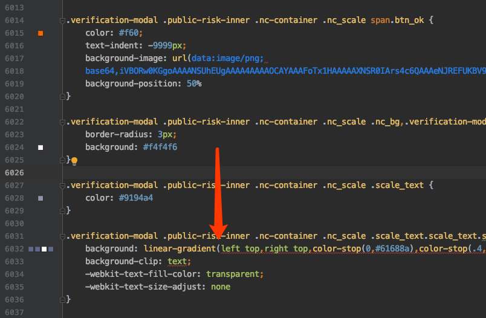

# [linear-gradient](2019/11_2/linear-gradient-warn)

编译vue代码时发现一个关于CSS属性**linear-gradient**的警告⚠️

```
warning  in ./src/css/style.scss

Module Warning (from ./node_modules/postcss-loader/src/index.js):
Warning

(6019:2) Gradient has outdated direction syntax. New syntax is like `to left` instead of `right`.
```

报错如图：



代码如图：



> 解决方案

在CSS属性linear-gradient的第一个参数前加`to`

[参考链接](https://blog.csdn.net/itpinpai/article/details/52885199)
