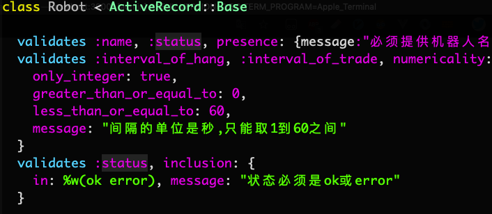
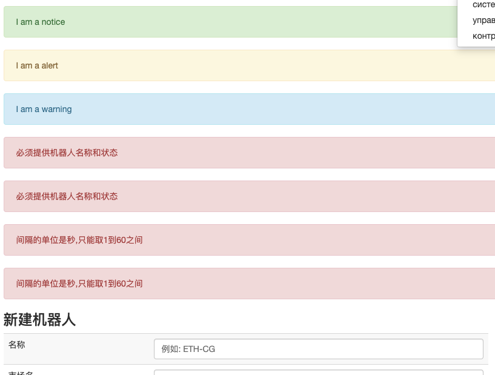

# [model数据验证与消息闪现(flash)](/2019/11/validates.md)

相关文章 - [jQuery验证checkbox](/2019/11/checkbox_jquery_validate.md)

## Models中同时验证多个字段

要求: 数据表中的字段名字与active_record中的自带验证方法名字不同

格式1: validates 字段1,字段2...字段n 验证方法:true

格式2: validates 字段1,字段2...字段n 验证方法:{验证条件, message:"errMsg"}

robot的数据验证代码如下:



```ruby
class Robot < ActiveRecord::Base
  validates :name, :status, presence: {message:"必须提供名称和状态"}
  validates :interval_of_hook, :interval_of_sleep, numericality: {
    only_integer: true,
    greater_than_or_equal_to: 0,
    less_than_or_equal_to: 60,
    message: "间隔的单位是秒,只能取1到60之间"
  }
  validates :status, inclusion: {
    in: %w(ok error), message: "状态必须是ok或error"
  }
```

## 验证整数在某个范围内

[StackOverflow]](https://stackoverflow.com/questions/10727498/rails-3-check-that-object-is-valid-with-params-before-update)上提供了很多种方法,有between,有in等等

经过实践检验, 只有我上面这种代码能同时检验是否是整数以及整数在某个范围

## rails能不能添加数据库约束?

migrate本身并不支持字段添加约束, 只能通过执行原生SQL语句实现约束

## ★新建/编辑时先进行数据验证后保存

### 新建controller的设计

```ruby
def create
  @robot = Robot.new(robot_params)
  if @robot.valid?
    @robot.save
    flash[:info] = "机器人#{@robot.name}新增成功!"
    redirect_to robots_path
  else
    # when rendering using flash.now
    flash.now[:error] = @robot.errors.messages.values.join("; ")
      # render方法能返回用户提交时的表单信息,让用户修改错误处
    render :new
  end
end
```

代码中有两点需要解释:

1. 使用render能让用户直接修改上次提交的表单数据, 即便出错了也不需要重新填写表单
2. 如果想在render方法中添加消息, 需要用flash.now[:info]

!> 注意新建时不要用create, 因为create会直接保存到数据库

### 编辑页面的数据验证逻辑

编辑功能的验证稍微困难点, 因为update方法不管有无错误都会保存

要使用一个之前没学过的方法 **assign_attributes**

```ruby
def update
  @robot.assign_attributes(robot_params)
  if @robot.valid?
    @robot.save
    redirect_to robots_path, notice: "机器人#{@robot.name}编辑成功!"
  else
    flash.now[:error] = @robot.errors.messages.values.join("; ")
    render :edit
  end
end
```

## 强调:给render发消息要用flash.now[:info]

## 同时flash多个同类消息

首先flash消息有四种: info notice alert error

只需在_flash.html.erb中的error部分加个for循环生成多个error消息

> flash.now[:error] = @robot.errors.messages.values.join("; ")

之前通过join把多条的error消息强行变成一行 这样的显示很不规范

我希望能同时显示多条flash[:error]消息 效果如图:



### 修改_flash文件

希望用一个for循环遍历显示所有错误信息, 如果传过来的消息不是数组, 那就把它变成数组

#### ** def create **

```ruby
def create
  @robot = Robot.new(robot_params)
  if @robot.valid?
    @robot.save
    flash[:info] = "机器人#{@robot.name}新增成功!"
    redirect_to robots_path
  else
    # when rendering using flash.now
    flash.now[:error] = @robot.errors.messages
      .values              # data_example [["err1"], ["err2"]]
      .map{|each| each[0]} # data_example ["err1", "err2"]
      # render方法能返回用户提交时的表单信息,让用户修改错误处
    render :new
  end
end
```

后记：

并非开发给普通用户的后台管理员系统，其实只需要前端验证就够了

jQuery Validate又简单又好用
