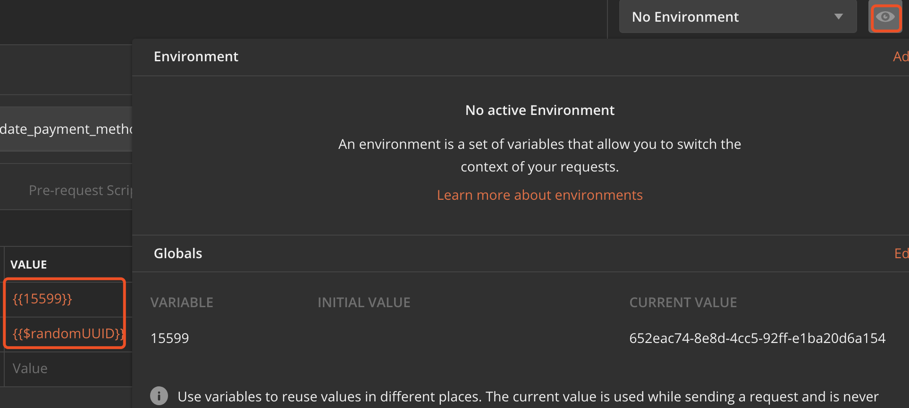
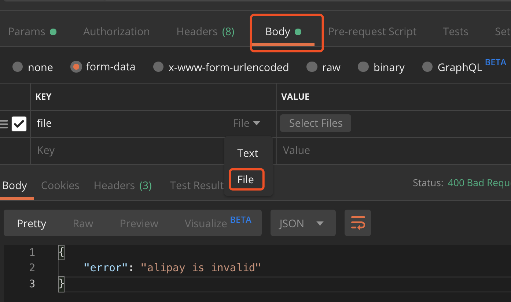

# [postman发送字符串+和发送文件的方法](/2019/12/postman_send_plus.md)

## postman环境与变量

点击右上角 带眼睛的图标可以设置变量

## postman发不了+

通过后端打log发现，postman发加会变成字符串空格

经Google后发现原来是+被URI_encode成空格

如果需要发字符串"+86"则要改为<var class="mark">%2B</var>86

解释为什么空格是+：搜索python slice，GET请求则是google.com/search?q=python+slice

## postman文件类型的参数

文件类型的参数不能放在params标签页内，要放在<var class="mark">body的form-data</var>

