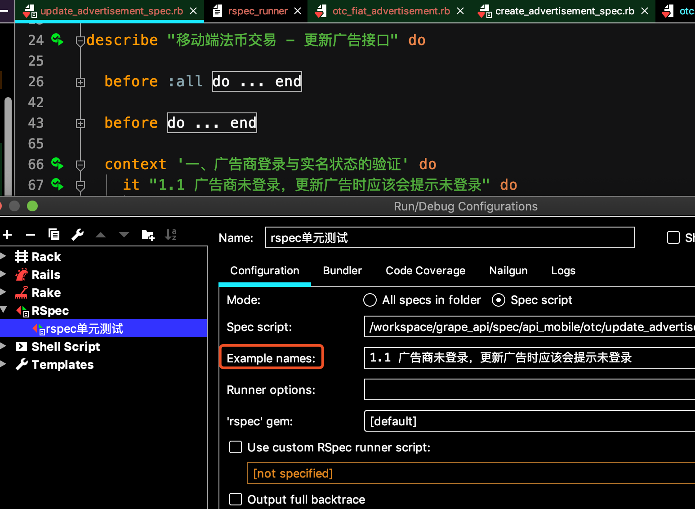

# [rspec只运行一个it/example/case](/2019/12/rspec_single_it.md)

这个技巧我在写单元测试时常常用到，确保我刚写的before hooks和FactoryBot能用

1. 指定it的内容

`rspec -e test_case` 或 `rspec --example test_case`

2. 按it所在行

这种方式可以指定运行1个或多个it

如果第10行有一个it，第20行是第二个it

`rspec spec/xxx_spec.rb:10:20`

<i class=“fa fa-hashtag"></i>
Rubymine中的运行设置

<i class=“fa fa-hashtag"></i>
相关链接

[rspec值运行某个test case](http://siwei.me/blog/posts/ruby-rspec-test-case)
