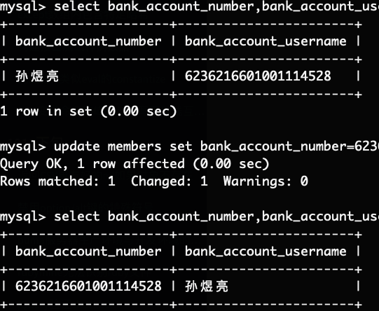

# [Mysql正则表达式-记一次清理脏数据的过程](/2019/12_1/mysql_regexp.md)

有前端的同学反馈，订单详情的接口返回的银行卡号和姓名反了



那就写个UPDATE语句改回来

```sql
UPDATE
  MEMBERS
SET
  BANK_ACCOUNT_NUMBER = 6236216601001114528,
  BANK_ACCOUNT_USERNAME = '孙煜亮'
WHERE
  ID=27843;
```

写完以后我好奇到底还有几个银行卡号是脏数据，还需正则表达式解决

<i class="fa fa-hashtag mytitle"></i>
regexp

> 找出银卡卡号不是16-19位数字的record

```sql
SELECT
  bank_account_number
FROM
  members
WHERE
  bank_account_number NOT REGEXP '[0-9]{16,19}'
```


