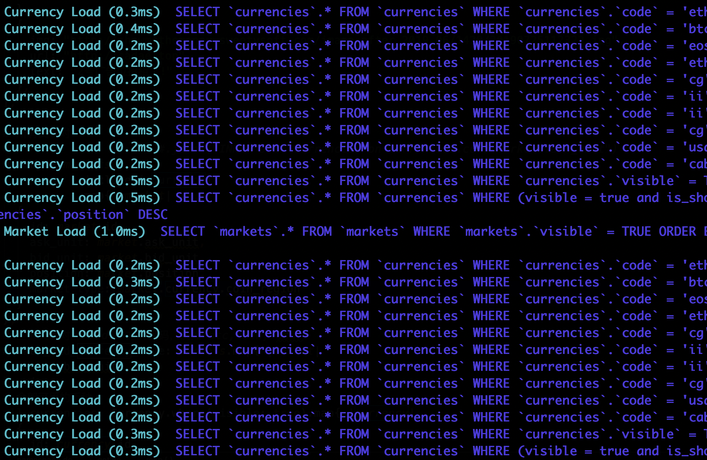
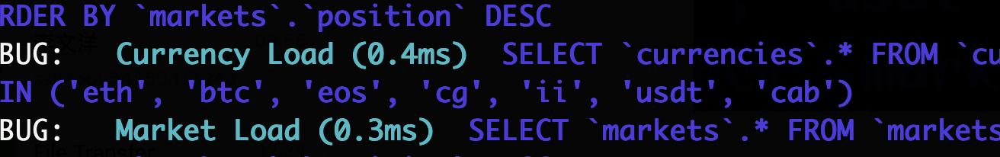

# [不通过主键(id)进行关联](/2019/12_2/association_without_primary_key.md)

<i class="fa fa-hashtag mytitle"></i>
相关文章

[ActiveRecord关联的命名约定/规范](/2019/11_2/includes_association.md)
 


```ruby
# 出现N+1查询问题的代码
markets.includes(:currency).map{ |market|
  market_type: Currency.find_by_code(ask_unit).coin_region
}
```

<i class="fa fa-hashtag mytitle"></i>
问题重现

markets表没有一个外键是currencies表的外键，好在belongs_to有选项可以指向非id列的关联

或者说ActiveRecord不管你的表结构如何，你想要指定哪一列是"主键"去关联都行

<!-- tabs:start -->

#### **models/market.rb**

> belongs_to :currency, foreign_key: :ask_unit, `primary_key:` :code

#### **usage.rb**

> markets.includes(:currency).map

<!-- tabs:end -->



<i class="fa fa-hashtag mytitle"></i>
参考链接

[https://stackoverflow.com/questions/16071735/active-record-association-without-using-id](https://stackoverflow.com/questions/16071735/active-record-association-without-using-id)

[https://stackoverflow.com/questions/21466726/rails-has-many-relationship-without-using-id](https://stackoverflow.com/questions/21466726/rails-has-many-relationship-without-using-id)
