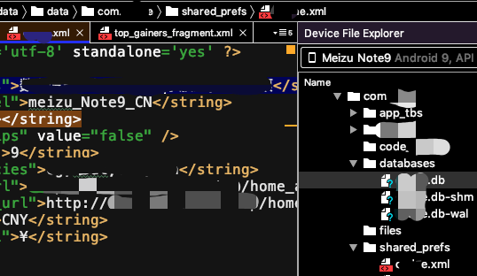

# [安卓读写SQLite数据库](/2020/01/android_sqlite.md)

<i class="fa fa-hashtag"></i>
该用哪个API？android.database.sqlite还是androidx.room？

> android.database.sqlite的优缺点

- API较底层，代码里大
- 没有SQL语句验证，也没有SQL注入的检查 
- 需要大量模板代码(boilerplate code)去转换SQL语句和Java对象
- 没有数据库迁移(Room真👍，支持迁移)，更改表结构会带来很大麻烦

<i class="fa fa-hashtag"></i>
Gradle添加Room的API库的依赖

```
def room_version = "2.2.3"
implementation "androidx.room:room-runtime:$room_version"
annotationProcessor "androidx.room:room-compiler:$room_version"
testImplementation "androidx.room:room-testing:$room_version"
```

<!-- tabs:start -->

#### **SQLite.java**

```java
@Database(entities = {Market.class}, version = 2, exportSchema = false)
public abstract class SQLite extends RoomDatabase {

  public abstract MarketDao marketDao();
  private static SQLite db;

  // 1 号migration, 起点是版本1, 终点是版本2
  private static final Migration MIGRATION_1_ADD_HIGH_LOW_TO_MARKETS  = new Migration(1, 2){
    @Override
    public void migrate(SupportSQLiteDatabase database) {
      // real表示SQLite的浮点类型
      database.execSQL("alter table markets add column high real");
    }
  };

  // 注意：即便使用单例模式，RoomDatabase的构造方法也不能设为private
  public static SQLite db() {
    if (db == null) {
      // SQLite数据库文件存储在 /data/data/${package_name}/databases/${app_name}.sqlite 中
      db = Room.databaseBuilder(BaseApplication.getContext(), SQLite.class, Constants.APP_NAME + ".sqlite")
        .allowMainThreadQueries() // 允许主线程执行SQL语句
        .addMigrations(MIGRATION_1_ADD_HIGH_LOW_TO_MARKETS)
        .build();
    }
    return db;
  }
}
```

#### **Market.java**

```java
@Entity(tableName = "markets")
public class Market {
  // 主键不能用自增的ID，App使用一天ID大约能增加到17万
  // @PrimaryKey(autoGenerate = true)
  // public int id;
  @NonNull // 主键需要非空
  @PrimaryKey()
  public String market_id;

  public Market(JSONObject market) {
    try {
      this.market_id = market.getString("market_id");
    } catch (JSONException e) {
      e.printStackTrace();
    }
  }
}
```

#### **MarketDao.java**

```java
// 使用方法 SQLite.db().marketDao().first()
@Dao // DAO(Data Access Object) design pattern
public interface MarketDao {
  @Insert
  public void create(Market market);

  @Query("SELECT * FROM markets LIMIT 1")
  public Market first();
}
```

<!-- tabs:end -->

<i class="fa fa-hashtag"></i>
TODO

增加异步执行SQL的实现代码

<i class="fa fa-hashtag"></i>
参考文章

[Save data using SQLite](https://developer.android.com/training/data-storage/sqlite)

<i class="fa fa-hashtag"></i>
sqlite文件的存放位置



## 避免频繁读写SQLite

执行一次SQLite大约耗时19-200ms不等，实际上使用SQL语句进行排序可能效率还不如使用Java代码排序

## TODO Room Database 迁移