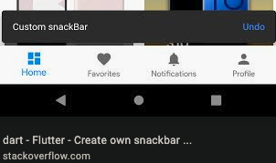

# [安卓笔记](/2020/01_1/android_notes.md)

## Snackbar



```java
Snackbar.make(findViewById(android.R.id.content).getRootView(),
  "Snackbar.make",
  Snackbar.LENGTH_SHORT)
  .show();

// 带Undo按钮
Snackbar mySnackbar = Snackbar.make(findViewById(R.id.myCoordinatorLayout),
        R.string.email_archived, Snackbar.LENGTH_SHORT);
mySnackbar.setAction(R.string.undo_string, new View.OnClickListener {
  // ...
});
mySnackbar.show();
```

## invisible和gone的区别

invisible：不显示，但是会保留组件占有的空间

此外对于ListView、GridView和RecycleView而言，还有额外的差异

> Adapter's getView() function didn't call, thus preventing views to load, when it is unnecessary

## StringBuffer和StringBuilder

拼接GET请求参数时需要使用可变字符串，StringBuffer是线程安全的

> StringBuffer is synchronized(线程安全), StringBuilder is not.
