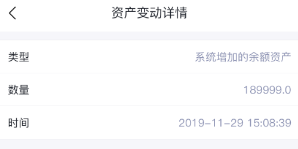

# [Android - ListView](/2020/01_1/list_view.md)

<i class="fa fa-paragraph"></i>
内心独白

从学习安卓到2019年的🎄都快3周了，依然不能对接上项目的接口

想要对接之前还得学个ListView组件把请求接口返回的数据漂亮地小时出来

要是用ruby我一天都能写完4个接口并且加上单元测试了，然而我以为我有后端基础安卓能学得快点

结果还是进展缓慢，我还指望过年前对接websocket。

于是今晚对自己狠一点——写不出ListView就不睡觉了！

## 学点AS技巧(视图xml中快速生成代码)

LinearLayout中：`or` => android:orientation

这个属性是设置线性布局的方向，一般是vertical(从上往下)

`<Lis` => 自动生成ListView组件

所有自动生成组件的代码都是通过左尖括号+组件名

<i class=“fa fa-hashtag"></i>
给ListView添加子布局文件row.xml

## 做个淘宝订单详情的页面

