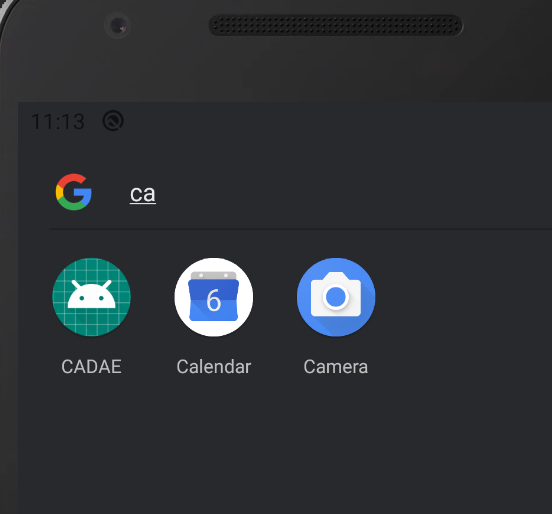

# [安卓虚拟机将App快捷方式添加到桌面](/2020/02/avd_add_app_shortcut_to_home.md)

Android Virtual Device(以下简称安卓虚拟机或avd)通过AS安装完App后往往在桌面上不显示

导致我想擦除SharedPreference的数据都要打开AVD Manager -> wipe data

但是这样会擦除掉整个虚拟机的数据，包括安卓10的DarkTheme设定之类的

还是希望桌面有个app的快捷方式可以按住app不放->app info->wipe data

解决方案一：桌面新增设置-app的组件，按住首页空白处就会有个Add widget的选项，之后将设置组件拖动桌面即可

最佳解决方案：通过底部的搜索栏，搜索我想要的App名称

搜索到想要的app后，按住相应app的图标，就能将其拖动到桌面
