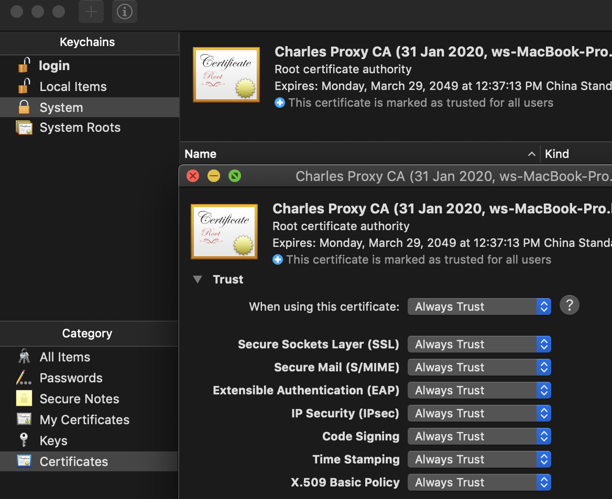

# [charles抓包笔记](/2020/02/charles.md)

激活码请前往zhile.io，生成激活码工具: https://www.zzzmode.com/mytools/charles/

以下记录我配置charles直到成功抓取火币安卓端的Https请求数据包

<i class="fa fa-hashtag"></i>
Step 1. 安装根证书

mac安装根证书：Help->SSL proxying->install root certificate

打开keychain，将charles的证书设置为always trust

<i class="fa fa-hashtag"></i>
Step 2. 安卓端连接代理

Help->SSL proxying->install ... certificate on a mobile ...

弹窗会显示这台mac的内网IP以及端口(默认端口是8888)

打开手机的wifi，设置手动代理，填上mac的IP和8888端口

之后安卓打开`chls.pro/ssl`下载证书并安装+信任

## 解析HTTPS数据

做到这一步，已经可以抓包明文的HTTP数据包，但是HTTPS的请求的response全是乱码

<i class="fa fa-hashtag"></i>
Step 3. 启用charles的SSL代理

Proxy->SSL Proxy Setting->include栏新增*:443

保存后<var class="mark">重启</var>charles

终于可以抓到火币法币交易的广告列表数据啦~

---

## update 安卓7无法装证书

apkpure看到ok交易所的app强制要求安卓7.0+，也就是支持SSL pinning且非root权限不能安装CA根证书

好家伙我红米14太新了CA证书难怪装不上只能装在user目录下不能全局CA根证书

唯一解决办法就root一个Android studio虚拟机

https://www.eet-china.com/mp/a162752.html

https://crifan.github.io/app_capture_package_tool_charles/website/how_capture_app/complex_https/https_ssl_pinning/android/xposed_justtrustme.html
