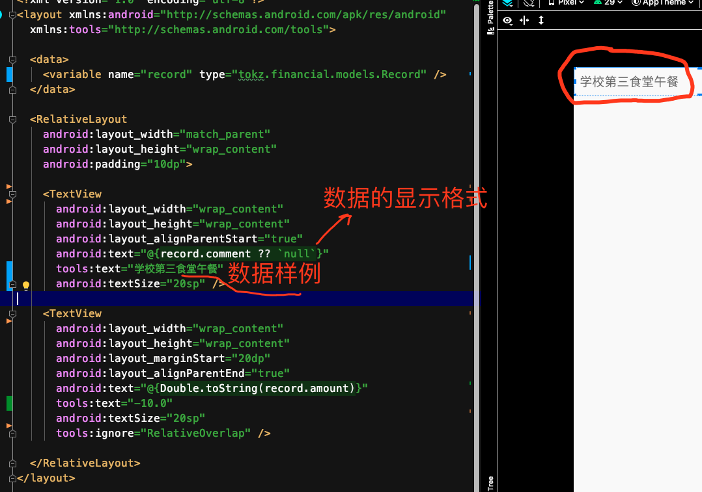

# [无需定义任何组件id的dataBinding写法](/2020/03/recycler_view_data_binding.md)

跟着[medium上这篇文章](https://medium.com/@sanjeevy133/an-idiots-guide-to-android-recyclerview-and-databinding-4ebf8db0daff)
的文章敲了一遍代码后，突然领悟到：原来安卓的MVVM是不需要定义任何组件ID的

传统的安卓MVP(Presenter)架构开发中，需要在xml中定义各个组件的id，然后在Activity/Fragment/Adapter中`findViewById`

例如TextView部分(xml代码)和设定TextView文字的部分(Java代码)是在两个文件，

需要频繁在两个文件间切换才能调试成想要的显示效果

而用了MVVM之后，xml变的跟Vue一样，Vue可以在html代码中嵌入js代码，安卓也可能在xml中嵌入Java代码了

那就完全不需要findViewById了，xml直接从数据集合(dataSet)中获取数据并加工后显示

> 比较智能的是，如果数据类的成员变量是私有的但提供了getter，databinding会把@{movie.title}转换为@{movie.getTitle}



这种将数据的样例(仅在预览模式下显示的tools:text)和获取数据的Java代码写在一起的开发体验太好了，所见即所得！

---

下面演示如何使用data binding渲染recyclerView

<!-- tabs:start -->

#### **model/record.java**

```java
public class Record {
  private String comment;
  private double amount;

  public String getComment() {
    return comment;
  }

  public double getAmount() {
    return amount;
  }

  public Record(String comment, double amount) {
    this.comment = comment;
    this.amount = amount;
  }
}
```

#### **RecordsAdapter.java**

```java
public class RecordsAdapter extends RecyclerView.Adapter<RecordsAdapter.ItemViewHolder> {

  private List<Record> records;

  public RecordsAdapter(List<Record> records) {
    this.records = records;
  }

  @NonNull
  @Override
  public ItemViewHolder onCreateViewHolder(@NonNull ViewGroup parent, int viewType) {
    LayoutInflater layoutInflater = LayoutInflater.from(parent.getContext());
    RecordItemBinding binding = DataBindingUtil.inflate(layoutInflater, R.layout.record_item, parent, false);
    return new ItemViewHolder(binding);
  }

  @Override
  public void onBindViewHolder(@NonNull ItemViewHolder holder, int position) {
    Record record = records.get(position);
    holder.setRecord(record);
  }

  @Override
  public int getItemCount() {
    return records != null ? records.size() : 0;
  }

  static class ItemViewHolder extends RecyclerView.ViewHolder {
    private RecordItemBinding binding;

    ItemViewHolder(RecordItemBinding binding) {
      super(binding.getRoot());
      this.binding = binding;
    }

    void setRecord(Record record) {
      binding.setRecord(record);
      binding.executePendingBindings();
    }

  }
}
```

#### **record_item.xml**

```xml
<?xml version="1.0" encoding="utf-8"?>
<layout xmlns:android="http://schemas.android.com/apk/res/android"
  xmlns:tools="http://schemas.android.com/tools">

  <data>
    <variable name="record" type="tokz.financial.models.Record" />
  </data>

  <RelativeLayout
    android:layout_width="match_parent"
    android:layout_height="wrap_content"
    android:padding="10dp">

    <TextView
      android:layout_width="wrap_content"
      android:layout_height="wrap_content"
      android:layout_alignParentStart="true"
      android:text="@{record.comment ?? `null`}"
      tools:text="学校第三食堂午餐"
      android:textSize="20sp" />

    <TextView
      android:layout_width="wrap_content"
      android:layout_height="wrap_content"
      android:layout_marginStart="20dp"
      android:layout_alignParentEnd="true"
      android:text="@{Double.toString(record.amount)}"
      tools:text="-10.0"
      android:textSize="20sp"
      tools:ignore="RelativeOverlap" />

  </RelativeLayout>
</layout>
```

<!-- tabs:end -->

---

安卓MVVM还需要掌握的概念：

- dagger2依赖注入
- ViewModel Provider
- ViewModel Factory
- Live Data
- Obverse(生产者/消费者模式更新数据)