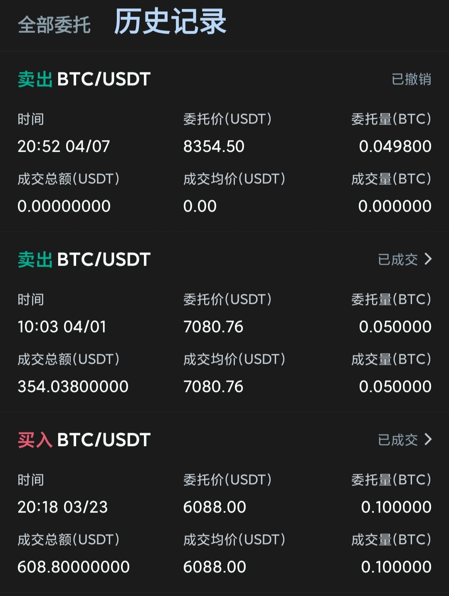

# [抄底BTC成功案例分析](/2020/04/case_study_buy_low_sell_high_on_btc.md)

虽然这是一个技术博客，但是金融技术也算技术的吧🥺

我不希望我的个人博客仅限于软件领域，本文分享的是2020年3月底我在火币上成功抄底比特币一周内赚了16%的成功案例

<i class="fa fa-hashtag"></i>
抄底

「抄底」一词顾名思义就是低买高卖实现盈利的方式，相对于「做空」来说，抄底是股票交易中最简单也是最直观的盈利方式

抄底的英文应该是[buy at the bottom and sell at the top](https://www.brainyquote.com/quotes/bernard_baruch_101015)
关于抄底有一个知名的quote:

> Don't try to buy at the bottom and sell at the top. It can't be done except by liars

---

对于散户而言我始终认为，无论是时间、技术、信息获取、资金、人力等等都不如野庄/投资经理/投机者等等，投资风险大，花一两千玩玩可以，千万别all in。

尤其是传销组织开的一些野鸡交易所，洗脑让客户把房子/车子/保险全抵押了贷款去投钱进去，我身边就有亲人就这样被骗，至今未能还清贷款。

---

3月底的时候，火币btc/usdt跌破6000，我看了下历史最高价有上过8000多，于是设了单在6000的低位买了0.1个BTC

只要不发生战乱，大家挤兑BTC换成黄金等更保值的商品，BTC的价格总能升上去的(毕竟总量恒定)

果然，一周后价格就升到7000了

我炒币的经历不多，有亏损也有像这次一样卖的价格太低了，虚拟货币交易所恶心🤢的是24小时开放，总不能凌晨起来操盘吧

不过市场又不是我能掌控的，不能有涨到7000时死活不卖要等涨到8000，涨到8000后又期盼着涨到10000，无穷无尽的贪婪心理。

所以我还是坚持我的原则，只花一两千去玩玩。接下来就随便聊聊期货和杠杆。

<i class="fa fa-hashtag"></i>
谈谈期货

最近原油期货市场曾跌到负数，导致中国银行的原油宝产品客户亏损300亿，大概率是被国际金融巨鳄给收割了

详情可以看[这个视频的分析](https://www.youtube.com/watch?v=__lm8pj-jco)

作为程序员可能会疑惑，价格怎么能是负数呢，没有数据库约束？Model约束？

饿了么/美团即便你有个1000块的红包，下单价格也最多能减到0.01

最近国内开放了所以还是得掌握些金融知识，有所了解才行

<i class="fa fa-hashtag"></i>
初探杠杆交易

可以先看[这个视频](https://www.youtube.com/watch?v=QwPOM4XuDqk)
了解下什么是杠杆交易

普通币币交易，币价就算跌到0，币还是你手里拿着，可杠杠不一样，如果加了10倍杠杠，币价跌了10%就「爆仓」了，交易所会没收你的所有币去抵债

> 股票的人看外汇觉得他们是赌徒，杠杆既然可以用到100倍甚至1000倍，可是外汇看币圈的人觉得我们是疯子
