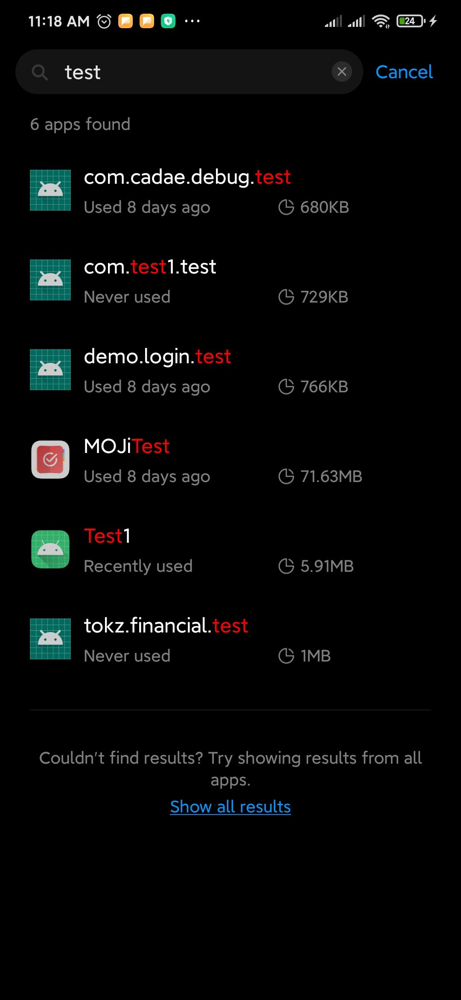
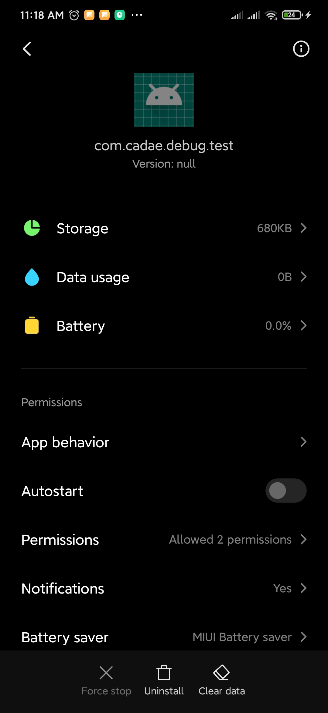

# [国产安卓机UI测试的坑](/2020/04/domestic_can_not_run_ui_test.md)

当我以为我解决了[编写安卓测试用例](/2020/04/android_test.md)的两个测试相关的坑后，跟着codewithmitch的教程就能愉快地练习安卓测试时，

没想到跟YouTube视频上完全一样的代码(也就两行)，都能报错：

> [!DANGER]
> java.lang.AssertionError: Activity never becomes requested state "[RESUMED, STARTED, DESTROYED, CREATED]" (last lifecycle transition = "PRE_ON_CREATE")

[网上这篇文章指出了问题的原因](https://wafer.li/Android/android-%E6%B5%8B%E8%AF%95%E5%9D%91%E7%82%B9%E8%AF%A6%E8%A7%A3%EF%BC%88%E4%B8%80%EF%BC%89/)

原因：国产的安卓ROM可能由于阉割了谷歌全家桶，或者国产ROM的手机管家关掉了应用自启动功能

安卓UI测试本质上是给手机安装一个 包名.test 的apk，然后自启动apk进行测试

---

---

但是这些自动安装的xx.test的apk都没有autostart(自启动)的权限

导致activityScenario启动失败

解决方案：

> 使用安卓模拟器进行测试

魅族的flyme系统没有设置应用权限的选项，应用列表也不像MIUI那样可以搜索

我发现我MIUI安卓10的系统即便允许自启动了还是无法跑UI测试

还念以前那台索尼Z5 欧洲版ROM系统的手机，用它就能跑UI测试了吧
