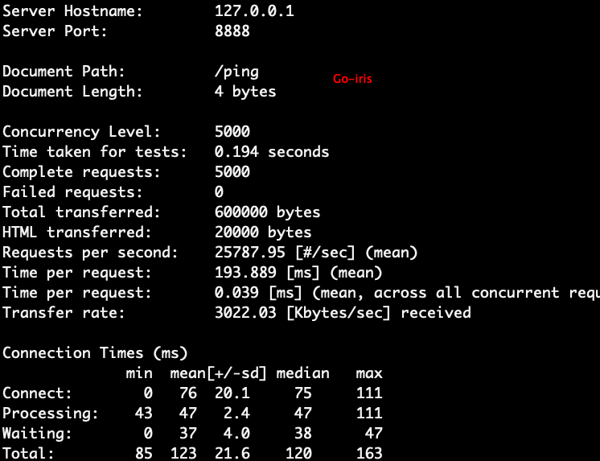
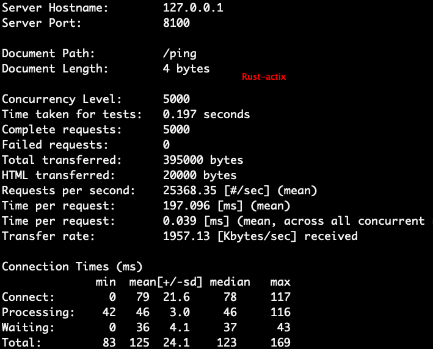

# [Go语言学习](/2020/04/golang.md)

最近我在读一些go项目的源码，发现Rust其实借鉴了很多go一些关键词和机制例如`panic`

go和Rust一样自带了benchmark,test,fmt等功能，只不过go的工具丰富程度还不如Rust

我花了半小时看完Go语言的菜鸟教程，初步结论是Go的channel确实让我眼前一亮值得一学，语言语法糖级别的协程

~~我打算以哲学家进餐问题为例单独写篇文章研究下Go的goroutine+channel~~

但是Go语言作为唯一一个暂不支持泛型等高级抽象的主流静态编译语言(说实话Go的一些包袱和兼容性决定Go2的泛型我也不是很看好)，

反而要依赖反射、interface等额外的运行时overhead去实现"泛型"

Go也不支持宏/元编程(codegen的功能可能不能像Rust宏那样从编译原理AST的更细腻的粒度去展开代码)

作为现代化编程语言，Go未免也太大道至简吧，连iterator,for_each,map,reduce,generator等API都没有，

个人感觉可能过于受到C语言之父等老的Unix大牛影响，很多C语言没有但是很重要的迭代器Go也学C语言那样不集成

如果用Go或C做infra倒无所谓，但是做业务CRUD没有map或for_each真的好吗？

## Go语言吐槽

- 工程上: 没有区分构建工具和编译工具，没有cargo init或cargo new等等初始化项目的规范，构建难
- 工程上: 包管理很烂
- 模块管理不够好用
- 没有迭代器、生成器、map、for_each、reduce等等函数式API(过度参考C语言)
- 没有模式匹配
- 字符处理不统一，没有统一成Unicode(过度参考C语言)
- 错误处理很傻很简单粗暴
- 首字母大小写表示公有私有(带来方便，同时也破坏了驼峰命名常量命名的一些业界约定)

---

## 方法论:如何学习新语言

对于掌握多门编程语言有经验的开发者而言，以下是我认为最佳的学习路线

1. 学习包管理/项目构建工具，例如maven/npm，理解项目文件结构
2. 利用第三方依赖开发一个http client/server，能读写简单的json数据
3. 简单了解下新语言的单元测试和benchmark的使用
4. 去leetcode上找Easy的题做一道
5. 解决哲学家进餐问题，理解新语言在多线程上的应用

> actix-web和gin性能比较

后记: actix-web并不是Rust最快最轻量的Web框架，性能不如tide或warp等，所以不应该拿actix-web去比go

我测试了rust和go star数最多以及最快的框架，用ab -n 1000 -c 200在我本地的mbp2019(i5 8G内存)上的测试结果是

actix(17000)，gin(16500)，iris(21000)

~~没想到Rust star最多的rocket框架性能如此糟糕😰(现在rocket边异步了，性能飞升)~~

由于gin打了log会影响性能，actix和iris都没打，所以gin和actix的性能实际上差距不大

而iris能领先gin/actix 15%~25%的性能，每秒甚至能处理23000个请求(10倍于rails)，实在强悍

我用ab -n 5000 -c 5000通过返回"pong"字符串的接口测试了Rust和Go开启编译器优化后的性能。actix-web每秒能处理25368个请求，Go-iris能处理25787个请求。

Rust从Debug版编译换成release版编译加上一些编译优化后，性能从1.7万提升到2.5万，而Go只是从2.2万提升到2.5万

> Go语言最快的iris框架开启编译器优化后的速度



> Rust语言开启release版本编译后的速度



Rust编译器选项里可以把默认的内存管理器换成FreeBSD的jemalloc或者微软的mimalloc，具体效果如何我没尝试了。

我mac电脑ab命令最多开到5000并发，开1万或2万并发会提示socket地址不够用了，可能我之前不小心用chown改了文件权限，也可能是端口本来就不够用。

我在Ubuntu测试服务器上ab命令能开到2万并发，所以测试结果仅供参考

## Go包管理工具

在官方没有推出go-modules包管理工具时，有一些第三方的包管理解决方案，如go-vendor

不过go-modules感觉不如gem/maven/npm等其它语言的包管理好用，更比不上cargo

> go mod init go_http_client

会生成一个go.mod的文件

在main.go中添加`import "github.com/gin-gonic/gin"`(Go知名Web服务器)后

执行`go mod tidy`会自动将依赖下载到`GOPATH/pkg/mod`中

此时go.mod文件多了一行`require github.com/gin-gonic/gin v1.6.2`

还多了一个go.sum文件(类似package.json-lock)

如果希望将项目依赖的包移到项目文件夹内，可以使用`go mod vendor`。

## Go项目构建

[golang-standards/project-layout](https://github.com/golang-standards/project-layout)

我非常喜欢Rust语言在一个项目里能定义多个bin，以及多个examples的特性，写完一个函数就能直接运行的爽快体验

[How to structure Go application to produce multiple binaries?](https://stackoverflow.com/questions/50904560/how-to-structure-go-application-to-produce-multiple-binaries/50904959)

[golang 的编译没有 debug release 之分吗？](https://www.v2ex.com/t/561636)

让我感到难受的是，go构建项目还得「背下」go build命令「参数的先后顺序」

> go build -o ${output} {source.go}

## Go可能不合理的设计

本文不希望是踩Go来吹捧别的语言，这样做很无聊也没有意义，我希望研究Go是如何解决计算机的各种问题的，

所以本章节只是挑几个我不喜欢Go的地方，不会过多抨击Go

<i class="fa fa-hashtag"></i>
驼峰式变量命名

I like snake case rather than camcelcase.

驼峰式命名变量的单词数少于3个还好，要是变量名是3个或以上的单词组成，用snake case可读性会好很多

而且我个人很不喜欢Go或Rust社区将单词缩写的风格，例如server缩写成srv、context缩写成ctx

看Rust Actix时各种ctx缩写让人有歧义，Actix有WebSocket的Context也有各种各样的Context，都写成ctx为了省几个字母，都没讲清楚指的是什么context

<!--
<i class="fa fa-hashtag"></i>
枚举类型可读性查

```go
const (
	gender_male = iota
	gender_femail = iota
)

const (
	trade_type_buy = iota
	trade_type_sell
)

func main() {
	gender := gender_femail
	trade_type := trade_type_sell
	fmt.Println(gender) // 1
	fmt.Println(trade_type) // 1
}
```

我还是喜欢Rust/Java的使用枚举类型的语句Gender.MALE，而不是go这样又是iota又没有命名空间的枚举
-->

<i class="fa fa-hashtag"></i>
编译时不检查unused的变量/函数

我个人还是很喜欢Rust语言严格的unused检查

---

在下一篇文章中，我再仔细研究/分析Go的杀手锏——channel
