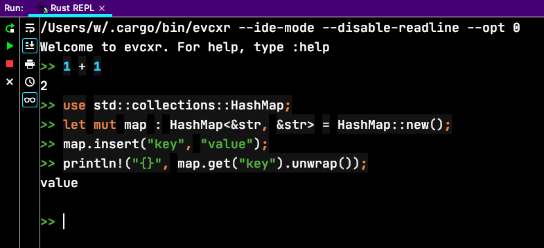

# [Rust入门](/2020/04/rust.md)

ruby/rails的性能不能满足实时性很强的需求(股票交易所)，于是尝试下[据说世界第一快的API框架](https://www.techempower.com/benchmarks/)
rust/actix

## rustup与cargo

rustup好像类似于brew，用于升级rust；cargo就等同于npm，比如cargo run = npm run

<i class="fa fa-hashtag"></i>
用rustup安装不要用brew/apt

rust官方不推荐使用homebrew/apt-get的包管理工具去安装，建议使用rustup(类似npm)

> curl --proto '=https' --tlsv1.2 -sSf https://sh.rustup.rs | sh

按1选择默认的安装路径

<i class="fa fa-hashtag"></i>
环境变量

```
github.com/rust-lang/rustup 文档的第1~2段话
$HOME/.cargo/bin will be in your $PATH environment variable, which means you can run them from the shell without further configuration.

Open a **new shell** and type the following:
```

意思是安装完后打开一个新的terminal就能

<i class="fa fa-hashtag"></i>
Intellij创建Rust项目

!> 只有Clion上才有debugger和profiler，建议使用CLion

设置`Toolchain location`: /Users/w/.cargo/bin 之后 Intellij会提示

`Download Standard Library via rustup`

然后帮我把rust标准库下载到

> /Users/w/.rustup/toolchains/stable-x86_64-apple-darwin/lib/rustlib/src/rust/src

> [!TIP]
> 推荐新手使用IDEA的「Rust REPL」工具，类似python或irb的shell环境学习Rust



<i class="fa fa-hashtag"></i>
Cargo创建Rust项目

> cargo new ${projectName} --bin

--bin表示项目是一个application而不是library

然后通过cargo run运行代码(也可以通过rustc把代码编译成可执行文件)

<i class="fa fa-hashtag"></i>
添加一个第三方库

在`Cargo.toml`下加上一行`rand = "0.7.3"`，然后 cargo build

所有第三方库都在crates.io上托管

> cargo update: ignore the lock, figure out all the latest version

<i class="fa fa-hashtag"></i>
Rust Book的前两个Demo

Rust book官方给出多个项目Demo让人学习rust，另一个是api手册(基本不怎么看)

这点要改rust点赞，python/ruby官方都没有以项目为基础练手的教学文章

而且Rust book第一个项目是猜数字，比小甲鱼Python猜数字的项目代码量更少，而且还有「非数字输入」的验证与过滤功能

Rust的野心很大，官方的第二个项目竟然是「哲学家进餐问题」，一个项目里把线程、结构体、Interface等概念解释清楚

所以个人感觉学完rust book的前两个Demo足以

```rust
let handles: Vec<_> = philosophers.into_iter().map(|p| {
    // thread::spawn function takes a closure as an argument
    // and executes that closure in a new thread
    thread::spawn(move || {
        // annotation move to indicate that
        // the closure is going to
        // take ownership of the values it’s capturing
        p.eat();
    })
}).collect();
```

## Rust一些知识

<i class="fa fa-hashtag"></i>
Rust的下划线(underscore in rust)

_ is a type placeholder 可以认为是自动类型推断占位符

> let books: Vec<_> = xxx.map(...).collect();

上面这行代码的type placeholder会根据collect返回类型将Vec设为一样的类型

下划线还有以下的用法，我就不是很理解了

```rust
match read_line(&mut input) {
  // 在这里_我的理解是不管这个输入变量是什么
  Ok(_) => do_some_thing,
  Err(e) => println!("{}". e)
}
```

下划线的第三种用法：

```rust
fn get_gender(gender: &str) -> Option<&str> {
  match gender {
    "Male" => Some("return male"),
    "Female" => Some("return female"),
    _ => None
  }
}
```

<i class="fa fa-hashtag"></i>
.collect()

能把iter类型转为vector

## rust句尾/句末的问号?

[参考](https://doc.rust-lang.org/edition-guide/rust-2018/error-handling-and-panics/the-question-mark-operator-for-easier-error-handling.html)
try!(foo()) 等于 foo()?
?类似unwrap，但unwrap和try!是不一样的

## Rust学习资料

# 学习资料

- [Rust Book猜数字和哲学家进餐问题的项目式教学](https://doc.rust-lang.org/1.0.0/book/dining-philosophers.html)
- [YouTube上dcode的rust入门教程(42集)](https://www.youtube.com/watch?v=vOMJlQ5B-M0&list=PLVvjrrRCBy2JSHf9tGxGKJ-bYAN_uDCUL)
- [YouTube大神用rust写了贪吃蛇游戏，这是他分享rust的ownership以及borrow概念](https://www.youtube.com/watch?v=8M0QfLUDaaA&list=LLFLN2ZAPopjz2zM-FomwnkQ&index=2&t=8s)
- [serde JSON反序列化的库](https://serde.rs/derive.html)
- [感谢reqwest库提供的网络请求解析JSON数据的Example](https://github.com/seanmonstar/reqwest/blob/master/examples/json_typed.rs)
- [极客学院上详细介绍Rust的Module用法的文章](https://wiki.jikexueyuan.com/project/rust-primer/module/module.html)