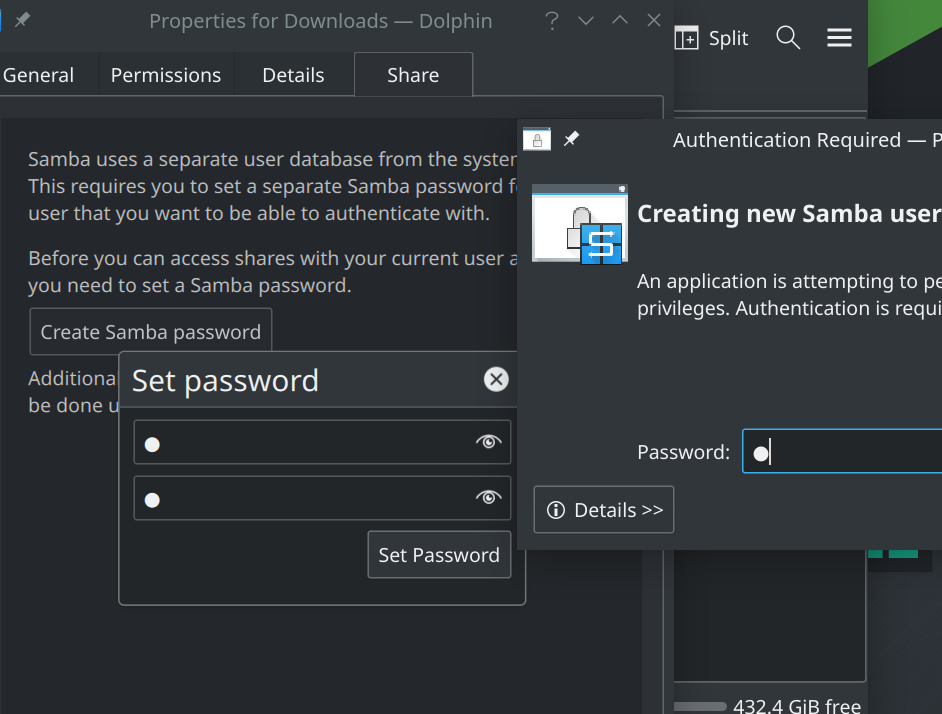
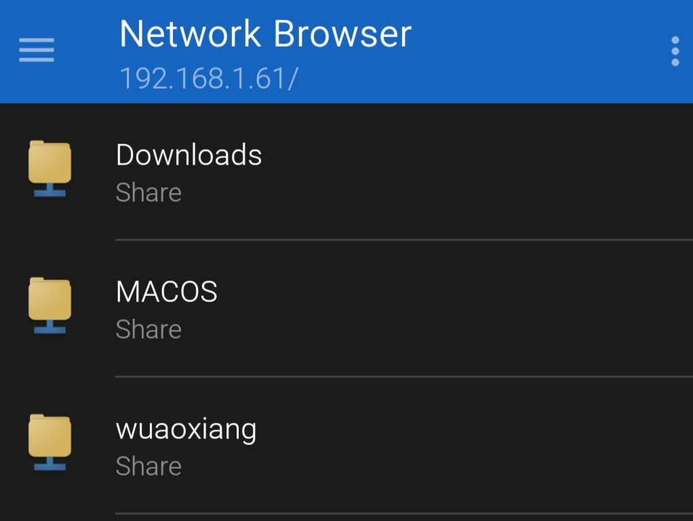

# [win/mac/linux共享文件夹](/2020/04/win_mac_linux_samba_smb_share_files.md)

同一个网络下多个设备间的文件共享，可以`python3 -m http.server 80`开启一个static_file_server，也可以通过蓝牙传输文件

但是蓝牙或HTTP文件传输效率和方便性都远不如smb/samba协议(用FTP也行)

下面介绍下主流操作系统如何开启smb_server和如何连一个smb_server(smb_client)

## win开启smb_server

win将某个文件夹属性设置为共享(注意开放读写权限)即可开启smb_server

如果共享文件夹后其它设备还是连不上，请检查控制面板->防火墙中是否启用文件分享

[参考文章](https://www.online-tech-tips.com/mac-os-x/connect-to-shared-folder-on-windows-10-from-mac-os-x/)

## mac开启smb_server

System Preferences(系统设置)->Sharing，打开file sharing，注意开放读写权限


## **linux配置smb**

manjaro_kde都预装了samba的package，samba的核心是smb和nmb两个systemd service

<https://wiki.manjaro.org/index.php/Using_Samba_in_your_File_Manager>

假设系统用户名是w

0. 禁用KDE wallet并`rm -rf ~/.local/share/keyrings`然后在seahorse配一个无密码默认keyring
1. sudo rm -rf /var/lib/samba && sudo rm /etc/samba/smb.conf
2. 安装manjaro-settings-samba包，里面包含创建samba用户组等操作的安装脚本
3. 备份后编辑/etc/samba/smb.conf(如果关了kde_wallet用简洁版配置即可)
4. ~~检查groups w中是否包含sambashare用户组~~
5. 创建samba用户w: `sudo pdbedit -a w`
6. 检查`sudo pdbedit -L`中是否包含samba用户w
7. sudo systemctl restart smb nmb
8. linux客户端第一次用用户w登陆并记住auth信息

!> 如果是min版的manjaro,似乎smb.conf的配置「一定不能有`guess ok=yes`」

```
[global]
   log file = /var/log/samba/log.%m
   #guest ok = yes

[home_w]
   path = /home/w
   read only = yes

[download]
   path = /home/w/Downloads
   writable = yes
```

根据<https://askubuntu.com/questions/724916/can-read-but-cannot-write-to-samba-share>

share的名字跟文件夹的名字不能是一样的，否则和遇到无法写入的问题



!> 步骤2只建议在UI上操作，用命令行创建的samba用户可能有各种问题!

¶ 无密码登陆仅在两端都是linux时才行?

可能manjaro的samba版本太高，只有两端都是manjaro时才能无密码登陆

所以别加`guest only`的配置项，让非linux的设备通过用户名登陆

## 启用KDEwallet可能导致登陆失败

## 密码输对还弹窗认证失败

用manjaro默认的配置(正确的配置)，然后加一个自己共享文件夹的配置

另一台linux机器连进来时用用户w进行登陆，下次连接是似乎就能记住密码了

简单来说用正确的配置让client记住auth信息，然后下次用自己随意的连接时可以

或者禁用掉KDE wallet

## 没有写入权限

可能是默认的guess用户是nobody对应系统用户nobody是所有文件只读权限

server端注释掉`guess ok = yes`，似乎linux会保存某个服务器

总结manjaro的samba版本4.0+太高了，对无密码登陆很不友好，所以基本就用密码登陆然后保存登陆信息吧

---

## 连接smb_server

假设192.168.1.3的设备已开启smb server

- windows: 直接在文件浏览器的路径栏中输入`\\192.168.1.3`
- mac: finder(访达)菜单栏->Go->Connected Servers，然后输入`smb://192.168.1.3`
- linux: 在file_manager(文件浏览器)地址栏输入`smb://192.168.1.3`
- android: 推荐谷歌商店network_browser
  
注意安卓的network_browser连linux要manual_connect且输入用户名密码不能无密码登陆)

!> 注意删除smb共享文件夹内的文件不会进入回收站而是直接删除



我的个人理解是client能看到smb_server的所有文件，但是只能对server给定的几个文件夹有写入权限

---

除了samba的方案我还考虑了FTP,但是远不如samba方便

## Android开启FTP server

MIUI/原生安卓自带的文件浏览器com.android.fileexplorer可以在右上角的下拉菜单中开启FTP服务器

然后win/mac/linux都能在地址栏输入`ftp://192.168.1.3:2121`进行访问

Android的FTP client就只能商店随便找个了，而且我找的ftp_client这个app不支持UTF-8，看不到名字带中文的文件

## mac开启FTP server

旧的mac OS版本在sharing设置界面能开启FTP，我用的11.2.1版本就只能去商店下载QuickFTP Server

## Linux开启FTP server

由于我没解决vsftpd启动报错的原因，故放弃
