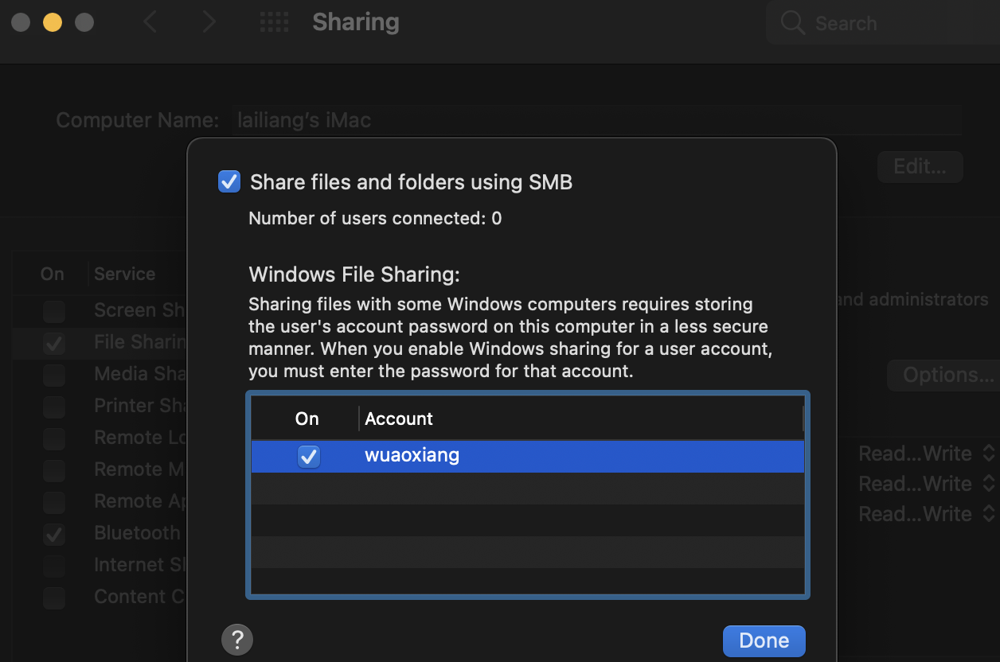
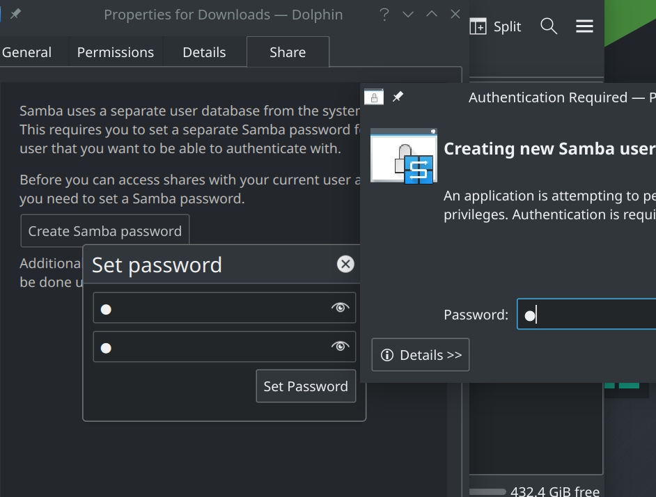
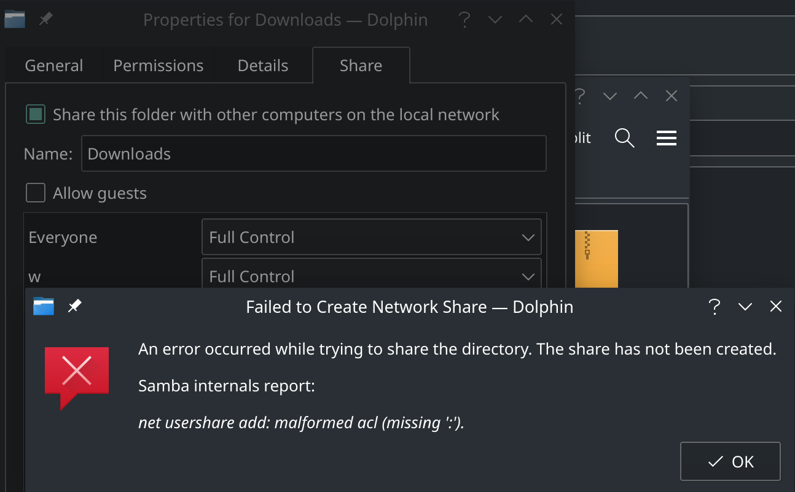
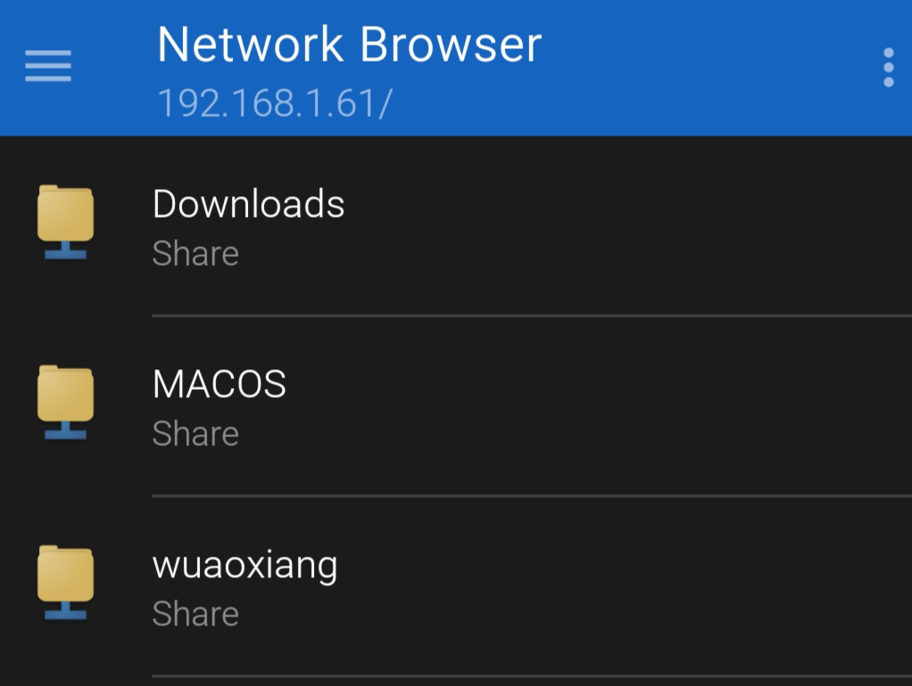

# [win/mac/linux共享文件夹](/2020/04/win_mac_linux_share_files.md)

同一个网络下多个设备间的文件共享，可以`python3 -m http.server 80`开启一个static_file_server，也可以通过蓝牙传输文件

但是蓝牙或HTTP文件传输效率和方便性都远不如smb/samba协议(用FTP也行)

下面介绍下主流操作系统如何开启smb_server和如何连一个smb_server(smb_client)

## win开启smb_server

win将某个文件夹属性设置为共享(注意开放读写权限)即可开启smb_server

如果共享文件夹后其它设备还是连不上，请检查控制面板->防火墙中是否启用文件分享

[参考文章](https://www.online-tech-tips.com/mac-os-x/connect-to-shared-folder-on-windows-10-from-mac-os-x/)

## mac开启smb_server

System Preferences(系统设置)->Sharing，打开file sharing，注意开放读写权限



## linux开启smb_server

大部分的linux桌面发行版都没有预装smbd的systemd service，以我用的manjaro/KDE为例:

> pamac install samba kdenetwork-filesharing manjaro-settings-samba

安装完重启后，在KDE的文件浏览器里，点开文件夹属性就能看到共享选项了，第一次共享需要创建smb账号



!> 建议不要linux用文件浏览器共享，很容易报错，直接改配置文件开systemd相关服务



在文件浏览器dolphin建好smb帐号后，立刻关掉共享，然后改配置文件`/etc/samba/smb.conf`

smb.conf底下加上以下内容

```
[Downloads]
   comment = Downloads
   path = /home/w/Downloads
   browseable = yes
   read only = no
   create mask = 0700
   directory mask = 0700
```

然后Android的network_browser要选择Manual Connection手动填上用户名密码才能连上

---

## 连接smb_server

假设192.168.1.3的设备已开启smb server

- windows: 直接在文件浏览器的路径栏中输入`\\192.168.1.3`
- mac: finder(访达)菜单栏->Go->Connected Servers，然后输入`smb://192.168.1.3`
- linux: 在file_manager(文件浏览器)地址栏输入`smb://192.168.1.3`
- android: 推荐谷歌商店network_browser
  
注意安卓的network_browser连linux要manual_connect，自动连不会弹出用户名密码输入框)

!> 注意删除smb共享文件夹内的文件不会进入回收站而是直接删除



我的个人理解是client能看到smb_server的所有文件，但是只能对server给定的几个文件夹有写入权限

---

由于smbd的设置导致Android连接Linux的smb_server不会弹出登录窗口，我思考了用FTP进行文件分享的备用方案

## Android开启FTP server

MIUI/原生安卓自带的文件浏览器com.android.fileexplorer可以在右上角的下拉菜单中开启FTP服务器

然后win/mac/linux都能在地址栏输入`ftp://192.168.1.3:2121`进行访问

Android的FTP client就只能商店随便找个了，而且我找的ftp_client这个app不支持UTF-8，看不到名字带中文的文件

## mac开启FTP server

旧的mac OS版本在sharing设置界面能开启FTP，我用的11.2.1版本就只能去商店下载QuickFTP Server

## Linux开启FTP server

由于我没解决vsftpd启动报错的原因，故放弃
