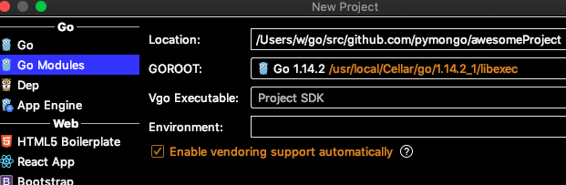

# [Go项目文件结构](/2020/05/go_file_structure.md)

本文算是我入门Go语言的笔记[Go语言研究](/2020/04/golang.md)
的补充部分

参考[medium](https://medium.com/rungo/working-in-go-workspace-3b0576e0534a)
上Go的这个系列文章，[中文翻译在](https://learnku.com/go/t/26863)

很喜欢medium上这个作者的文章，文章里有大量的vscode精美截图演示

## src、bin、pkg

homebrew安装完go以后，默认的$GOPATH是`~/go`

$GOPATH上有三个文件夹：src、bin、pkg

pkg类似rust的lib，没有main函数的go项目会编译到pkg内

按照Go的约定约定，go项目的代码放在`$GOPATH/src/github.com/user_name/repo_name`能省下不少麻烦

与$GOPATH类似，每个GO项目下也有src、bin、pkg这三个文件夹

## GOROOT和GOPATH

brew更新的go，会自动更新GOROOT，不要手动修改GOROOT的值

也可以通过`go env`命令查看当前的环境变量

> GOROOT="/usr/local/Cellar/go/1.14.2_1/libexec"

---

import语句会优先搜索$GOROOT/src寻找包，其次再去$GOPATH/src下搜索

## Go包管理

没有go mod之前，所有代码第三方包的代码都必须通过go get或vendor将代码下载到项目里

我很讨厌自己的代码和别人的代码都放在src目录下，而且切换不同项目可能需要修改GOPATH环境变量才能正常工作

先不说go get的缺点，相比npm中心化的包管理托管，go直接拉github上的代码确实自由很多，但是缺少了中央包管理系统的review机制

[关于Go Module的争吵](https://zhuanlan.zhihu.com/p/41627929)
一文中提到：

“Go团队领导层总是拒绝从其他现代语言(的做法)中学习,Go歇斯底里的尝试不去达成任何其他人已经达成的共识”不能同意更多

## 新建Go项目

由于新点的版本支持go mod包管理工具，所以在GoLand创建go项目时就选第二个go modules就可以了

至于go mod是不是go官方用来替代$GOPATH机制的技术，我不是很了解



新建完项目后，项目文件夹内就一个go.mod文件

Go不像Rust自带Cargo工具构建项目，所以还是老老实实用IDE构建项目吧，我离开了IDE都不知道如何运行代码了，懒得去背go过于复杂的命令以及参数顺序

## package嵌套

```
.
├── go.mod
└── src
    ├── app
    │   └── main.go
    └── greet
        ├── greet.go
        └── hello
            └── hello.go
```

我认为比Rust或python的嵌套module难用多了

```go
import (
	"github.com/pymongo/go_file_structure/src/greet/hello"
)

func main() {
	hello.Say()
}
```

## package私有方法

小写字母开头的方法/变量名是私有的，大写字母开头的方法/变量名是公有的

这又是Go语言「违法软件开发共识」的语法，为什么要违背大家约定好的「大写字母是常量或类」这种共识呢？

这样的约定导致Go语言private const变量的命名极其丑陋

## Go的优点

单步调试比较好用，不至于像rust一样经常跳到汇编代码中

所以Go语言还是挺适合用来刷leetcode题的，比C++代码简洁，又能像C++一样部分题跑进0ms

TODO Go语言单步调试真的不会跳进汇编代码？
