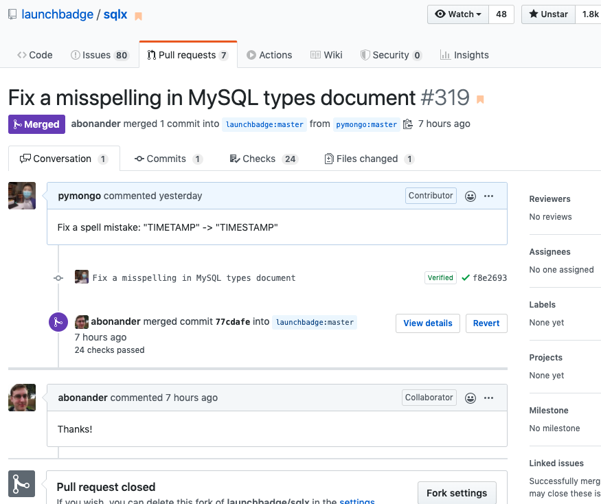

# [sqlx项目提PR修正文档](/2020/05/pr_to_sqlx_document.md)

再次阅读Rust类型与Mysql类型转换一览表时，发现了[sqlx文档](https://docs.rs/sqlx/0.3.5/sqlx/mysql/types/index.html)
的一处`spell mistake`

文档中有一处单词拼写错误：

```
chrono::DateTime<Utc>	TIMESTAMP
chrono::DateTime<Local>	TIMETAMP
```

`docs.rs`上的文档是通过`cargo doc`将代码的doc_string(一般是md语法)生成静态html文件

随便在网页文档上选一段话，通过搜索功能很快在找到[Github源码文件](https://github.com/launchbadge/sqlx/blob/master/sqlx-core/src/mysql/types/mod.rs)

`TIMETAMP`应该是笔误，Mysql就没有TIMETAMP

于是fork到我repo，只修改了一行的话直接在github网页上改，然后提PR过去

我的commit message是：

> Fix a misspelling in MySQL types document

[PR](https://github.com/launchbadge/sqlx/pull/319)的description：

> Fix a spell mistake: "TIMETAMP" -> "TIMESTAMP"



翱翔 2021-10-02 评论: 当时我对 git, CI, 开源社区常用术语不太熟练，其实 commit message 叫 fix a typo 就好了
