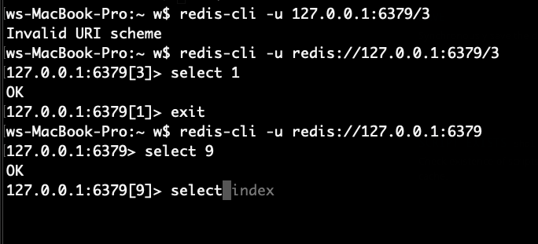

# [redis切换数据库](/2020/05/redis_select_db_index.md)

学习了redis的SELECT命令，用于切换redis连接的数据库

默认情况下redis连接的是0号数据库

如果用`redis-cli -u 127.0.0.1:6379/1`连接的是1号数据库

由于Rust语言的actix-redis库创建连接时地址中不允许出现斜杠，

只能在连上redis之后发送SELECT命令更换数据库，类型MySQL的use xxx
