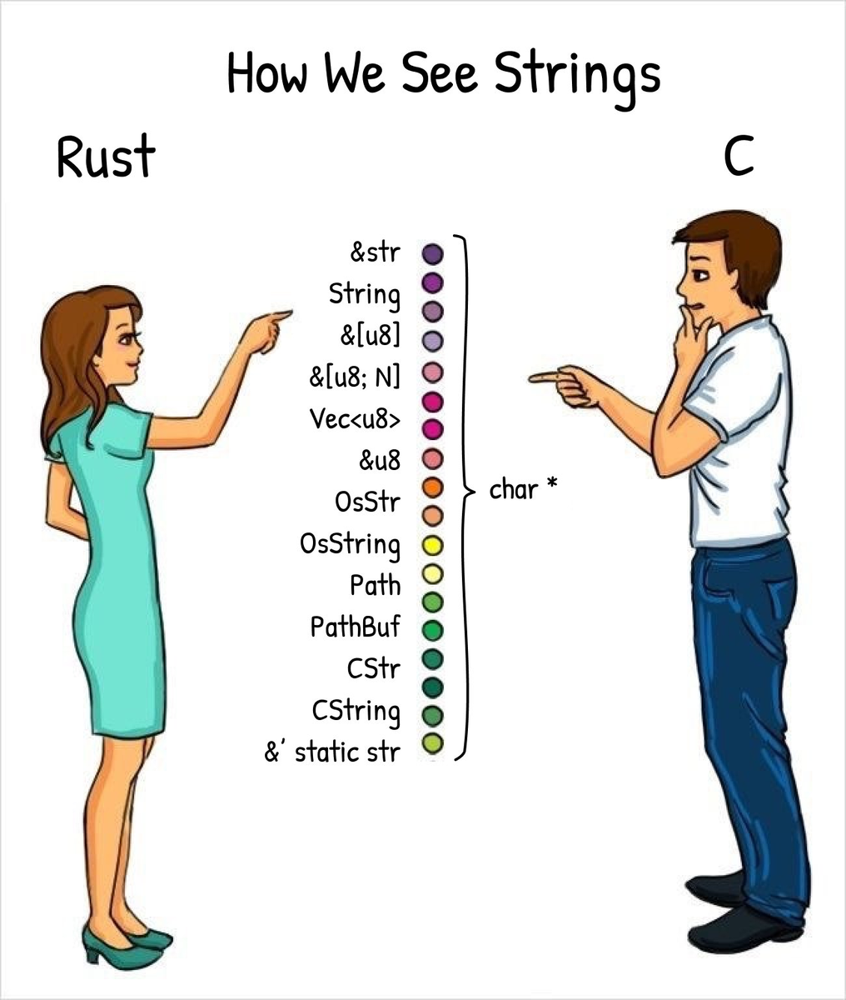

# [类型丰富语言](/2020/06/type_rich_language.md)

我认为按 动态/静态 或 弱类型/强类型 去区分编程语言不太合适，

静态语言Rust/Java也有REPL环境、自动类型推断这种动态语言的特性

现在有一种发展的趋势，编译型语言越来越强，逐步实现动态语言的各种特征，又能保证高性能

我更倾向于按 类型丰富语言 或 类型不那么丰富语言 去区分

例如整数在Python/Ruby只能用Number一种类型去表示，

在Java中可以用byte/short/int/long等等，

C/C++相比Java多了unsigned或long long等，

Rust/Go就更多了，u8/u16/u24/i32/u32等等

让我联想到下面这张图



所以我更倾向于按类型的丰富程度去区分语言

## 类型丰富语言的优缺点

### 缺点

学习难度大，只适合精英团队使用，一般团队还是选择python/ruby/php/js这种猛操快的脚本语言，瞎写都不会报错

[Rust 未来会成为主流的编程语言吗？](https://www.zhihu.com/question/389139613/answer/1168895383)

```
新一代的互联网程序员根本不怕出bug，程序也不需要维护多久，干嘛要难为自己啊？
有bug就不能先release？弄得编译不过是想跟自己过不去吗？
反正有没有bug都是要加班，都已经997了再出bug又能怎么样？有种扣工资开除我呀！
rust没戏。只有能瞎写的语言才会成为主流。
```

类型丰富语言例如Rust去掉了各种语法糖，可能写80多行才等于ruby/js5-10行，开发效率较低，不如ruby/js快速完成需求(不管有没有Bug)

### 优点

能按计算机存储的最小单位Byte去思考问题，51单片机和MySQL虽有Bit类型，但是实际上至少占1Byte的存储空间


