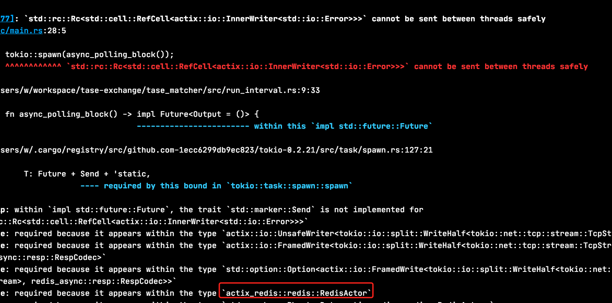

# [异步线程安全地操作redis](/2020/07/async_redis.md)

actix-web框架中读写redis相关的middleware是actix-redis

actix-redis主要有两个API —— 同步的send()和异步的do_send()

和sqlx类型，send的内容就是纯粹的redis命令

只写不读的话也不关心redis命令是否执行成功，用send()就行了

如果需要用GET命令获取redis某个key的值，就必须要用do_send()之后await

但是在tokio::spawn的异步线程内，actix-redis使用do_send()API，会提示线程不安全(can't share between threads safety)



我阅读actix-redis的源码发现，RedisActor其实就是async-redis外面套了一层Actor

我尝试在tokio::spawn内部使用async-redis的异步读取操作，结果运行正常

## async-redis初始化

async-redis库提供了两种建立redis连接的API，connect方法属于low-level API

由于业务需求，我选用了自带「断线重连」功能的paired_connect

```rust
pub static NOTIFICATION_REDIS: OnceCell<PairedConnection> = OnceCell::new();

// ...
let redis_addr = std::net::SocketAddr::from_str("loclhost:6379").unwrap();
let redis_conn = redis_async::client::paired_connect(&redis_addr).await.unwrap();
let _ = RDS.set(redis_conn);
```

## async-redis读写redis

```rust
redis_conn.send_and_forget(resp_array!["SET", "test", "1"]);
let res: RespValue = redis_conn.send(resp_array!["GET", "test"]).await.unwrap();
if let RespValue::BulkString(chars) = res {
    // chars属于Vec<u8>类型
    dbg!(chars);
}
```
