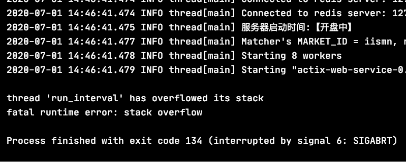

# [thread has overflowed可能的原因](/2020/07/fix_thread_has_overflowed.md)

下面这段代码一运行就会报错

> thread 'run_interval' has overflowd its stack

```rust
pub fn sync_polling_block() -> impl Fn() {
    || {
        loop {
            log::info("test");
            std::thread::sleep(std::time::Duration::from_secs(1));
        }
    }
}

fn main() {
    let thread_builder = std::thread::Builder::new()
        .name(String::from("run_interval"))
        .stack_size(1024);
    let _handler = thread_builder.spawn(sync_polling_block()).unwrap();
    // handler.join().unwrap() 会阻塞进程导致p
}
```



查阅相关资料后发现，运行时异常的原因在于在线程内获取不到全局的logger对象，属于变量线程安全相关问题

跟我代码中thread::spawn之后没有thread.join()应该无关

解决方案1: 线程内不打log

解决方案2: 换成tokio::spawn之后在线程里面打log也不会报错了

```rust
pub fn async_polling_block() -> impl Future<Output = ()> {
    async {
        let mut interval = tokio::time::interval(std::time::Duration::from_secs(1));
        loop {
            log::info("test");
            interval.tick().await;
        }
    }
}

fn main() {
    tokio::spawn(async_polling_block());
}
```
