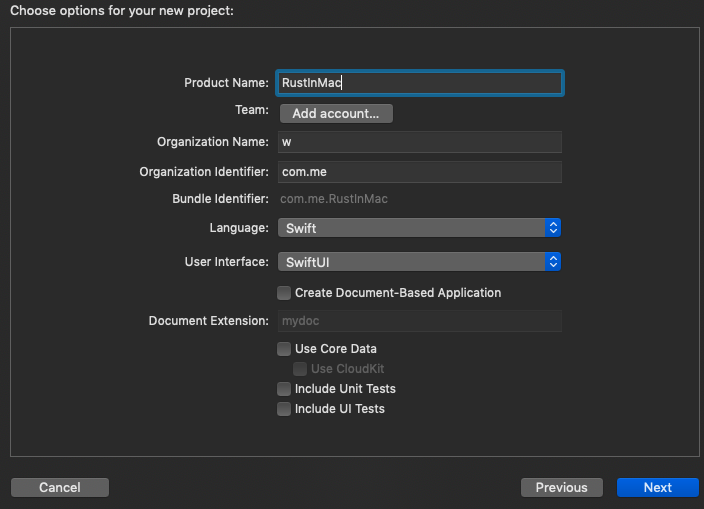

# [Rust编译成安卓/IOS库](/2020/08/rust_to_android_ios_mac.md)

## Rust to Android

按照[官方教程](https://mozilla.github.io/firefox-browser-architecture/experiments/2017-09-21-rust-on-android.html)
走基本不会出错

通过NDK的Python脚本展开一份安卓SDK到项目文件夹内

> /Users/w/Library/Android/sdk/ndk/21.3.6528147/build/tools/make_standalone_toolchain.py --api 26 --arch arm --install-dir NDK/arm64 --force

Android SDK不要用29，否则编译Rust代码时会找不到某些g++编译器

`...NDK/arm/bin/arm-linux-androideabi-clang` not found`

Android这边链接到rust的target文件夹内的so文件的软链接要用「绝对路径」

实验表明，如果Rust库使用的是API 26，那么安卓API版本是26+都可以，例如28、29

我个人想法是可以通过结构体，让Java保存数据库SQLite的链接，这样可以实现更复杂的功能例如聊天等等

我的感想:

可以将Rust部分抽象成core部分+各平台接口转换部分

例如我写好了聊天部分的核心代码，如果想编译到安卓则需要写一小部分从JVM虚拟机获取对象/线程的代码，如果编译到IOS又是另一种写法等等

## Rust to IOS

Rust编译报错`xcrun: error: SDK "iphoneos" cannot be located`的原因与解决方法:

原因是安装了XCode以后没有将SDK切换成XCode的

> sudo xcode-select --switch /Applications/Xcode.app

然而[官方教程](https://mozilla.github.io/firefox-browser-architecture/experiments/2017-09-06-rust-on-ios.html)
要设置一堆配置项头都看晕了

后来我去[YouTube](https://www.youtube.com/watch?v=lKYSQ4JkSLU)
上看了这个视频(14-17分钟)后才发现原来是这么简单

代码可以用官方教程的，但是如何导入Rust编译好的库以及Bridging部分建议看他的视频

## Rust to mac



创建好项目后，在左侧sidebar中新建一个new group(相当于文件夹)

然后将编译好的相应平台的librust.a拖进去，会弹出对话框勾选copy if necessary...

然后在刚刚新建的文件夹内新建一个.c文件，创建完后会自动生成.h和Bridging Header文件

然后将官方教程中.h和bridging文件的相应代码粘贴进去

现在可以在.h文件的文件夹内新建的swift文件类里引用到Rust写的函数

```swift
class RustApi {
    static func sayHello(name: String) -> String {
        let res = rust_greeting(name);
        let swift_res = String(cString: res!);
        rust_greeting_free(UnsafeMutablePointer(mutating: res))
        return swift_res
    }
}
```

最后在ContentView中`Text("Hello, Wordld!")`改成`Text(RustApi.sayHello(name: "Rust"))`就完成了

---

## Rust to windows(dll)

由于我不会win32编程，暂不考虑Rust编译成windows的库
