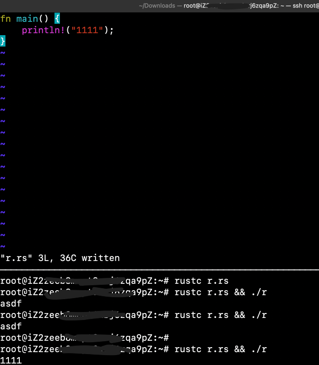

# [运维-tmux会话管理](/2020/11/tmux.md)

在开发过程中，经常需要Terminal开多个tab SSH连测试服务器，一个tab实时滚屏看nginx log，一个看server log，一个打开vim ......

很容易打开密密麻麻一堆tab，而tmux工具就是为了解决这个问题，一个tab一个SSH里同时vim修改文件和看log

最佳实践应该是一个Terminal的tab的tmux管理一台云主机或本地机器的所有事情

打开tmux会话还有一个好处是不会因为长时间不操作而断开SSH的连接(tmux会自动帮你keep alive)

tail_f_nginx会话看nginx error log:

```
tmux new -s tail_f_nginx
tail -f /var/log/nginx/error.log
# Ctrl+b, d 暂时退出当前tmux会话
```

---

## tmux -CC control mode

将终端的 tab 映射成 tmux 的 tab/window，需要 terminal emulator 支持

例如 KDE 的 console 不支持，mac 也只有 iterm 支持

---

额tmux的缺点是跟mac系统下Ctrl+B光标左移的快捷键冲突了，还有个小缺点就是默认不允许嵌套会话(也是好处，避免嵌套会话过于乱套)

tail_f_nginx会话启动python3 http.server:

```
tmux new -s server
python3 -m http.server 8080
# 离开: Ctrl+b, d
tmux attach -t server # 又回到server的tmux会话
# 上下分屏并新建一个bash[0]的会话: Ctrl+b, "
curl localhost:8080 # 此时能看到上屏的server多一条log，以及下屏返回更多内容
```

光标在上下屏间移动的命令是Ctrl+b ;/o

上屏修改Rust代码下屏运行的图片示例:


