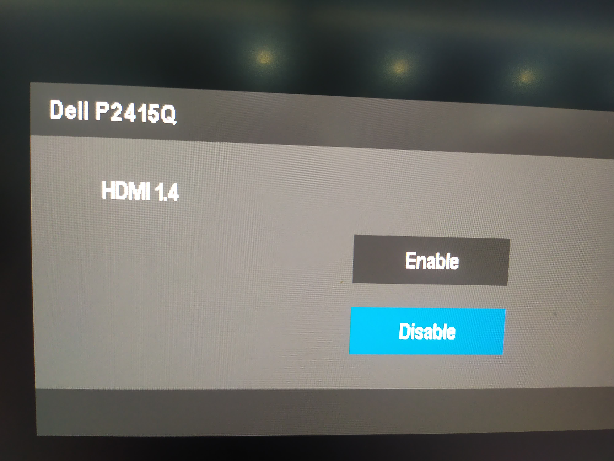

# [戴尔2415输出4k@60](/2021/02/dell_p2415q_enable_hdmi2.md)

KDE显示器设置不支持4k，害得我以为小米售价29的HDMI线不支持HDMI 2.0，于是买了款次日达的绿联HDMI线

在线和荣耀笔记本都铁确定支持HDMI 2.0的情况下，那就只能是显示器的问题了

可是Dell P2415Q的tech specs指明支持4k@60，于是我再搜搜发现[这个型号需要自行启用HDMI 2.0](https://www.dell.com/support/kbdoc/en-us/000126493/setting-up-the-p2415q-p2715q-monitors-with-hdmi-2-0-that-support-4k-x-2k-60hz)

我将显示器恢复出厂设置后照着文章的步骤enable HDMI 2.0后，再连上笔记本，首次启用2.0 manjaro系统弹出了显示器分配的弹窗(win+P弹出的界面)

终于能让我的Linux工作机用上4k@60Hz的显示了！

公司配的p2415q 16年左右的产品，现在已停产，现在只能买的更新的2721Q，dell显示器产品线up系列最高端，up系>u系>p系

然而u系的4k屏售价在4000-5000，比我荣耀笔记本还贵，可以考虑买性价比更高的国产aoc高端4k屏
