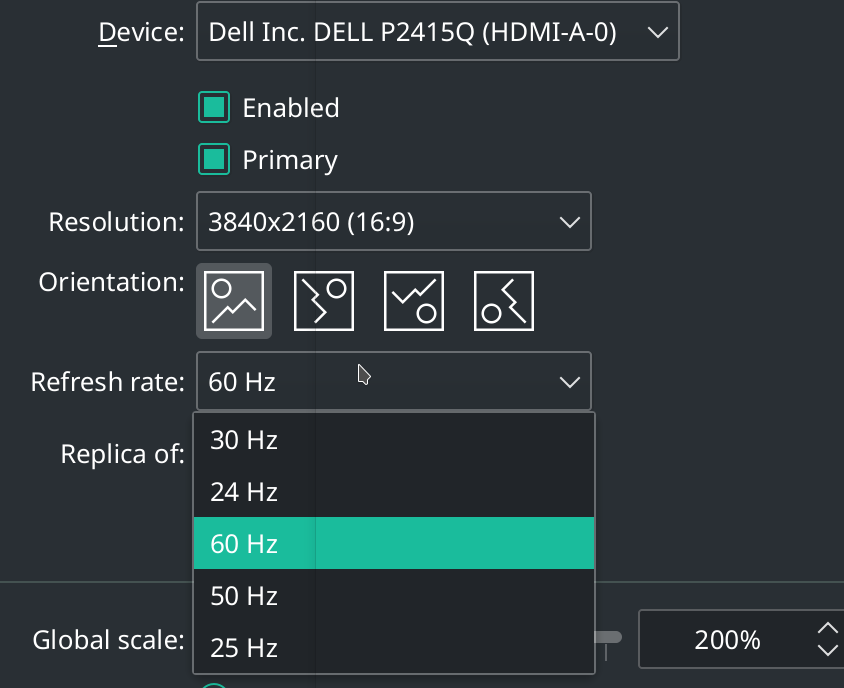
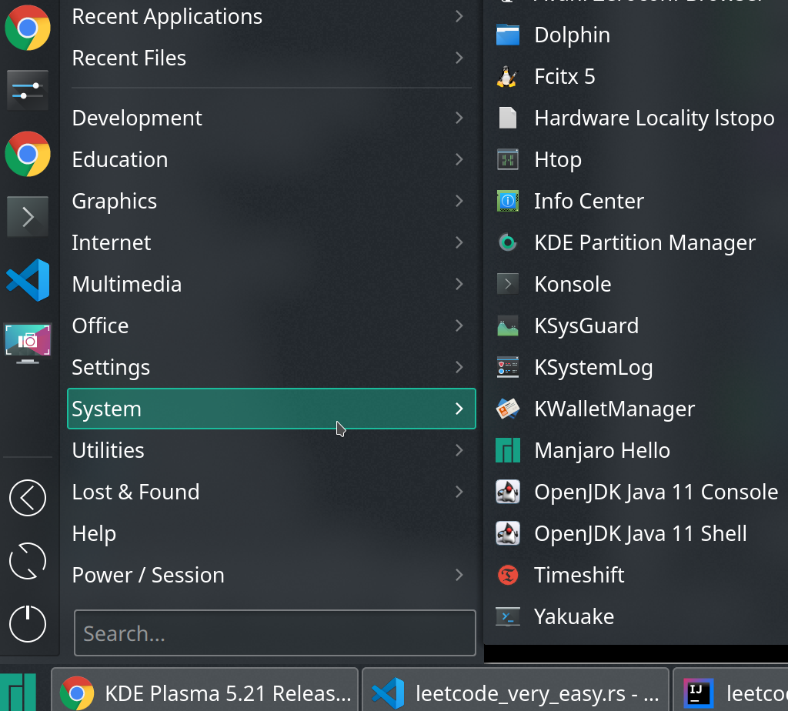

# [荣耀笔记本装linux](/2021/02/manjaro_kde_config.md)

## 为什么选择荣耀笔记本

苦于13年款的mac_air屏幕太小只有11寸，分辨率1368*768看的眼睛难受，而我之前买过的thinkpad因识别不到电池开不了机，surface_pro因未知原因变砖开不了机也进不了BIOS

作为重度电脑使用者，打算换台高端点的旗舰级，用过那么多笔记本后我对笔记本的要求还是挺高的，

最初只有20款苹果M1的air和戴尔XPS能被我看上，但这两款想要16G内存的配置价格得上万，

于是我转而考虑性价比很高的小米笔记本，知乎网友提醒同价位还有联想小新和华为/荣耀的旗舰机。

有朋友说等21年苹果M1芯片的mbp 16寸机出了他就买，正好我也嫌弃11寸的air屏幕太小，我定下了我第一条选购标准——16寸大屏幕

符合16寸+屏幕的就似乎只剩荣耀的magicbook pro 2020款(以下简称荣耀本)，看了下演示为了实现超窄边全面屏，摄像头做成升降式，我喜欢。

而且喇叭面积占键盘区域的1/4，大音量+立体声+音质好，这屏幕+喇叭的组合一下子打动了我——就华为(荣耀)笔记本了

以我用过的电脑来看苹果质量是最好的，13年买的用了8年还不坏，没用过华为系的电脑，所以我抱着试试水的心态买了最便宜的r5芯片型号

心想要是被荣耀本坑了，也损失不大，挂闲鱼卖掉再买mac_air。后来荣耀本的表现出乎我意料，真后悔没加700买更好的r7。

荣耀本的BIOS不支持MBR引导，所以将安装包ISO解压到FAT格式的U盘是不行的，推荐用etcher制作EFI格式的U盘引导

## xfce桌面尝试

听社区(Rust群)吹manjaro发行版好用，于是我下了manjaro下载页排第一位的xfce_minimal

装完后由于显卡驱动故障不能改亮度，而且重启或开机有概率直接黑屏，让我一度怀疑是引导的问题。

后来经网友提醒黑屏时按<var class="mark">CTRL+ALT+F2</var>可以进入cli/text模式，cli模式下发现xstart启动报错导致桌面没启动起来，而且触控板也没驱动

xfce的文件浏览器居然不支持new tab，都2021年了还跟windows那个file explorer一样不支持new tab

而且xfce的设置选项太少了(没有nightshift设置)，还不能搜索设置项，懒得修复驱动问题，直接重装KDE算了!

于是我装了`manjaro-kde-20.2.1-210103-linux59.iso`

---

## KDE显示与驱动

### 屏幕亮度调节

一共有三种主动调亮度的方法

1. 任务栏右下角的battery_and_brightness图标
1. 笔记本功能键
2. 改文件/sys/class/backlight/xxx/brightness   

如果长时间不操作，KDE默认会降低屏幕亮度，类似win10进入待机前会降低屏幕亮度几秒

但是KDE并不会像win10动动鼠标恢复原亮度，KDE待机时屏幕变暗后就不会变回来

建议关掉待机让屏幕变暗的相关设置

### 屏幕色温nightshift

nightshfit(色温)在display_and_monitor里，

### dark theme

1. Appearance->Theme改成BreeezeDark
2. application_style->configure_gtk...->Adwaita-dark

### 高分屏缩放

win10的建议是1080P屏幕用125%的缩放，mac的建议是4k屏用200%的缩放

4k@60Hz屏适合将scale(devicePixelRatio)设为200%



### KDE任务栏配置

右键任务栏或开始菜单选择alternative即可更换组件，也可以右键任务栏edit panel去掉无用的trash等widget

我更换默认的开始菜单和任务栏后，把开始菜单+任务栏从像win10改成像win7



### 摄像头/指纹锁驱动检查

荣耀本的埋藏式摄像头可以用VLC打开，前置摄像头能正常工作

指纹锁(Fingerprint)的话只有win10和Ubuntu系统才有相关设置，我暂时不想用第三方的，

等KDE的5.21版内置了指纹锁的设置菜单(现在manjaro用的还是5.20)再测试下

## 常用软件安装

vscode微软官方的cmake+c/c++插件很棒，go插件应付go开发，ra应对Rust开发，基本vscode一个就够了

我还装了qt_creator应对qt开发和idea想体验下Intellij-Rust

### 安装C/C++工具链

建议先更新glibc，否则gcc安装后会提示glibc版本太低，但是更新glibc会同时更新gtk,KDE等，可能在安装KDE的更新时图形界面会没掉然后黑屏，切换到cli模式再sudo reboot即可

```
# sudo pacman -Su glibc # 更新glibc，建议先用pacman更新所有软件(会自动更新glibc)

# 由于vscode上Rust的codelldb单步调试插件依赖clang生态的lldb，所以要把clang也装了
# openssl的动态链接库在archlinux一般都自带了，无需额外安装
sudo pacman -S base-devel cmake clang gdb # 安装gcc/g++, binutils, pkgconf等build_tools
```

gcc和llvm是两个比较常用的编译器后端，例如clang就是llvm C++的前端

gcc可以通过输入的文件后缀名区分用哪一个编程语言的前端，所以gcc可以同时编译C和汇编

gccrs项目就希望开发一个gcc的Rust前端，可以把Rust代码通过gcc后端进行编译

本身Rust也提供了rust-gdb和rust-lldb工具兼顾gcc和llvm

### C/C++工具生态

QA: cargo fmt alternative in C/C++: ???

- 构建工具: cmake
- 包管理工具: pacman:)
- 静态分析/lint: cppcheck, clang的clang-tidy和clazy-standalone
- 堆内存泄漏检查工具: valgrind(也能用来分析Rust应用)
- C/C++解释器: root/cling

### pacman的rustup

pacman安装的rustup的一个好处是可以不把`~/.cargo/bin`加到PATH环境变量中(只要没用cargo audit等第三方cargo子命令或可执行文件)

另外一个好处则是隔离了rust自带的可执行文件和自己装第三方可执行文件，如果没cargo install其它可执行文件，不需要把`~/.cargo/bin`加到PATH中

> _binlinks=('cargo' 'rustc' 'rustdoc' 'rust-gdb' 'rust-lldb' 'rls' 'rustfmt' 'cargo-fmt' 'cargo-clippy' 'clippy-driver' 'cargo-miri')

如果用rustup装，cargo-fmt和cargo-audit混在了`~/.carbo/bin`一个文件夹内

pacman装的/usr/bin/rustc等可执行文件其实是个/usr/bin/rustup的软链接，

pacman的rustup会将`/usr/bin/rustc`转换为`rustup run nightly rustc`去执行

ra等工具链的安装和配置请看我另一篇文章: [vscode配置Rust环境](/archive/vscode/vscode_setup_rust.md)

---

我项目里数据库主要用mongodb和redis，照着mongodb的arch wiki教程装完后改下systemd配置文件的ExecStart即可启动

至于docker安装可以参考 <https://github.com/vkill/Archlinux/blob/master/Docker.md>

### MySQL安装

```bash
sudo pacman -S mysql
sudo mariadb-install-db --user=mysql --basedir=/usr --datadir=/var/lib/mysql
sudo systemctl start mysqld
sudo mysql -uroot -p

mysql> CREATE USER 'me'@'localhost' IDENTIFIED BY 'me';
mysql> GRANT ALL PRIVILEGES ON mydb.* TO 'me'@'localhost';
mysql> FLUSH PRIVILEGES;
mysql> quit

mysql -ume -pme
mysql> select current_user();
mysql> show databases;
```

### java版本切换

安装完idea后就自动会装上jdk11，可以通过`archlinux-jshell status`管理多个java版本

Ubuntu则通过`update-java-alternatives`工具管理多个java版本

### proxy代理工具

详见我另一篇文章: [manjaro KDE proxy setting](/2021/04/manjaro_kde_proxy.md)

### 安装chrome

```
sudo pacman -S fakeroot # 构建chrome或大部分aur包所需工具
sudo pacman -S yay # 用类似的aur_helper工具yaourt也行
yay -S google-chrome
```

通过`yay -Ql google-chrome`得知chrome安装到了`/opt/google/chrome/`，而pacman的包一般都安装在`/usr/share`

### 输入法安装

请看我另一篇文章: [manjaro/KDE安装小鹤双拼](/2021/02/manjaro_linux_fcitx5_xiaohe_shuangpin.md)

### 安装微信

首先需要安装以下字体避免微信中的中文字体乱码(adobe思源黑体不能解决乱码问题)

> sudo pacman -S wqy-microhei wqy-zenhei

(建议把微软字体`ttf-ms-fonts`也装了)然后再安装deepin包装过的wine套壳微信

> yay -S deepin-wine-wechat

wine应用在高分屏(4k屏)下没有缩放，会显得非常小，以下命令可以打开wine设置

> WINEPREFIX=~/.deepinwine/Deepin-WeChat/ winecfg

将显示字体DPI从96改成192(就是整体放大两倍)，微信UI和字体都会变大2倍

### 办公/教学/演示软件安装

- dingtalk(eletron版)
- screenkey(按键输入回显，用于录制教学视频或演示)
- obs-studio(主要用于屏幕录制)
- peek(录屏gif格式，类似licecap)
- sunloginclient(远程桌面、远程控制)

TODO linux上似乎没有好用的腾讯会议(能屏幕共享，能用麦克风摄像头)

### 安装smb server

smb协议是一种跨平台文件共享协议(win/mac都内置)，由于linux自带那个ftpd不知道怎么用，看教程安装的vsftpd也启动失败

安装smb的过程可以看我另一篇文章: [win/mac/linux共享文件夹](/2020/04/win_mac_linux_share_files.md)

### 卸载无用的系统自带

- Steam(linux工作机不装游戏)
- firefox(用chrome就够了)
- cantata(音乐播放器，功能与VLC重复)
- k3b(都2021年了谁还用光驱啊)
- kget(用浏览器下载文件就够了，不需要下载工具)
- thunderbrid(工作不用邮件，不需要邮件客户端)
- hp device manager(没有打印机)
- manjaro-hello
- konversation(没用过Internet Relay Chat)
- qbittorrent(好久没用BT下载海盗湾的盗版电影了)
- manjaro-documentation-en(manjaro user guide)

卸载steam后需要清理以下残留文件

> rm -rf .steam .steampath .steampid ~/.local/share/Steam

### linux应用推荐

task_manager/todo_list: gnome-todo(虽不如mac的todo,但还算凑合)
C++ develop: cppcheck, root, qtcreator, kdevelop
教学演示工具: screenkey

---

## 系统设置

### 自动记住Wifi密码

system_settings->network->connections->wifi_security_tab->storage_password_for_all_users

### terminal(kconsole)

取消行数上限: profile->edit->scrolling->unlimit

如果鼠标往上滚动时，terminal不会翻页，输入`reset`重置下就好了

### ~/.bashrc

```
# unlimit bash history
HISTSIZE= 
HISTFILESIZE=
export PATH="$PATH:~/.cargo/bin"
alias caps="setxkbmap -option caps:backspace && xmodmap -e 'clear lock'" # enable caps continus bachspace
```

### git config

```
git config --global user.name "w"
git config --global user.email "w@example.com"
git config --global pull.rebase false
git config --global credential.helper store 
```

### ssh-agent配置

1. ssh-keygen
2. github账户的密钥管理中加上步骤1生成的公钥
3. (可选)ssh -T git@github.com # 检查步骤2是否成功

如果电脑重启过ssh-agent没启动起来，则执行以下操作   

1. eval `ssh-agent -s` # 一定要eval执行ssh-agent输出的几个修改环境变量的命令
2. ssh-add

然后就可以`ssh -A example.com`在云主机上使用开发机的github_ssh密钥进行pull/push私有仓库代码

### 右键菜单context_menu设置

dolphin's settings->services 中可以关闭部分context_menu的一级菜单，这部分配置在文件系统的:

> /usr/share/kservices5/ServiceMenus

右键菜单的create_new内新建各种libreoffice文件的配置文件在:

> /usr/share/templates

删掉或重命名那几个libreoffice相关的desktop文件就能在右键新建菜单中看不到了

### 文件管理器F5刷新

注意KDE(dolphin)并不会像mac/windows那样real-time刷新文件列表，如果找不到某个文件，可以按F5刷新

另外一个dolphin常用快捷键是<var class="mark">alt+.</var>可以开关隐藏文件的显示

顺便一提，类似windows任务管理器的应用叫system_monitor

### 全局emacs布局?

工作机从mac换成linux后最不习惯的是不能用Ctrl+F/B/P/N上下左右移动光标

自从玩英雄联盟的同事教会了我

往以下两个gtk/gnome应用的配置文件添加`gtk-key-theme-name="Emacs"`的配置项，如果应用支持emacs keymap就会优先选用emacs布局

- ~/.config/gtk-3.0/settings.ini
- ~/.gtkrc-2.0

### 去掉系统一些无用快捷键

screen_edge设置里鼠标移到右上角就显示show desktops这个没用

不需要cmd+L键锁屏(mac的chrome cmd+L是光标移到网址，总是误按)，用krunner输入lock the screen进行锁屏

### 启用spell check

详细过程看我另一篇文章: [解决 KDE spell check 报错](/2021/04/manjaro_kde_spell_check.md)

## idea配置

idea和pycharm这类有免费的社区版的软件用pacman安装即可，像CLion这样的就得AUR或者官网下载

由于我2年的mac开发习惯上90%的时间用idea，10%的时间用vscode，所以idea熟悉了macOS keymap实在改不了，只好把mac上idea的配置

linux下的idea首先要安装官方的mac_keymap插件才能导入mac的配置

然后就`Help->Edit Custom Properties`中加以下配置，允许以win键为modifier的快捷键

> keymap.windows.as.meta=true

我的经验是只备份一个idea的keymap和general(字体大小)的配置文件，然后所有jetbrains全家桶共同使用这一个按键配置

还是建议尽早适应emacs布局，mac布局cmd+鼠标左键还是不能跳到方法定义，得用super(meta)+b

## vscode别装OSS版本

不要装`code-OSS`那个包，会少emacs/remote_ssh等众多插件和配置(因为很多插件都是不开源的license)

要装`visual-studio-bin`这个包，不习惯Ctrl+f/b/n/p没法移动光标，所以我改成了emacs keymapping

## 千万不要 sudo reboot

一定要执行 sync 命令后再 sudo reboot

或者用 sudo shutdown -R，否则一旦内核更新但没装载到硬盘，一旦reboot图形界面就挂了

## Linux桌面快捷键

像`Alt+F2`和`Ctrl+Alt+F1`等等都是所有Linux桌面都有的快捷键

- alt+F2: 弹出搜索框，功能类似mac的spotlight_search
- ctrl+alt+F1/F2(注1): 似乎是切换recovery模式或启动模式的按键，对于桌面版Linux来说Ctrl+Alt+F1切换成图形界面，那么F2就是cli_mode/text_mode
- ctrl+alt+t: 新建terminal窗口

注1: manjaro/arch里text_mode和desktop_mode互相切换还是挺容易的，Ubuntu则稍微麻烦点

以下快捷键都是我在KDE桌面验证过的，未在Ubuntu/GNOME下试过的快捷键

- alt+space: 为了照顾mac用户的习惯，除了用alt+F2还能用跟mac同样的快捷键呼出krunner
- win+q: 切换activity(每个activity下面可以有多个workspace)
- Ctrl+F1: 切换到workspace1
- win+1: 切换到任务栏位置1的应用，跟windows的win+1快捷键功能一样
- alt+1: 同一个应用内切换到tab 1
- alt+`: 同一个应用内多个窗口间切换  
- win+tab: switch workspace
- win+w / F11: 全屏/撤销全屏(KDE/plasma的Meta键是win键的意思，在mac系统meta是alt)
- win + +/-: 放大镜，快捷键跟windows一样
- Ctrl+Esc: 打开system_activity，类似windows任务管理器
- F12: 开/关yakuake下拉式terminal
- alt+F1: 在开始菜单中搜索
- win+e: 开文件浏览器
- alt+.: 文件管理器开关隐藏文件的显示
- win+.: emoji picker
- Ctrl+; fcitx粘贴板，功能类似IDEA的cmd+shift+v，可以挑选最近几次复制内容进行粘贴
- (fn)F1/F2: 屏幕亮度
- (fn)F3: 键盘背光开关
