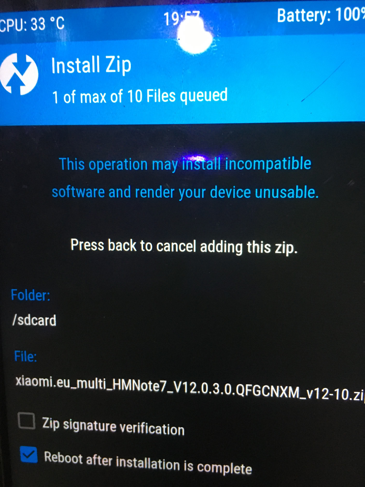
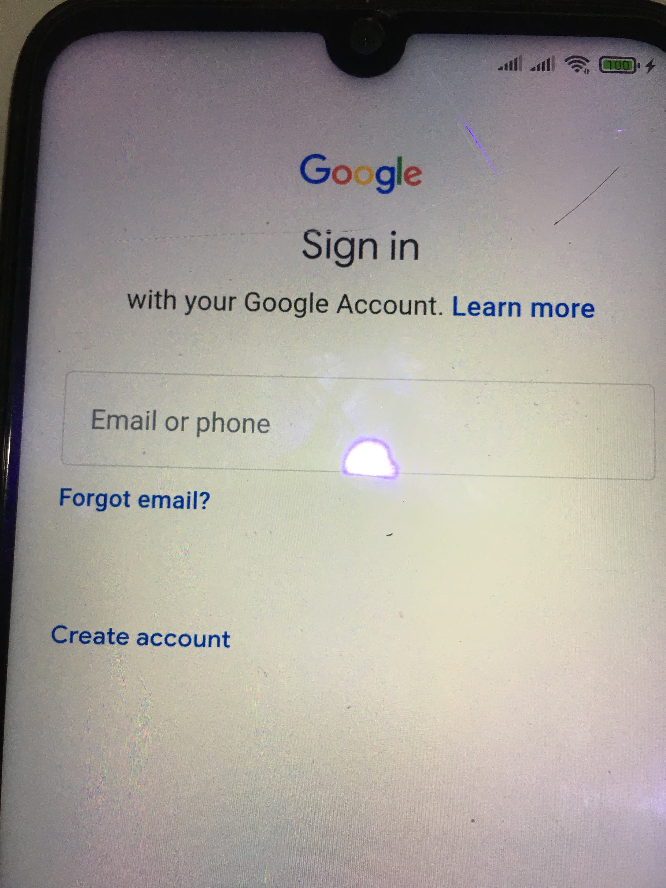
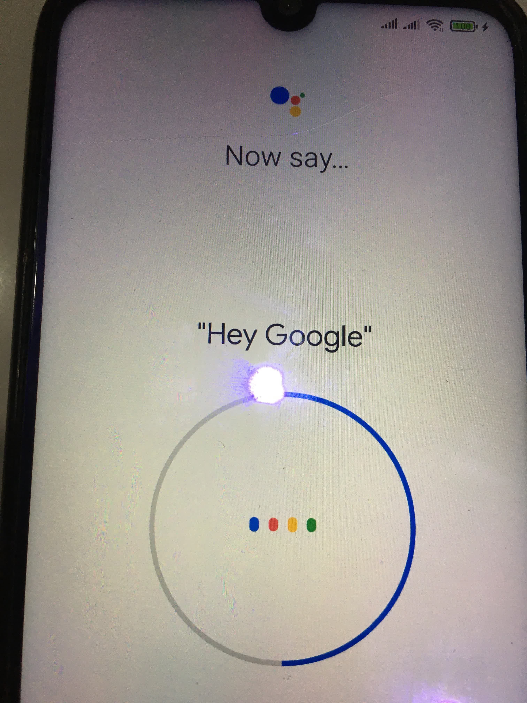
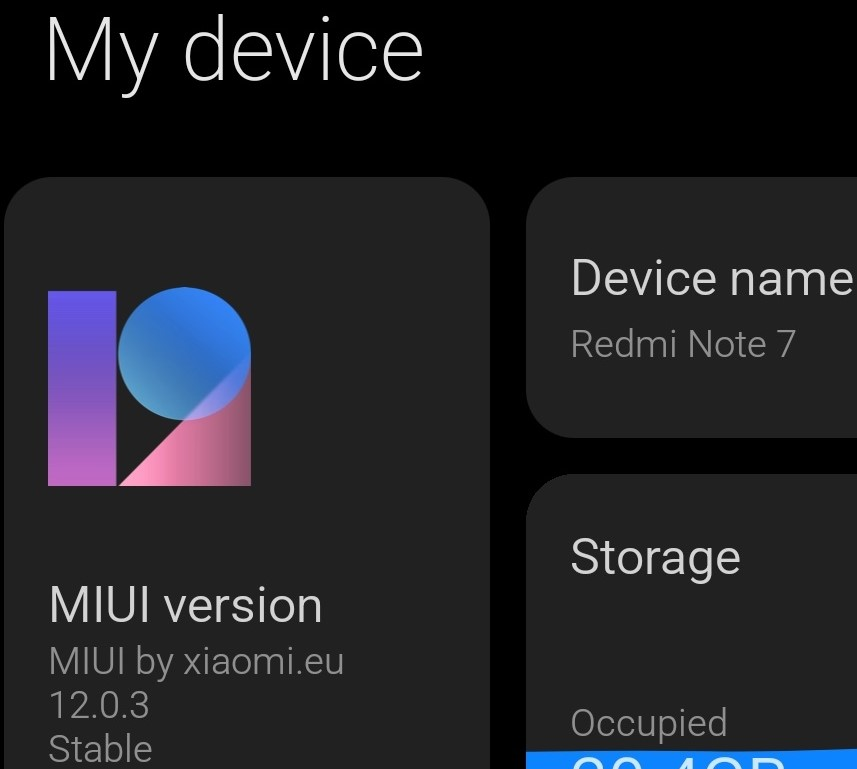

# [刷欧版MIUI教程](/2021/02/miui_eu.md)

由于刚出红米note7那会还没欧版ROM，我随便线刷个开发版以便root，但是最近开发板升级到MIUI12以后，Google服务框架就崩溃了，导致Google Play等应用闪退。

引用这个帖子中[谷歌全家桶无法运行，所有谷歌应用都停止运行](https://www.xiaomi.cn/post/24475920)
MIUI官方人员的回复:

> 对于系统没有预装GMS服务框架的机型，今后不再特殊支持用户自行安装GMS框架

> 小米是说性能好的机子装gms不容易影响续航和流畅度，所以旗舰预置

还是尽早换更干净更接近原生Android的欧版

## 第一步: 解锁bootloader

新买的手机我记得要登录小米账号满7天才能申请解锁

## 第二步: 安装twrp recovery

twrp recovery和解锁bootloader都是「一次性」的，如何手机之前做过则不需要重复做。

twrp是进行"卡刷"的界面，有备份、清除数据等功能，需要用Andoird SDK platform tools帮忙刷入。

为此我直接安装了一个Android Studio，提供了fastboot,adb等命令行工具

Android SDK准备好后，可以去twrp官网下载相应机型最新的.img后缀的文件，例如我是红米note7则下载twrp-3.5.0_9-0-lavender.img

然后一定要重命名为twrp.img再复制到platform-tools文件夹内

此时让手机「音量上+开机」进入fastboot模式，以下是我刷入twrp.img的命令行操作记录

```
C:\Users\w\AppData\Local\Android\Sdk\platform-tools>fastboot devices
9e1ecc67        fastboot

C:\Users\w\AppData\Local\Android\Sdk\platform-tools>fastboot flash twrp-3.5.0_9-0-lavender.img
unknown partition 'twrp-3.5.0_9-0-lavender.img'
fastboot: error: cannot determine image filename for 'twrp-3.5.0_9-0-lavender.img'

// 需要把下载好的recover_img重命名为twrp.img
C:\Users\w\AppData\Local\Android\Sdk\platform-tools>fastboot flash recovery twrp.img
Sending 'recovery' (32268 KB)                      OKAY [  0.782s]
Writing 'recovery'                                 OKAY [  1.057s]
Finished. Total time: 1.864s

C:\Users\w\AppData\Local\Android\Sdk\platform-tools>fastboot reboot
// reboot时一定要按住 电源+音量上 进入刚刚刷的twrp recovery
```

## 第三步: twrp内完成卡刷

首先要点wipe清除手机数据，然后手机就能被windows电脑识别成内部存储器，可以将xiaomi.eu上下载的zip包复制进去，

如果wipe后电脑识别不到手机，则需要在twrp的设置里启用mount



## (可选)跳过谷歌账号初始化

原生的安卓系统第一次开机需要登录谷歌账号，建议先拔掉手机卡(不让谷歌偷偷用流量)不连wifi，然后开机状态下

```
adb shell settings put secure user_setup_complete 1
adb shell settings put global device_provisioned 1
```

再次重启应该就能跳过google setup wizard

国人一般的科学上网方法都是下载某个VPN的client，安卓手机初始化要用透明代理的wifi(也就路由器科学上网)，门槛有点高，如果能进系统拷贝一个科学上网的apk登录谷歌倒不难。

## win10共享科学上网网络

我参考了ExpressVPN的这篇文章创建了一个临时的虚拟路由器科学上网网络，才解决的

[How to share a VPN connection from your Windows PC](https://www.expressvpn.com/support/vpn-setup/share-vpn-connection-windows/)

具体做法是Win10先开HotSpot，再连ExpressVPN，然后在网络适配器大可`ExpressVPN tap adapter`的属性，然后共享给`本地连接2`(也就是个人热点/hotspot的网络)

然后就能拥有一个可科学上网的wifi让安卓手机得以完成谷歌初始化





---



参考文章: https://www.unvone.com/70104.html
