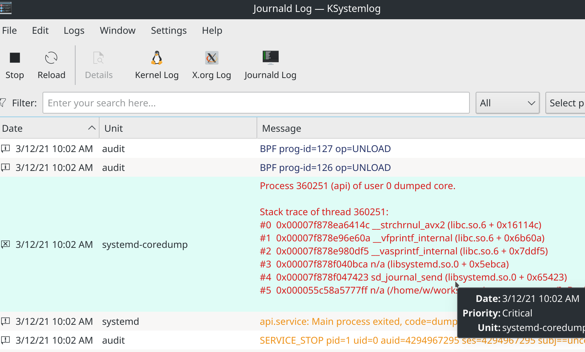

# [systemd API段错误](/2021/03/libsystemd_segfault.md)

在我[上一篇systemd的文章](/2020/11/systemd.md)讲解了用systemd部署和管理Rust项目，

这篇文章主要讲如何改进Rust的logger并将Rust的日志级别映射成systemd-journal的日志级别

本文重点讲述我在调试systemd API时遇到了两个错误，一个是字符串内存地址错误，另一个是段错误(segfault)

由于项目中的log_level是运行时读取配置文件或环境变量获取，一旦更改日至等级还得重启项目进程

而且无论打到stdout或是stderr都是journal的INFO级别，没法通过强大的journal工具筛选日志

于是我看完了systemd crate的journal部分源码，

得知通过`libsystemd.so`的`sd_journal_sendv`函数可以自定义journal的日志等级，

不过这个日志等级不叫`LogLevel`而是叫`PRIORITY`

rust-systemd库提供了类似KDE的`KSystemLog`工具查看所有unit的日志，不过功能和易用性远不如KSystemLog

于是运行systemd库的几个example,通过KSystemLog校验输出发现确实打印出了各种等级的日志

## sd_journal_print

我网上看到一篇很不错的[sd-journal.h的教程文章](http://0pointer.de/blog/projects/journal-submit.html)

```c
#include <systemd/sd-journal.h>

int main() {
    sd_journal_print(LOG_NOTICE, "Hello World");
    return 0;
}
```

试着用sd_journal系列最简单的API, `sd_journal_print`

用法非常简单，第一个参数是i32类型的日志级别，第二个参数是字符串CStr

## pkgconf链接systemd

最简单的编译方法是通过-l动态链接systemd库 `gcc -lsystemd main.c`

也可以使用pkgconf工具: 

> gcc `pkg-config --cflags --libs libsystemd` main.c

或

> gcc `pkgconf --cflags --libs libsystemd` main.c

其实pkg-config是pkgconf的软链接，这两是一样的

```
$ file /usr/bin/pkg-config 
/usr/bin/pkg-config: symbolic link to pkgconf
```

## journal_print的水土不服

用C语言调用`sd_journal_print`时会发现会把C语言的宏信息__FILE__, __FUNC__, __LINE__等信息也记录下来

对C语言来说自动记录下这些信息太棒了，而对Rust来说并没有C这样的__FUNC__宏，而且对日志的行号、文件名等信息的记录，

Rust是通过log::Record的结构体去记录，所以最佳实践是Rust将行号文件名的信息合并到log message的字符串中

然后只向sd_journal API发送日志级别和日志消息的字符串，多发送其它信息是没有意义的

在我manajro系统电脑上，Rust调用sd_journal_print会把文件名绝对路径追加到log message后面，在我看来这就有点"UB"了

要想去掉强行加上去的文件名，Rust就只能调用`sd_journal_send`和`sd_journal_sendv`

## ★as_str导致sendv调用失败

首先要在build.rs中加上一行(默认只会链接glibc这个C语言的dylib)

> println!("cargo:rustc-link-lib=dylib=systemd");

```rust
use std::os::raw::{c_int, c_void};

#[link(name="systemd", kind="dylib")]
extern "C" {
    fn sd_journal_sendv(iov: *const iovec, n: c_int) -> c_int;
}

#[repr(C)]
struct iovec {
    iov_base: *const c_void,
    iov_len: usize
}

impl From<&str> for iovec {
    fn from(s: &str) -> Self {
        Self {
            iov_base: s.as_ptr() as *const c_void,
            iov_len: s.len()
        }
    }
}

#[test]
fn test_sd_journal_sendv() {
    let priority_iovec: iovec = "PRIORITY=3".into();
    // 错误写法: `format!("").as_str().into()` 或 `"MESSAGE=log1".to_string().as_str().into()`
    // 错误写法不能正确得到字符串地址
    // 正确写法: let msg_iovec: iovec = "MESSAGE=log1".into();
    let msg_iovec: iovec = format!("MESSAGE={}", "log1").as_str().into();
    let iovecs = vec![priority_iovec, msg_iovec];

    let ret: Vec<iovec> = vec!["PRIORITY=3", "MESSAGE=log2", "UNIT=api"].into_iter().map(|x| x.into()).collect();
    unsafe {
        sd_journal_sendv(iovecs.as_ptr(), iovecs.len() as c_int);
        sd_journal_sendv(ret.as_ptr(), ret.len() as c_int);
    }
}
```

这就遇到我知识盲区了，String::as_str().as_ptr() as *const c_void 之后再传给C语言systemd那边就无法解析到字符串内存地址？？？

我看rust-systemd源码中也没有用as_str()而是用AsRef将String转&str

## ★send segfault段错误

我不太喜欢sd_journal_sendv这个方法需要将字符串指针转成不透明指针void *，于是发现了更便利的sd_journal_send

根据[journal-fields的文档](https://man7.org/linux/man-pages/man7/systemd.journal-fields.7.html)

以下划线开头的field都是私有属性，例如`__SYSTEMD_UNIT`

也就是说并不能指定unit_name，输出日志时unit_name会根据 systemd进程的unit_name>可执行文件的文件名>进程名 等优先级

来决定最终日志的unit是什么，我们只需要传入PRIORITY和MESSAGE两个字段

虽然`sd_journal_send`方法的入参是个va_list(类似python函数的*args任意数量的参数)

也就像printf()函数那样可以传入任意数量的参数，Rust也有va_list也就是三个点来binding C语言的va_list

但是也可以用`(priority: *const c_char, message: *const c_char)`这样两个字符串入参去绑定函数的prototype

```rust
#[link(name = "systemd", kind="dylib")]
extern "C" {
    //fn sd_journal_send(format: *const c_char, ...);
    fn sd_journal_send(priority: *const c_char, message: *const c_char) -> c_int;
}

#[test]
fn test_sd_journal_send() {
    unsafe {
        sd_journal_send(
            "PRIORITY=4\0".as_ptr() as *const c_char,
            "MESSAGE=hello\0".as_ptr() as *const c_char,
        );
    }
}
```

文档中说了字符串要加terminator,也就是CStr,C语言的字符串要以'\0'结尾

上面这代码正常情况都能运行(偶尔也会segfault段错误)，但是一旦做成systemd的service后去运行就直接报错



完了我又不会用lldb/rust-lldb等工具链去debug可执行文件的segfault(检查调用栈之类)

心急之下只能看看别人C语言的文章介绍，看看C语言那边是怎么用`sd_journal_send`的

我再次阅读: [sd-journal.h的教程文章](http://0pointer.de/blog/projects/journal-submit.html)

发现别人调用sd_journal_send时最后一个参数是<var class="mark">NULL<var>

所以Rust的调用部分代码改成以下格式果然可以正常运行

```rust
sd_journal_send(
    "PRIORITY=4\0".as_ptr() as *const c_char,
    "MESSAGE=hello\0".as_ptr() as *const c_char,
    std::ptr::null() as *const c_char
);
```

再仔细读一下文档:

> It takes a series of format strings, each immediately followed by their associated parameters, terminated by NULL

文档还特意高亮了NULL，看来我英文理解错误了，首先提醒了`a series of`，最后这句`terminated by NULL`要结合上下文的`a series of`去理解

所以这个NULL指的是最后一个参数是NULL作为终止提示。其次C语言的文档不会像Rust那样提示CStr一定要以'\0'结尾

## 完整版logger代码

https://github.com/pymongo/logger

## journal限制日志大小

虽然journal会自动对日志进行分卷压缩(logrotate)，但是过于久远的日志其实就没什么用了

我曾看过这样的帖子: [有人在生产环境, 使用 systemd 下的 journal 日志管理工具么?](https://v2ex.com/t/734086)

有人说线上看日志时，默认是用vim从头看，然后不小心按了G跳转到最后一行的指令，由于日志超过20G而且行数特别多

直接导致云主机卡死而且CPU内存负载爆涨！

有人评论说可以用journal-remote找非生产环境的空闲机器去看日志

但我觉得最佳方法还是得限制每个systemd unit的日志大小，例如超过10G就自动删掉旧的日志

```
$ sudo emacs /etc/systemd/journald.conf

SystemMaxUse=10G
SystemKeepFree=20G

$ sudo systemctl restart systemd-journald
```

## journal-remote

> systemctl status systemd-journal-remote

看上去值得一试，KSystemlog软件也有添加remote journals的按钮

我本地的manjaro系统预装了systemd-journal-remote，测试服务器的centos并没有装journal-remote，故放弃