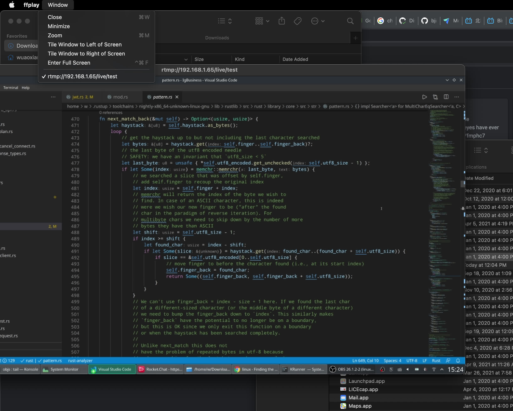

# [compile nginx-rtmp](/2021/04/compile_nginx_rtmp_source.md)

由于2021/04/24的成都Rust meetup有直播需要，rustcc社区以往的meetup的直播+录播解决方案都是 腾讯会议同步直播到b站

我分享的主题需要用我自己的linux系统的电脑进行live coding，但是linux系统既没有腾讯会议也没b站直播客户端

所以我就提出让专业的导播用一台windows电脑去切镜头，还是继续用腾讯会议+b站同步推流，导播自己可以切画面

用mac的嘉宾分享时画面切给嘉宾，只有我用linux分享时再使用其他屏幕共享技术将画面共享到导播的windows系统直播机器

后来 Mike 说会场用两台电脑，一台接摄像头，另一台放嘉宾演讲的 ppt，这两台都接入Mike发起的腾讯会议，Mike在重庆远程进行导播和切画面

由于我要做live coding但linux无腾讯会议客户端，只能让会场的接入会议的mac直播机开ffmpeg放我rtmp推流的画面

由于试了几个跨平台的屏幕共享方案可行性都不太理想:

- microsoft的remote_desktop_protocol mac上看freerdp可能会黑屏，而且不能设置成仅共享屏幕
- x11vnc, tigervnc 等 vnc 方案配置过于复杂，而且一运行就容易报错
- teamviewer/zoom付费，不能像obs推流那样设置超高画质

最后还是我曾经用过 nginx-rtmp 可行

---

OBS官方有nginx-rtmp的教程: <https://obsproject.com/forum/resources/how-to-set-up-your-own-private-rtmp-server-using-nginx.50/>

但是这个教程是5-6年前的，有些问题，需要自己改动

首先 nginx-rtmp 不是nginx自带的模块/插件，需要把nginx和nginx-rtmp的源码一起编译生成的nginx可执行文件才能启用rtmp服务器的配置

构建两个项目所需的`libpcre3.so`指的是perl common regular expression，我的manjaro装了那么多软件应该是装过这个包的

> $ wget https://github.com/sergey-dryabzhinsky/nginx-rtmp-module/archive/dev.zip

这个 wget 获取nginx-rtmp源码的压缩包是会404的，github好像改过导致`/archive`这样获取不到源码的压缩包

导致`brew install rbenv`或aur的processing包因为github 404的问题而无法安装

那没办法了，只能git clone源码，然后在nginx源码构建时的`--add-module=`参数时改成clone下来的文件夹名字

```
$ tar -zxvf nginx-1.15.1.tar.gz
$ cd nginx-1.15.1
$ ./configure --with-http_ssl_module --add-module=../nginx-rtmp-module
$ make build
```

由于我就在会场偶尔用用，所以不需要把nginx可执行文件装到/usr/bin

有了 nginx 可执行文件后要创建 nginx 的日志和配置文件

在`/usr/local/nginx/`目录下创建以下文件

```
├── conf
│   └── nginx.conf
└── logs
    └── error.log
```

logs下的nginx.pid和access.log会在nginx启动时创建，nginx.pid文件用于找到正在运行中的nginx进程PID,方便进行reload配置文件的操作

然后`nginx.conf`的内容如下

```
events {}
rtmp {
    server {
        listen 1935;
        chunk_size 4096;
        application live {
            live on;
            record off;
        }
    }
}
```

`sudo ./nginx` 启动 nginx 即可，配置文件有变动就 `sudo ./nginx -s stop` 然后再启动

## OBS 推流设置

首先 stream_server_url 肯定是: <rtmp://localhost:1935/live>

然后 stream_key 就类似直播的「房间号」

例如 stream_key 设置成 `room1`，我们就从 VLC Player 或 ffmpeg的 ffplay 打开以下链接:

> rtmp://localhost:1935/live/room1

如果推流密钥设置成 `room2` 只需要将上述的 `room1` 改成 `room2`

这是在 mac 电脑上看我 manjaro 开的 rtmp 屏幕共享的效果演示图:



## alternative for nginx-rtmp

国人用Rust写的一个rtmp服务器，但使用体验一般，可靠性不好，容易掉线: <https://github.com/harlanc/xiu>
