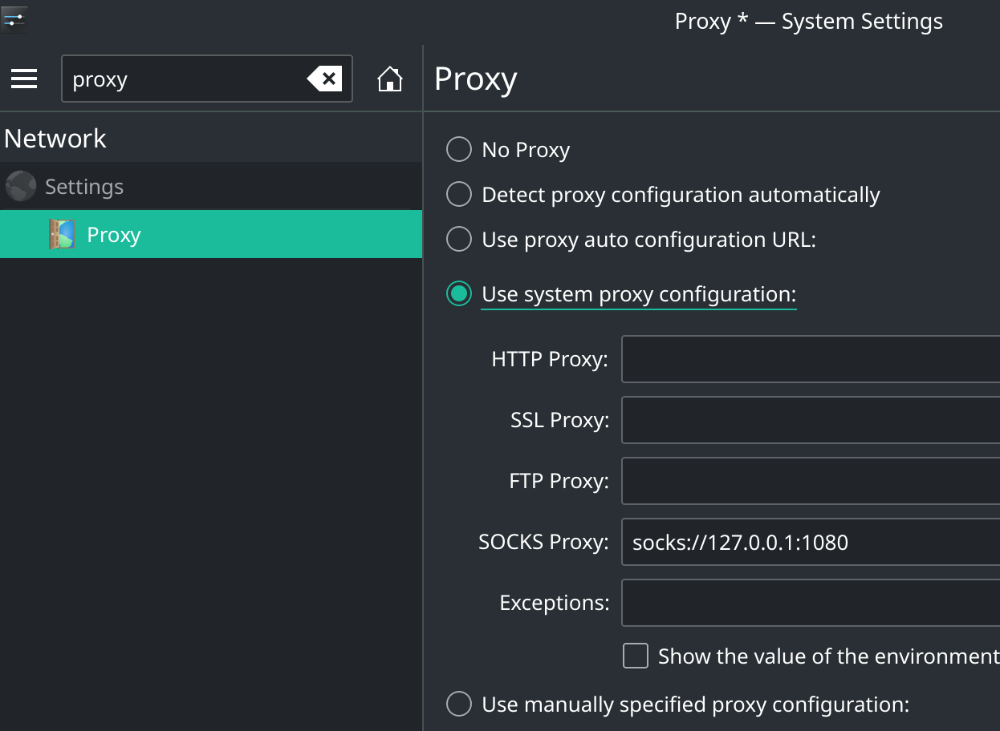
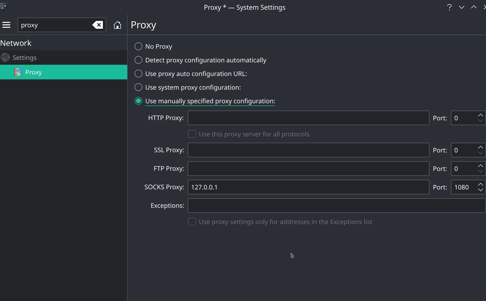

# [manjaro KDE proxy setting](/2021/04/manjaro_kde_proxy.md)

TODO KDE怎么把VPN共享到wifi热点，好让android_setup_wizard时可以走代理连谷歌

有空可以参考下这篇文章: [Sharing VPN connection on Linux](https://kamranzafar.org/2012/08/16/sharing-vpn-connection-on-linux/)

## expressvpn`

expressvpn用的openVPN协议，默认就是「全局代理」，系统设置成**no_proxy**就行了

## trojan/ss/ssr

### archlinux trojan

systemd那个trojan service无法打开配置文件就很奇怪，所以只能手动`trojan config.json`或自己写个systemd的user service去管理trojan进程

```
Apr 08 13:10:58 trojan[721649]: [2021-04-08 13:10:58] [FATAL] fatal: /etc/trojan/config.json: cannot open file
Apr 08 13:10:58 trojan[721649]: [2021-04-08 13:10:58] [FATAL] exiting. . .
Apr 08 13:10:58 systemd[1]: trojan.service: Main process exited, code=exited, status=1/FAILURE
Apr 08 13:10:58 systemd[1]: trojan.service: Failed with result 'exit-code'.
```

### chrome使用trojan代理

系统设置的proxy设置，选用 use_system_proxy 或 use_manually_specified_proxy 都能让trojan在chrome上生效，如图





### terminal使用trojan代理

在需要走代理的命令前面加上`ALL_PROXY=socks5://127.0.0.1:1080`就行了

或者加上 `socks_proxy=127.0.0.1:1080`

如下所示(IP地址已打码)，加上代理后curl能访问ifconfig.me，但是不加代理直到10秒TIMEOUT都连不上ifconfig.me

```
[w@w-manjaro temp]$ ALL_PROXY=socks5://127.0.0.1:1080 curl --max-time 10 ifconfig.me
**.**.**.**[w@w-manjaro temp]$ curl --max-time 10 ifconfig.me
curl: (28) Connection timed out after 10001 milliseconds
```
