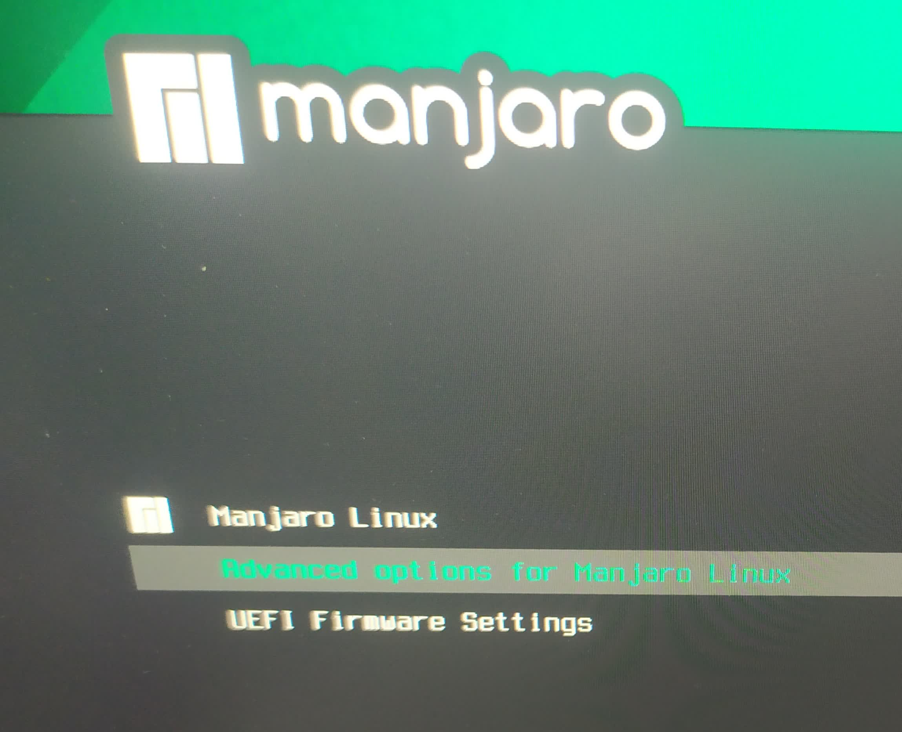
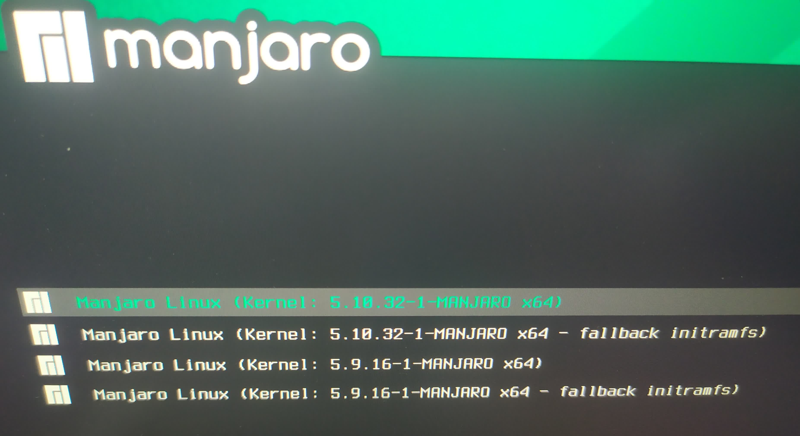

# [manjaro 切换内核](/2021/04/manjaro_kde_switch_kernel.md)

自从 2021-04-29 manjaro 推送更新后，每次开机 manjaro 都发一个 Notification 提示我 kernel 版本过低

再看看 manjaro 官网下载链接都变成 manjaro-kde-21.0.3-210428-linux510.iso

果断升级 kernel 了！希望能缓解下编译代码时 CPU/内存高负载导致图形桌面卡死

## manjaro 滚动式更新

所谓「滚动式」更新就是所有软件包都用最新的版本，但是只会更新当前 kernel 小版本的更新

例如 5.10.1 升级成 5.10.2 但不会升级成 5.11，kernel 跨大版本还需自己手动更新

## 安装最新的 LTS kernel

去 <kernel.org> 上能找到最新 kernel 的版本

在 Kernel - System Settings 的 UI 界面内将 5.10 的内核装上(记得一定不能删running的kernel)

```
sudo cp /etc/default/grub /etc/default/grub.bak # backup default config
sudo nano /etc/default/grub # 注释掉GRUB_TIMEOUT_STYLE=hidden
sudo update-grub # grub reload config
```

注释掉 grub 配置文件的 GRUB_TIMEOUT_STYLE=hidden 才能在启动时显示 grub 菜单

grub配置修改重启后会在以下grub菜单内停留几秒，选择 `Advanced Options for Manjaro Linux`



然后grub会进入一个选择kernel版本的界面:

!> 注意不要选 `fallback initramfs` 后缀的内核，这个是用于回滚用的



最后 kernel 更新完后，grub的默认设置会记住上次选择的kernel,删掉老的kernel再将grub改回默认设置就行了
