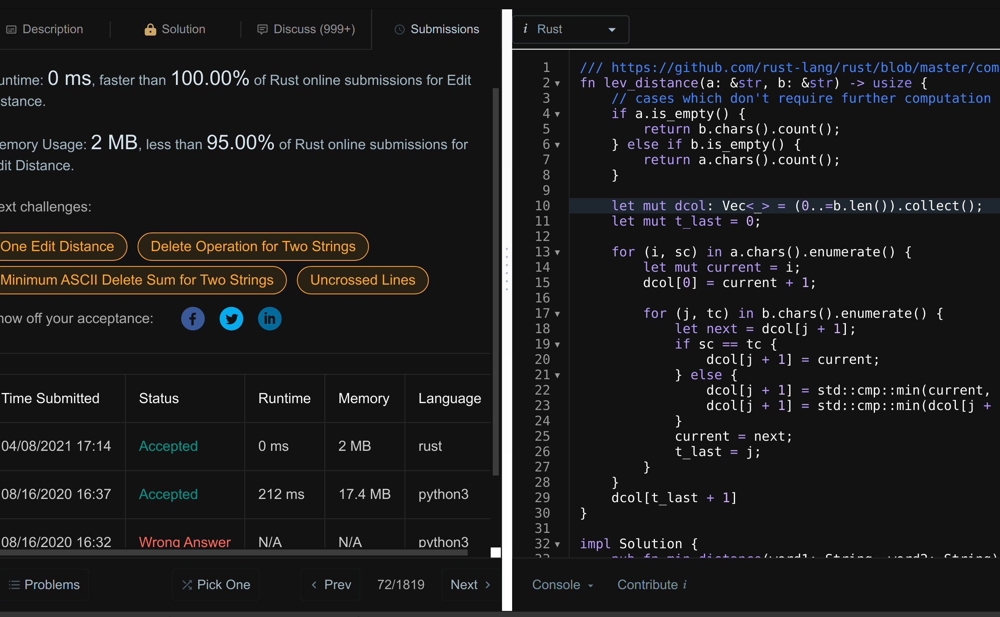

# []()

<!--
文章标题方案:
- 用rustc源码竟然过了leetcode题
- 拼写错误的候选词推荐算法
-->

笔者最近在做一个聊天应用，想给聊天消息输入框加上拼写错误检查，毕竟 word, keynote 等涉及文本输入的软件都有拼写错误检查和纠错功能

于是想到开发中经常用的 rustup, cargo, rustc 不就内置了拼写错误时纠错建议的功能么?

在 rustup 输入错误的单词时例如`rustup dog`，此时 rustup 就会提示把`dog`改成`doc`

```
[w@w-manjaro ~]$ rustup dog
error: The subcommand 'dog' wasn't recognized
        Did you mean 'doc'?
```

## rustup 的拼写纠错建议的实现

以`Did you mean`的关键词全文搜索 rustup 源码，找到出处在`src/cli/error.rs`

```rust
fn maybe_suggest_toolchain(bad_name: &str) -> String {
    let bad_name = &bad_name.to_ascii_lowercase();
    static VALID_CHANNELS: &[&str] = &["stable", "beta", "nightly"];
    lazy_static! {
        static ref NUMBERED: Regex = Regex::new(r"^\d+\.\d+$").unwrap();
    }

    if NUMBERED.is_match(bad_name) {
        return format!(
            ". Toolchain numbers tend to have three parts, e.g. {}.0",
            bad_name
        );
    }

    // Suggest only for very small differences
    // High number can result in inaccurate suggestions for short queries e.g. `rls`
    const MAX_DISTANCE: usize = 3;

    let mut scored: Vec<_> = VALID_CHANNELS
        .iter()
        .filter_map(|s| {
            let distance = damerau_levenshtein(bad_name, s);
            if distance <= MAX_DISTANCE {
                Some((distance, s))
            } else {
                None
            }
        })
        .collect();
    scored.sort();
    if scored.is_empty() {
        String::new()
    } else {
        format!(". Did you mean '{}'?", scored[0].1)
    }
}
```

`damerau_levenshtein`其实就是描述两个字符串之间的差异，`damerau_levenshtein`距离越小则两个字符串越接近

该函数的将输入的错误单词跟正确的候选词挨个计算`damerau_levenshtein`距离，

最后排序下`damerau_levenshtein`距离输出最小的候选词

rustup的`damerau_levenshtein`来自 strsim 库，除了 rustup, darling 等知名库也导入了 strsim 库

查阅维基百科的`damerau_levenshtein`词条后发现`damerau_levenshtein`的同义词是`levenshtein_distance`和`edit_distance`

## 用 rustc 源码竟然过了算法题

edit_distance 是个动态规划算法中的一个经典问题，果然 [leetcode](https://leetcode-cn.com/problems/edit-distance/) 上有 edit_distance 的算法题

我拿 strsim 库的`damerau_levenshtein`去 leetcode 上提交能通过，但是运行耗时 4ms，不太理想

原因是 strsim 的 edit_distance 算法动态规划的空间复杂度是 O(n^2)

rustc 源码会尽量不用第三方库，所以我猜测 rustc 没有用 strsim 源码，那就看看 rustc 的实现会不会更好


在 Rust 的 github 仓库中搜索`edit distance`关键字能找到[这个 commit](https://github.com/rust-lang/rust/commit/93d01eb443d0f871716c9d7faa3b69dc49662663)

在`find_best_match_for_name`函数内调用了`lev_distance`函数去计算两个字符串



## edit_distance 算法

为了进一步验证带`rustc-ap`前缀的库是不是从 rustc 源码导出的，我们看看很可能用到部分 rustc 源码的 rust-analyzer

```
[w@w-manjaro rust-analyzer]$ grep -r --include="*.toml" "rustc-ap" .
./crates/syntax/Cargo.toml:rustc_lexer = { version = "714.0.0", package = "rustc-ap-rustc_lexer" }
```

果然发现 rust-analyzer 用到了`rustc-ap-rustc_lexer`这个库，毕竟 rust-analyzer 是做静态分析的，跟编译器的部分功能有点重合很正常

## 如何引用 rust 源码

> rustup component add rustc-dev
