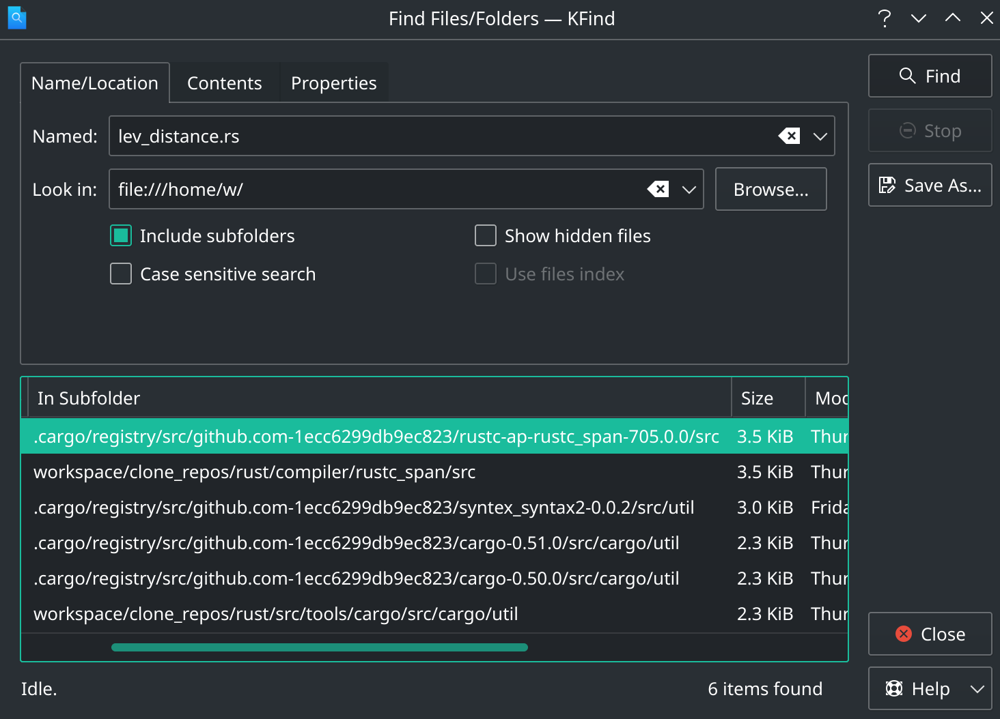

# [用 rustc 源码实现拼写错误候选词建议](/2021/04/rustc_edit_distance_and_typo_checker.md)

---
pub_date: Sat, 27 Mar 2021 16:00:00 GMT
description: Executable file under `no_std` environment

---

# 用 rustc 源码实现拼写错误候选词建议

作者: 吴翱翔@pymongo

> 原文: [用 rustc 源码实现拼写错误候选词建议](https://pymongo.github.io/#/2021/04/rustc_edit_distance_and_typo_checker.md)

最近想给一个聊天应用的聊天消息输入框加上拼写错误检查，毕竟 word, keynote 等涉及文本输入的软件都有拼写错误检查和纠错功能

于是想到开发中经常用的 rustup, cargo, rustc 不就内置了拼写错误时纠错建议的功能么?

在 rustup 输入错误的单词时例如 `rustup dog`，此时 rustup 就会提示把 `dog` 改成 `doc`

```
[w@w-manjaro ~]$ rustup dog
error: The subcommand 'dog' wasn't recognized
        Did you mean 'doc'?
```

## 字符串的编辑距离

### rustup 的拼写纠错建议的实现

以 `Did you mean` 的关键词全文搜索 rustup 源码，找到出处在 `src/cli/error.rs`

```rust
fn maybe_suggest_toolchain(bad_name: &str) -> String {
    let bad_name = &bad_name.to_ascii_lowercase();
    static VALID_CHANNELS: &[&str] = &["stable", "beta", "nightly"];
    lazy_static! {
        static ref NUMBERED: Regex = Regex::new(r"^\d+\.\d+$").unwrap();
    }

    if NUMBERED.is_match(bad_name) {
        return format!(
            ". Toolchain numbers tend to have three parts, e.g. {}.0",
            bad_name
        );
    }

    // Suggest only for very small differences
    // High number can result in inaccurate suggestions for short queries e.g. `rls`
    const MAX_DISTANCE: usize = 3;

    let mut scored: Vec<_> = VALID_CHANNELS
        .iter()
        .filter_map(|s| {
            let distance = damerau_levenshtein(bad_name, s);
            if distance <= MAX_DISTANCE {
                Some((distance, s))
            } else {
                None
            }
        })
        .collect();
    scored.sort();
    if scored.is_empty() {
        String::new()
    } else {
        format!(". Did you mean '{}'?", scored[0].1)
    }
}
```

`damerau_levenshtein` 其实就是描述两个字符串之间的差异，`damerau_levenshtein` 距离越小则两个字符串越接近

该函数的将输入的错误单词跟正确的候选词挨个计算 `damerau_levenshtein` 距离，

最后排序下 `damerau_levenshtein` 距离输出最小的候选词

rustup的 `damerau_levenshtein` 来自 ***strsim*** 库，除了 rustup, darling 等知名库也导入了 strsim 库

查阅维基百科的 `damerau_levenshtein` 词条后发现 `damerau_levenshtein` 的同义词是 `levenshtein_distance` 和 `edit_distance`

### 用 rustc 源码竟然过了算法题

rustc 源码会尽量不用第三方库，所以我猜测 rustc 不会像 rustup 那样用 strsim 源码，那就看看 rustc 的实现会不会更好

在 Rust 的 github 仓库中搜索`edit distance`关键字能找到[Make the maximum edit distance of typo suggestions](https://github.com/rust-lang/rust/commit/93d01eb443d0f871716c9d7faa3b69dc49662663) 的 commit

顺着这个 commit 的改动在 `find_best_match_for_name` 函数内调用了 `lev_distance` 函数去计算两个字符串的编辑距离

edit_distance 是个动态规划算法或字符串算法的经典问题，果然 leetcode 上有 [edit_distance 的算法题](https://leetcode.com/problems/edit-distance/)

我拿 rustc 源码的 lev_distance 函数在 leetcode上通过 edit_distance 一题


用 strsim 的相关函数也能通过编辑距离这题，但是运行耗时 4ms 会比 rustc 源码运行耗时 0ms 慢点

原因是 strsim 的 edit_distance 算法动态规划的空间复杂度是 O(n^2)，而 rustc 的实现空间复杂度是 O(n)

### edit_distance 算法

从 rustc 源码的 lev_distance 函数签名 `fn lev_distance(a: &str, b: &str) -> usize` 来看

输入的是两个字符串 a 和 b, 返回值表示 a 和 b 的 edit_distance

edit_distance 表示从字符串 a 修改成 b 或从字符串 b 修改成 a 至少需要的操作(插入/删除/替换一个字母)次数

例如一个拼写错误的单词 `bpple` 需要一次替换操作，将第一个字母 `b` 替换成 `a` 才能变成 `apple`

所以字符串 `bpple` 和 `apple` 之间的 edit_distance 就是 1

以下是一段 edit_distance 的二维数组 dp 状态的实现，可以结合代码注释进行理解，详细的推断和动态规划状态转移方程可以看 leetcode 的官方题解

```rust
/// 从字符串word1修改成word2至少需要多少次操作(replace/insert/delete)
#[allow(clippy::needless_range_loop)]
fn edit_distance_dp(word1: String, word2: String) -> i32 {
    let (word1, word2) = (word1.into_bytes(), word2.into_bytes());
    let (word1_len, word2_len) = (word1.len(), word2.len());
    // # dp[i][j]表示word1[..i]至少需要多少次操作(replace/insert/delete)替换成B[..j]
    // 很容易想到的其中一种状态转移的情况: 如果word1[i]==word2[j]，那么dp[i][j]==dp[i-1][j-1]
    let mut dp = vec![vec![0; word2_len+1]; word1_len+1];
    for i in 0..=word1_len {
        // 需要i次删除操作才能让word1[..i]修改成空的字符串word2[..0]
        dp[i][0] = i;
    }
    for j in 0..=word2_len {
        // 需要j次插入操作才能让空字符串word1[..0]修改成word2[..j]
        dp[0][j] = j;
    }
    for i in 1..=word1_len {
        for j in 1..=word2_len {
            if word1[i-1] == word2[j-1] {
                dp[i][j] = dp[i-1][j-1];
            } else {
                // dp[i-1][j-1] + 1: word1[i-1]和word2[i-2]不同，所以替换次数+1,
                //                   如果dp的决策层选择replace操作，dp[i][j]总共操作数等于dp[i-1][j-1]+1
                // d[i-1][j]表示往word1末尾插入word2[j]，dp[i][j-1]表示word1删掉末尾的字母让word1和word2更接近
                dp[i][j] = dp[i-1][j-1].min(dp[i-1][j]).min(dp[i][j-1]) + 1;
            }
        }
    }
    dp[word1_len][word2_len] as i32
}
```

由于 rustc 源码为了性能选用了一位数组存储动态规划的状态，用到了很多状态压缩、滚动数组之类的技巧，较难理解，本文就不对 rustc 的动态规划 edit_distance 算法做解释

---

## 引用 rustc 编辑距离的函数

### rustc 动态链接库?

考虑到 rustc 源码的 lev_distance 会比 strsim 库性能略微好点，所以就直接调 rustc 源码的 lev_distance 就行了

当我尝试在代码中加入 `extern crate rustc` 时就出现以下报错:

> error[E0462]: found staticlib `rustc` instead of rlib or dylib

然后 rustc 会提示找到个类似的静态链接库文件 

> /home/w/.rustup/toolchains/nightly-x86_64-unknown-linux-gnu/lib/rustlib/x86_64-unknown-linux-gnu/lib/librustc-nightly_rt.asan.a

然后我试着用 nm 命令去读取库文件的函数符号表

```
$ nm -D librustc-nightly_rt.tsan.a
...
sanitizer_linux_s390.cpp.o:
nm: sanitizer_linux_s390.cpp.o: no symbols

sanitizer_mac.cpp.o:
nm: sanitizer_mac.cpp.o: no symbols

sanitizer_netbsd.cpp.o:
nm: sanitizer_netbsd.cpp.o: no symbols
...
```

发现里面有一个 `sanitizer_netbsd.cpp` 的文件，网上搜索得知这是 llvm 的源文件

所以这些 `librustc-nightly_rt` 开头的库全是 llvm 相关的静态链接库，并不是 rustc 的库

### rustc-ap-rustc_span

我相信我编译过很多像 rust-analyzer, racer 等静态分析的库，说不定电脑本地的 cargo 缓存就有 rustc 源码的 lev_distance.rs



果然发现 rustc-ap-rustc_span 这个 crate 就有 lev_distance 函数

再参考 StackoverFlow 的问题 [How to use `rustc` crate?](https://stackoverflow.com/questions/48372993/how-to-use-rustc-crate?rq=1) 和 racer 源码后发现

而以 `rustc-ap-rustc_` 命名开头的库都是由 Rust 官方团队的 [alexcrichton](https://github.com/alexcrichton/rustc-auto-publish)
定期从 rustc 源码中同步代码并发布到 crates.io 中

为了进一步验证带`rustc-ap`前缀的库是不是从 rustc 源码导出的，再看看很可能用到部分 rustc 源码的 rust-analyzer

```
[w@w-manjaro rust-analyzer]$ grep -r --include="*.toml" "rustc-ap" .
./crates/syntax/Cargo.toml:rustc_lexer = { version = "714.0.0", package = "rustc-ap-rustc_lexer" }
```

果然发现 rust-analyzer 用到了 `rustc-ap-rustc_lexer` 这个库，毕竟 rust-analyzer 是做静态分析的，跟编译器的部分功能有点重合很正常

其实像 rust-analyzer 和 racer 等静态分析工具都会用到 rustc-ap-rustc_* 这样命名开头的 rustc 编译器组件库

我参考 racer 源码可以在 Cargo.toml 中这么引入 rustc_span，进而使用 rustc_span 的 lev_distance 函数

> rustc_span = { package="rustc-ap-rustc_span", version="714.0.0" }

### rustc-dev component

阅读 rustup component 相关文档得知，rustc-dev 组件包含了 rustc 的动态链接库和源码(方便静态分析)

> rustup component add rustc-dev

然后就可以使用 rustc 编译器的各种组件

```rust
#![feature(rustc_private)]
extern crate rustc_span;
```

### rust-analyzer 对 rustc 源码静态分析

然后在 Cargo.toml 中加入以下内容，

```toml
[package.metadata.rust-analyzer]
rustc_private = true
```

然后 rust-analyzer 能对 rustc API 的使用进行静态分析

然后参考 rust-analyzer 的这两个 [#6714](https://github.com/rust-analyzer/rust-analyzer/issues/6714), [#7589](https://github.com/rust-analyzer/rust-analyzer/issues/7589)

想让 rust-analyzer 对 rustc 的使用进行静态分析，需要设置 rustc 源码的路径:

> "rust-analyzer.rustcSource": "/home/w/.rustup/toolchains/nightly-x86_64-unknown-linux-gnu/lib/rustlib/rustc-src/rust/compiler/rustc_driver/Cargo.toml"

rustc-dev component 会提供 rustc-src 也就是 rustc 源码

目前 rust-analyzer 还不支持 `extern crate test` 的静态分析，但我看 rust-src component 提供了 test crate 的源码:

> /home/w/.rustup/toolchains/nightly-x86_64-unknown-linux-gnu/lib/rustlib/src/rust/library/test/Cargo.toml

所以 rust-analyzer 和 intellij-rust 将来有望支持 test crate 的静态分析

不过像 libc 虽然 rustup 每个 toolchain 都装了 libc 的 rlib 类型的动态链接库，可惜 rust-src component 没有包括 libc 源码

所以用 `extern crate libc` 的方式引入 toolchain 自带的 libc 还是不能做静态分析的

---

## 语料库

拼写错误候选词建议需求的实现思路可以是: 对常用英语单词的每个单词跟拼写错误的单词去计算编辑距离，取编辑距离最近的 5 个单词作为获选词建议

字符串间编辑距离的算法可以直接用 rustc 源码的 lev_distance，常用英语单词表则需要一个语料库

### /usr/share/dict/words

mac 和树莓派的 raspbian 系统都在 `/usr/share/dict/words` 存放英语语料库，用于系统预装的记事本等应用进行拼写错误检查

像 ubuntu_desktop 或 raspbian 这种带图形桌面环境的 linux 发行版一般会在 `/usr/share/dict/words` 内置语料库

如果没有找到语料库，可以通过 `sudo apt install wbritish` 或 `sudo pacman -S words` 进行安装

除了用操作系统自带的语料库，还可以选用 github 的 [english-words](https://github.com/dwyl/english-words) 仓库作为语料库

---

## 拼写错误检查器 trait

为了方便更换语料库存储的数据结构，需要先对语料库的行为抽象出一个 trait，便于重构或复用代码

```rust
trait TypoSuggestion {
    /** OS_DICTIONARY_PATH
    macos/raspbian: os built-in diction
    ubuntu: sudo apt install wbritish
    archlinux: sudo pacman -S words
    */
    const OS_DICTIONARY_PATH: &'static str = "/usr/share/dict/words";
    const MAX_EDIT_DISTANCE: usize = 1;
    const NUMBER_OF_SUGGESTIONS: usize = 5;
    fn new() -> Self;
    fn is_typo(&self, input_word: &str) -> bool;
    fn typo_suggestions(&self, input_word: &str) -> Vec<String>;
}
```

trait TypoSuggestion 核心就两个函数: `fn is_typo()` 判断输入的单词是否在语料库中， `fn typo_suggestions()` 如果输入的单词拼写错误才返回若干个最相似的候选词建议

## Vec<String> 实现候选词建议

既然操作系统语料库是个每行都是一个单词的文本文件，很容易想到用 `Vec<String>` 去存储每个单词，我将这个实现命名为: VecStringTypoChecker

```rust
pub struct VecStringTypoChecker {
    words: Vec<String>,
}

impl TypoSuggestion for VecStringTypoChecker {
    fn new() -> Self {
        use std::io::{BufRead, BufReader};
        let mut words = vec![];
        let word_file = BufReader::new(std::fs::File::open(Self::OS_DICTIONARY_PATH).unwrap());
        for word in word_file.lines().flatten() {
            words.push(word);
        }
        Self { words }
    }

    fn is_typo(&self, input_word: &str) -> bool {
        dbg!(self.words.len());
        unsafe { dbg!(heapsize::heap_size_of(&self.words as *const Vec<String>)) };
        !self.words.contains(&input_word.to_string())
    }

    fn typo_suggestions(&self, input_word: &str) -> Vec<String> {
        if !self.is_typo(&input_word.to_string()) {
            return vec![];
        }
        let mut suggestions = vec![];
        for word in self.words.iter() {
            let edit_distance = rustc_span::lev_distance::lev_distance(input_word, word);
            if edit_distance <= Self::MAX_EDIT_DISTANCE {
                suggestions.push(word.clone());
            }
            if suggestions.len() > Self::NUMBER_OF_SUGGESTIONS {
                break;
            }
        }
        suggestions
    }
}
```

VecStringTypoChecker 的测试代码如下:

```rust
#[test]
fn test_typo_checker() {
    let typo_checker = VecStringTypoChecker::new();
    let input_word = "doo";
    println!(
        "Unknown word `{}`, did you mean one of {:?}?",
        input_word,
        typo_checker.typo_suggestions(input_word)
    );
}
```

测试代码的输出结果示例:

> Unknown word `doo`, did you mean one of ["boo", "coo", "dao", "do", "doa", "dob"]?

### VecStringTypoChecker 的时间复杂度

is_typo 要遍历整个数组判断输入单词是否在单词表里，显然时间复杂度是 O(n)

假设单词表中平均单词长度为 k，输入单词的长度为 L，typo_suggestions 的时间复杂度则要 O(n\*L\*k)

### valgrind 和 memusage 测量堆内存使用

其实用数组去存储语料库的每个单词的内存利用率是很低的，很多单词都是重复部分很多

以作者的电脑为例，存储在操作系统硬盘上的单词表有 11 万个单词，占据硬盘空间 1.2M

> [w@w-manjaro ~]$ du -h `readlink -f /usr/share/dict/words`
> 
> 1.2M    /usr/share/dict/american-english

那 1.2M 的单词文件以 `Vec<String>` 的数据结构在内存中需要占用多少空间呢？

由于 Rust 标准库的 `std::mem::size_of` 只能测量栈上的空间，标准库没有测量智能指针在堆上占用空间的方法

所以只能借助可执行文件的内存分析工具 `valgrind --tool=massif` 或 `memusage`

```rust
#[test]
fn test_vec_string_typo_checker() {
    let _ = VecStringTypoChecker::new();
}
```

在 memusage 工具内运行上述单元测试，测试内只进行将操作系统语料库读取成 `Vec<String>` 的操作

> memusage cargo test test_vec_string_typo_checker

这里只关注 memeusage 输出结果的**堆内存**峰值信息:

> Memory usage summary: heap total: 4450158, heap peak: 4409655, stack peak: 8800

`VecStringTypoChecker::new()` 过程的堆内存峰值 大约是 4.2 MB，可能有些 Rust内部对象 堆内存使用会影响结果

所以我效仿称重是要「去皮」的操作，让 memusage 测量一个 Rust 空函数的运行时堆内存峰值，空函数的堆内存峰值是 2-3 kb

Rust 其它的一些堆内存使用相比 `VecStringTypoChecker::new()` 的 4.2 MB 小到可以忽略不计

## Trie 前缀树/字典树

1.2M 大约 11 万个单词用 `Vec<String>` 去存储大约需要 4.2M 的堆空间，显然不是很高效

例如 doc, dot, dog 三个单词，如果用 `Vec<String>` 去存储，大约需要 9 个字节

但是如果用"链表"去存储，这三个单词链表的前两个节点 'd' 和 'o' 可以共用，这样只需要 5 个链表节点大约 5 个字节的内存空间

这样像链表一样共用单词的共同前缀的数据结构叫 **trie**，广泛用于输入法，搜索引擎候选词，代码自动补全等领域

### 前缀树的插入和搜索

正好 leetcode 上也有 [Implement Trie (Prefix Tree) 这种实现 trie 的算法题](https://leetcode.com/problems/implement-trie-prefix-tree/)

```rust
#[derive(Default)]
struct Trie {
    children: [Option<Box<Trie>>; 26],
    is_word: bool,
}

impl Trie {
    fn new() -> Self {
        Self::default()
    }

    fn insert(&mut self, word: String) {
        let mut node = self;
        for letter in word.into_bytes().into_iter().map(|ch| (ch - b'a') as usize) {
            node = node.children[letter].get_or_insert_with(|| Box::new(Trie::default()))
        }
        node.is_word = true;
    }

    fn find_node(&self, word: &str) -> Option<&Self> {
        let mut node = self;
        for letter in word.into_iter().map(|ch| (ch - b'a') as usize) {
            node = node.children[letter].as_ref()?;
        }
        Some(node)
    }

    fn search(&self, word: String) -> bool {
        self.find_node(&word).map_or(false, |node| node.is_word)
    }

    fn starts_with(&self, prefix: String) -> bool {
        self.find_node(&prefix).is_some()
    }
}
```

解读下 Trie 数据结构的 `children: [Option<Box<Trie>>; 26]` 字段

26 表示当前节点往下延伸一共能扩展出 26 个小写字母，注意数组成员的类型是 `Option<Box<Trie>>`

参考 Rust 单链表的实现，我们希望树的节点能分配到堆内存上，否则编译器会报错 `Recursive data type`

想更深入探讨 Rust 链表相关问题的读者可以自行阅读 [too-many-lists](https://rust-unofficial.github.io/too-many-lists/) 系列文章

Trie 的 is_word 字段表示从根节点到当前节点的路径能组成一个单词

如果没有这个 is_word 标注，那么插入一个 apple 单词时，无法得知 apple 路径上的 app 是不是也是一个单词


现在只需要解决两个问题就可以优化拼写检查的过程

1. 前缀树存储语料库的实现
2. (重点)针对前缀树数据结构的 edit_distance 算法
