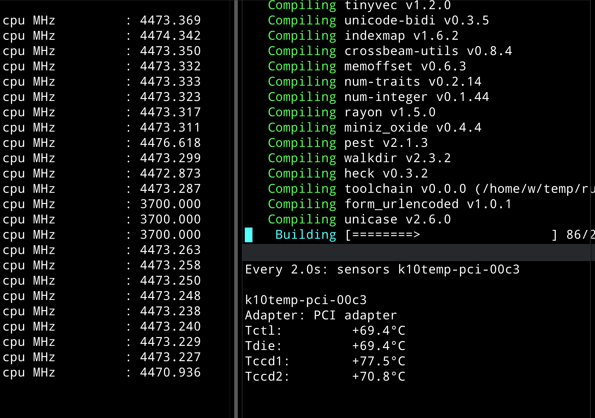

# [amd超频的尝试](/2021/05/amd_overclock.md)

6核笔记本换12核台式机后，发现开机进程数从270左右变成380

原来有些进程类似`cpuhp/23`换24线程的CPU后就变成24个了，而且主板外设硬件也比笔记本多，所以多100多个进程很正常

板U套: ASUS_X570_PLUS + 5900X



很多人说主板的PBO设置默认的Auto其实就是Disable

我看在我这X570高端主板上，似乎默认配置就会从3.7超频到4.4

照着知乎上那种解锁功率墙等等的超频配置，编译代码的速度也就提升1%

而且会导致CPU温度达到86度，主板默认配置下不会超过80度的

加上lld的优化后其实编译ra代码可以杀进28秒内，已经够快了，超频也就快1秒多没必要

因为我用的不是360水冷所以散热跟不上PBO带来的性能提升也有限

## CPU温度

sensors命令工具的输出中， k10temp-pci是amd的CPU温度传感器

可以用`watch sensors`实时监控CPU温度

或者使用`watch inxi --sensors`实时监控CPU温度

## 监控CPU频率

watch inxi --flags # CPU flags

watch "cat /proc/cpuinfo | grep MHz"

## 内存频率

想着CPU默频是3700所以额外加钱买了3600的内存条

没想到amd最新的zen3 CPU官网上写着最大支持3200MHz的内存

意味着我主板强行设置成3600MHz可能导致CPU「**分频」

```
System Memory Specification
Up to 3200MHz
System Memory Type
DDR4
```

我人都傻了，只能说这昂贵的海盗船复仇者3600内存条几年后才能遇到能支持3600MHz的amd CPU，而且从32G扩展成64G也只能买同型号同频率的海盗船

> sudo dmidecode -t memory | grep MT

或者

> sudo inxi --memory

通过dmidecode查看当前内存频率，发现主板默认的内存频率设置成2133(主板设置主页也能看到)，连我这4600H的笔记本都是3200

于是果断在主板F7高级设置->ai_tweak->memory_frequency

或者开DOCP让内存频率自动设置成内存条的默认频率

## inxi -M查看主板版本

> sudo dmidecode -s bios-version

> sudo dmidecode -s bios-release-date

不用装fwupd那个固件更新工具

¶ reference:
- <https://zhuanlan.zhihu.com/p/356507791>
- <https://www.bilibili.com/read/cv4583366/>
- <https://www.techpowerup.com/forums/threads/amd-curve-optimizer-any-guides-experience.275640/page-2>
