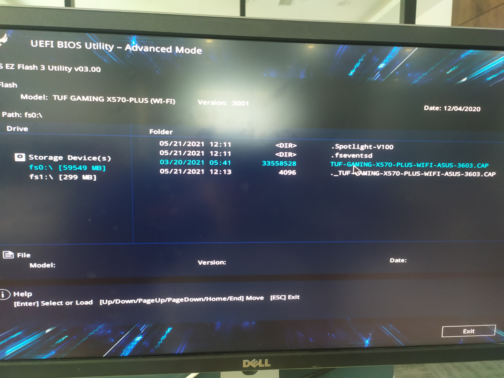
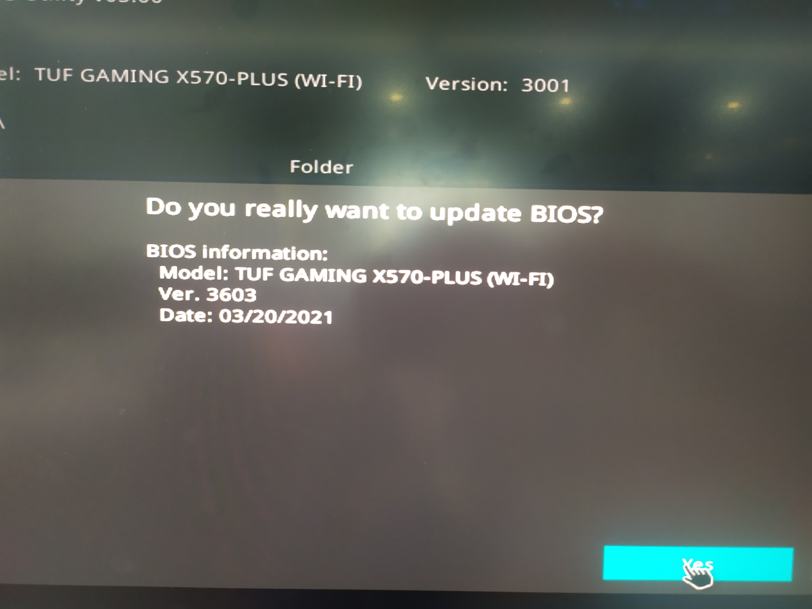

# [华硕X570主板BIOS更新](/2021/05/asus_x570_plus_update_bios.md)

在华硕的 `How to update BIOS with EZ Flash` 文章中有两种方法更新BIOS

要么用 windows 相应的华硕工具(或者 win10 本身就能更新主板固件)，要么自己下载主板固件到 FAT32/VFAT 文件系统的U盘中(只要是主板能识别的 filesystem type)

首先这篇文章比较旧了，现在华硕固件的文件后缀是 `.CAP` 而不是文中的那种后缀名格式

进入主板BIOS界面后进入高级模式，在tool->Ez flash一栏进入Ez flash工具



Ez flash解析完CAP文件后就会出现即将安装的BIOS版本信息，安装完重启即可



主板更新完后会恢复默认设置，重新开启PBO和内存DOCP即可(否则内存默认只会用2133频率)

## cat /sys/class/dmi/id/bios_date

查询 BIOS 版本信息的三种方法:
1. cat /sys/class/dmi/id/bios_date
2. inxi -M
3. sudo dmidecode

```
[w@ww ~]$ sudo dmidecode -s bios-version^C
[w@ww ~]$ inxi -M
Machine:   Type: Desktop Mobo: ASUSTeK model: TUF GAMING X570-PLUS (WI-FI) v: Rev X.0x serial: <superuser required>
           UEFI: American Megatrends v: 3001 date: 12/04/2020
[w@ww ~]$ sudo dmidecode -s bios-version
[sudo] password for w:
3001
[w@ww ~]$ sudo dmidecode -s bios-release-date
12/04/2020
```

## 荣耀笔记本更新 BIOS

驱动之类的让linux的包管理帮忙更新，驱动存储在硬盘上，可能只有 BIOS 固件是烧录在主板上的

由于虚拟机不能更新固件，双系统怕引导坏，建议U盘装个winPE/win-to-go

因为绝大部分的PE系统都是不能联网的(比windows兼容模式还弱鸡)，所以建议下载完整版的主板BIOS固件进行离线更新

即便我装了个号称能连wifi的PE(实际上找不到输入wifi密码的窗口)，用手机USB分享wifi倒是能上网，但是华为电脑管家所有驱动的下载失败

所以只能选择华为网站上给出的第二种更新BIOS的方法，也就是下载固件离线进行更新

¶ Reference:
- <https://359303267.github.io/PE/>
- <https://www.asus.com/Motherboards-Components/Motherboards/All-series/TUF-GAMING-X570-PLUS-WI-FI/HelpDesk_BIOS/>
- <https://www.jb51.net/hardware/MotherBoard/641437.html>
- <https://www.asus.com/support/FAQ/1008859/#B1>
