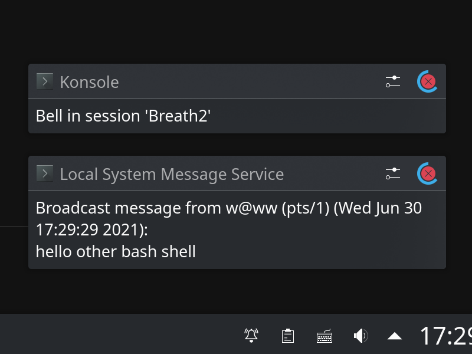

# [BLP读书笔记1](/2021/06/beginning_linux_programming_1.md)

## 为什么说我基础太差

面试官和同事经常说我基础太差，什么是基础太差，就是没有系统的学习Linux操作系统和网络通信这类基础知识

同事苦口婆心劝我自己过于关注新的技术和库，也过于频繁的在微信/tg群吹水闲聊浪费时间

我连IO模型屁都不懂去看glommio这种io_uring有意义么？以前都是通过文章零零碎碎的学习操作系统知识

最高效最可靠能「系统」的学完操作系统网络知识还是看Unix那几本经典书籍

## linux basic overview

下面这段是从知乎上抄来的对linux编程基础的概述，希望我通过经典书籍系统的学习后都能掌握以下知识点:

Linux的API是遵循POSIX标准的，自行谷歌什么叫POSIX。Linux下程序开发几大块，文件操作，这个很重要，你要知道Linux下的一个思想叫一切皆文件，可见文件读写多重要了。I/O模型，五大I/O模型，阻塞，非阻塞，复用，信号驱动和异步I/O，环环相扣丝丝相连，概念和操作都要仔细琢磨，最重要的当属复用，就是select，poll和epoll，面试笔试就问这个东西，要知道他们的适用范围和优缺点。进程和线程，包括进程和线程的概念和区别，进程和线程的建立，同步，通信，互斥等等。网络编程，就是socket编程,Linux编程，这个学不好等于啥都没学，这个估计还得了解一下TCP/IP协议，编程方面主要是那几步，申请socket，bind，listen，accept几步，要熟悉种常见的服务器模型，进程池线程池方式的，多进程方式的，复用方式的，最重要的是复用方式的，这部分可以先只写服务器，测试直接用Telnet就好了

关于基础我还有一些问题和疑惑:

- linux IO模型怎么知道socket有新数据需要读取
- std::net::TcpStream怎么知道有新数据来了需要读取
- std::net::TcpStream怎么兼顾同时read和write,所以split成读写各一个stream?

## 操作系统/网络经典书籍学习顺序

1. Beginning linux programming 4th edition
2. The Linux programming interface(man7.org文档网站的作者，1600多页，类似APUE)
3. Advance programming in the Unix environment 3th edition
4. Unix Network Programming The Sockets Networking API 3th edition
5. Unix Network Programming Interprocess Communications 2th edition
6. TCP/IP Illustrate Volume 1
7. Linux system programming

以后我把Beginning linux programming书名缩写成BLP，其它书名也类似的缩写

## TLPI 1600多页能看完吗

首先一定要克服高考四六级考试时看到长篇英文的文章就头疼看不下去或者看的非常慢的英语英语水平

我以前常常6-7分钟内要求看完的阅读理解我看了20分钟都没看完导致我英语考试时哪怕不走神也经常时间不够写不完

还有就是一定是b站/小说/直播/游戏这种东西占据我时间，时间挤一挤总是有的

例如steam好几个游戏我都玩了1000+小时，拿这些时间去看经典书，哪怕1小时只看1页都能看完吧

就像我本来应该06/28就开始读BLP的结果因为昨晚看直播去了拖延症导致浪费一晚上的时间

## 用Rust/C/Bash重写Linux命令

同事建议说学操作系统或Linux编程建议重写linux大部分命令工具，这样能深入熟悉一些系统调用

TODO 找张老师要一个Rust重写linux各种命令的清单?

<https://zaiste.net/posts/shell-commands-rust/>

- du -> du-dust // ncdu(C)
- top -> bottom/ytop
- cat -> bat
- ls -> exa
- find -> fd
- ps -> procs
- sed -> sd
- grep -> ripgrep
- diff -> delta
- cd -> zoxide

## BLP的学习目标

1. 提高英语阅读速度，快速掌握linux和操作系统领域高频单词
2. 简单的不深入的过一遍linux的IO模型、线程、文件等等概念
3. 顺带学习gdb调试,makefile,shell编程，gtk/qt部分可以快速掠过

最重要的是想解决: 英语句子中每个单词都看似认识，可是连起来就看不懂句子的意思

## BLP的不足

1. 各个标准跟windows之间的对比太浪费篇幅，对GNU描述过多
2. 1998年左右写的书，甚至还有读磁带这种上古外设，有的系统调用没更新成C99标准(例如gmtime书上还保留0-61闰秒)
leap second跟闰年没关系，以前原子钟跟太阳时有误差用来修正用的

## 读书的方法

1. 直接跳过前言、推荐序、关于作者、版权信息都无关内容，直接从目录开始看
2. 先不看errata勘误表，能不能在看书时发现书写错了能跟勘误表想到一块去

## BLP学习阶段记录

2021/06/29开始每天看30+页的英文书籍、游泳1km、大门关闭前前离开办公楼、11点半前入睡...

从 2021/06/29 开始读：
- 2021/06/29: 28-64
- 2021/06/30: 65-100
- 2021/07/01: 101-121
- 2021/07/02: 121-141
- 2021/07/03: 142-142
- 2021/07/04: 143-157
- 2021/07/05: 158-162
- 2021/07/06: 163-178
- 2021/07/07: 179-193
- 2021/07/08: 194-302
- 2021/07/09: 303-

我从 28/819 Introduction 开始细看 BLP

高频词:
- facilities: 设施/工具
- preemptive: 抢占式
- vice versa: 反之亦然
- simultaneous: 同时的
- advisory: 咨询，例如 Advisory lock (advisory表示不限制其它进程读写，并非强制执行的意思)
- errata：书籍的勘误表

有意思的词:
- implicit: 潜在
- phenomenon: 现象
- preceding: 先前的
- subsequent: 后一个, e.g: subsequent editions of the book
- POSIX-compliant： 兼容POSIX标准
- eliminate: 消除
- inevitable: 不可避免的/必然的

短语:
- **early hours: 凌晨**
- consumed virtually all the CPU time: 几乎占满了CPU时间
- brush up: 复习，重新学习
- be wary of: 谨慎

---

## Introduction

主要看行文规则/印刷约定/符号约定，例如粗体字是表示什么意思的代码之类的规定

Introduction章节的一些疑问:
- curses库用来命令行交互?

---

## ch1.GetStarted

简评 Instroduction 到 GetStarted 都过于水，而且过多篇幅比较linux和windows的差异

> A complete discussion of shared libraries and their implementation on different systems is beyond the scope of thisbook

本书对动态库的描述有限，不像静态库那样有详细例子教你怎么编译

### GetStarted琐碎需知识

- `/bin`：executable binaries used in booting the system
- bison/yacc command: flex: lexer?, bison: parser
- 可以用grep在/usr/include中找到exit系统调用的入参常量: EXIT_SUCCESS(stdlib.h)
- libdbm.so
- Unix need `$ randlib libsll.a` operation to add table of content to sll, linux is optional
- libm.so.6中的`.6`表示libm.so的版本6

### /etc/ld.so.conf

除了/usr/lib，额外的LD_LIBRARY_PATH库搜索路径的配置在`/etc/ld.so.conf`

### ctags

> ctags source code cross-reference system, which records symbollocation information as regular expressions suitable for use by searching programs

同事说过C语言不容易基于AST跳转代码定义，一般都靠全文搜索或者全文正则搜索

ctags看上去像一个辅助C语言查找代码定义的一个工具

### 类似man的info命令

info命令比man的优点在于联网浏览最新文档以及支持跳转

> benefit of the info system is that you can navigate the documentation using links

我没搞懂emacs跳转到代码定义的快捷键
请教了玩emacs的同事才知道「按下回车」就能跳转

---

## ch2 bash part1

- 像重定向或管道符号其实都是源于bash语言
- export command 是为了set env_var in subshells, `set -a`会export当前所有变量
- 编写bash脚本的好习惯是最后一行加上`exit 0`
- `1+1`会提示command not found，要用`expr 1 + 1`将其识别为表达式，注意expr命令的加号和数字间要空格隔离开

疑问:
- set-group-id/set-gid和set-user-id/set-uid bit_flag

### 「重要」常用bash $变量

- `$?`上个命令的exit_code
- `$_`表示上一个命令的最后一个参数，类似`Esc+.`
- `$$`当前当前进程的PID,常用于创建临时的sock文件例如`/tmp/pid_$$.sock`
- `$#`表示当前进程的参数个数
- `$0`表示第一个参数(就是/bin/bash可执行文件名)
- `$*`list all args/parameter from $1
- `$@`建议用$@遍历args，不会受到IFS环境变量的影响
- `$PS1`表示bash提示符的前缀，例如`root@localhost $`

### `2>&1`

> $ kill 123456 >killouterr.txt 2>&1

`2>&1` means direct standard error to the same place as the standard output

也就是STDOUT和STDERR插向同一个插座，而不是把STDERR汇流到STDOUT

### 「重要」test函数

在zsh中才能知道某个函数是不是bash自带函数

which test: `test: shell built-in command`

`if test -f ch02_args.sh` 等同于 `if [ -f ch02_args.sh ]; then`

例如用test函数检测文件是否存在:

```bash
if [ -f ch02_args.sh ]; then # need to add whitespace around `[` and `]`
    echo "file is regular file"
else
    echo "file not exist or not a regular file"
fi
```

!> 可以用`help test | less`查看test函数完整的参数列表

「重要」test函数常用表达式:
- -v var # 
- int_expr -eq int_expr
- -n string # string is not null and not empty
- -a file # file exist
- -d file # file is a dir(这里跟stat系统调用探测文件类型高度一致)
- -f file # file is a regular file

test -? 跟 find的-type ? 跟 stat 高度一致

例如 find -type d 跟 test -d 都是表示查找文件夹类型的文件

### bash `:` 符号

`while :`等同于`while true`

还有一个用法`: ${var:=value}`冒号能避免var作为变量被eval(说实话可读性极差没看懂先跳过这个知识)

### bash dot command

> . ./shell_script

`. ./shell_script`点后面执行的脚本能修改当前shell环境的变量

`.` prelead can execute the command in the current shell context

### 排序去重显示所有非root进程

> ps -ef | sort | uniq | grep -v root | more

### 管道语法错误示例

> cat mydata.txt | sort | uniq > mydata.txt

> you will end up with an empty file, because you will overwrite the mydata.txt file before you read it.

### bash read函数

```
$ read var_name
$ echo $var_name
my_input
$ echo \$b
$b
$ echo '$b' # 跟ruby一样单引号不替换变量
$b
$ echo "$b"
my_input
```

### 「有趣」wall命令和/dev/pts

Beginning Linux Programming的作者内容编排真的用心
我读了50多页介绍不同的Linux命令就有30多个，新的代码例子都用新介绍linux命令去演示

例如我刚刚学到的wall命令可以向/dev/pts/中所有shell发送通知(如图)

> 可以通过 `ps -a` 查看所有 terminal (TTY)类型的process，也就是 wall 会给 `ps -a` 的所有进程发通知

我读第二章的最大收获就是bash test函数，test检查文件类型跟stat系统调用高度一致

wall命令的消息推送比`echo -e "\a"`强大多了

说到消息推送，linux 还有一个 `notify-send "hello"` 推送消息功能



### shift - args.pop(0)

> set $(date)

before shift: $1=Wed $2=Jun

after shift : $1=Jun, $#(args.len()-=1)

### trap - 信号捕获

`trap -l` 能列出signal.h中所有信号

### 「重要」find命令

查找所有文件夹名字带有bash的: find -type d -and -name bash*

`find -type -d` 跟 `test -d` 一样都是检测文件夹类型的文件

如果不想把查询过滤参数跟其它参数混在一起或者有歧义，可以像这样用括号把过滤条件的参数包起来:

特别是大量or或and条件并列时更需要加括号来避免歧义

> \(-newer X -or -name "_*" \)

find 用上通配符时尽量用双引号包起来，否则可能参数解析失败

!> find -exec 参数后必须跟上`\;`表示exec执行的命令结束，exec的`{}`这对**花括号表示find到的每个文件名**

> find . -type f -and -name "*function*" -exec stat {} \;

💞💕: ***find -exec grep*** 结合使用达到idea/vscode项目文件夹*全文搜索*的效果
