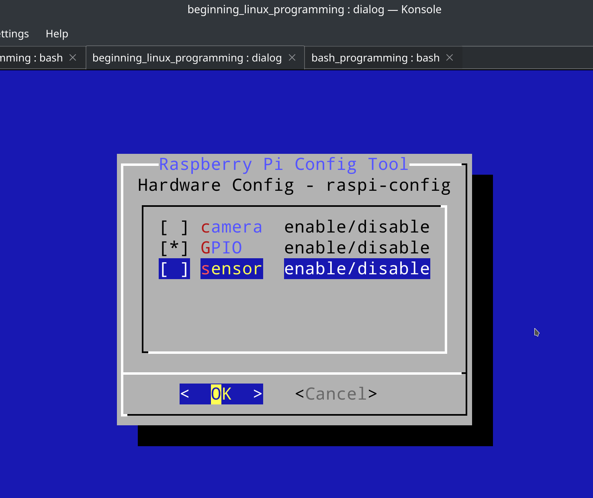

# [BLP 读书笔记 2](/2021/07/beginning_linux_programming_2.md)

## 复习正则表达式

`[:blank:]`这种单独用没有任何匹配效果，要么就套上中括号`[[:blank:]]`去匹配字符串中any char is space or tab

> some useful special match patterns that can be used in square braces

所以套上中括号的`[[:isdigit]]`才等于`[0-9]`

```rust
fn check_re(re_str: &str, s: &str, is_match: bool) {
    let re = regex::Regex::new(re_str).unwrap();
    if let Some(capture) = re.captures(s) {
        println!("re={}, s={}, capture={:?}", re_str, s, capture);
    }
    assert_eq!(re.is_match(s), is_match);
}

fn main() {
    check_re("[:blank:]", " ", false);
    // [[ " " =~ [[:blank:]] ]] && echo "match"
    check_re("[[:blank:]]", " ", true);
    check_re("[[:blank:]]", "    ", true);
    check_re("[[:blank:]]a[[:blank:]]", "I have a apple, a bike", true);
}
```

## ch2 bash part2

### ch2暂时跳过的知识点

- xargs命令
- 105页的${foo:=bar},${foo:+bar},${foo:?bar}等用法
- ed文本编辑器

### 「重要」bash的正则检测

> [[ " " =~ [[:blank:]] ]] && echo "match"

### 「重要」grep命令

grep aka general regular expression parser

💞再次强调💕: ***find -exec grep*** 结合可以搜索在特定文件中搜索关键字

### 再谈 expr 命令

`expr 1 + 1 \* 2`注意expr的所有操作数和符号都要空格隔开，否则`1+1`会理解成1+1命令

也可以用 `$(())` 达到类型expr的效果，例如: `echo $(( 1 + 1 * 2))`

### 再谈 ${} 替换

!> The double paren-theses are used for arithmetic substitution 

所以$双括号跟$单括号的含义是不一样的

> To protect the expansion of the $i part of the variable, you need to enclose the i in braces like this

`var_${i}`

变量如果找不到则默认值: `echo ${my_var:-default_none}`

¶ 掐头去尾:

```
path=/usr/lib
echo ${path#/} # usr/lib
echo ${path%lib} # /usr/
```

例如可以通过这种掐头去尾的用法将当前目录的所有gif文件转为word

```
for image in  *.gif; do
    cjpeg $image > ${image%%gif}jpg
done
```

### set调试bash程序

- set -x 或 bash -x 可以在执行前打印每行语句
- set -u 或 bash -u 可以在遇到「undefined variable」时报错

`set -o xtrace`比`set -x`更详细，可以在问题代码附近开启xtrace，问题代码结束时`set +o xtrace`关闭xtrace

### 「有趣」dialog命令行图形工具

dialog可以打造一个类似树莓派[raspi-config](https://www.raspberrypi.org/documentation/configuration/raspi-config.md)
的命令行图形界面的系统设置应用

gdialog(zenity)则是类似dialog但是用gtk窗口写的dialog

例如 `dialog --msgbox "Hello" 0 0` 可以出现渲染显示一个命令行对话框

根据`dialog --help`

> Auto-size with height and width = 0
> 
> Maximize with height and width = -1

所以长宽设置成「0表示自动调整大小」，长宽设置成「-1表示填充满父级容器，跟父级容器一样大」

注意长宽大小的单位都是一个字符宽度，而不是px

#### 用checkbox模拟raspi-config

```
dialog --title "Raspberry Pi Config Tool" --checklist "Hardware Config - raspi-config" 0 0 0 camera "enable/disable" on GPIO "enable/disable" off sensor "enable/disable" off
```



--title参数是窗口的最外层标题栏，--checklist的第一个参数是窗口内层的标题栏

`0 0 0`表示长宽和每列的高度都是自动调整大小

`camera "enable/disable" on` 表示:
- 第一行第1列(status)列的初始值是: on(显示为星号)
- 第一行第2列(tag列)是`camera`
- 第一行的第3列(item列)是`enable/disable`

按键操作跟其它命令行软件类似，空格键或回车键能切换当前行的状态，on->off或off->on，上下左右方向键来移动光标

#### $? 获取上一个进程的exit_code(捕获dialog的用户输入)

#### bash的"alias"函数委托模式

在bash脚本中可能因为没加`.`前缀修改当前shell_context，所以alias不生效

但是我们有个需求是，同一个程序能运行在基于dialog命令行UI，也能运行在gtk基于gdialog的桌面窗口UI

```bash
my_dialog() {
    dialog "$@"
    #gdialog "$@"
}

my_dialog --title "Questionnaire" --msgbox "Welcome to my survey" 0 0
```

注意 dialog 要用 "$@" 去接参数，用 $@ 会把参数"Hello World"拆分成"Hello"和"World"两个参数

#### echo -e "\c" 表示不换行

此书的CD信息管理软件中大量用到`echo -e "... \c"`

---

### CD应用的update_cd函数

注意这个函数并不是SQL的UPDATE

主要逻辑就是通过 grep -v(invert) 找出所有专辑名不为a的专辑，并重新写入回tracks.csv

等于说通过grep -v输出内容写回原文件实现了删除指定title行的操作

remove_records函数也是通过相同的原理和过程实现csv文件删除记录

最后再用 add_record_tracks 逐条重新插入专辑a的歌曲

注意 CD应用 维护了一个 当前选中CD名称的状态

只有当选中了某个CD时(一个CD对应tracks表中多个歌曲，一对多的关系)，菜单会多三个选项:

```
l) List tracks on xxx
r) Remove xxx
u) Update track information for xxx
```

---

## ch3 files part1

### some system call:
- ioctl: control a stream device
- mmap: map pages of memory
- fcntl: file control

### inode

`ls -i`或`stat`能查看文件的inode，文件类型、权限、访问时间等信息都存储在inode中

### 「重要」directory entry link

> A directory is a file that holds the inode numbers and names of other files.
> 
> each directory entry is a link to a file's inode
> 

delete file in directory and would will remove this link

and links of this file -= 1 (you can get link of a time by `ls -l`)

if links==0, the inode and datablock to this file no longer in use and marked as free

所以要怎么解释删除文件到回收站后(非rm)的links数?

这inode/datablock的释放机制听上去跟std::rc::Rc非常像，我再回顾下Rc的重点:

§ 弱引用

为了避免像双向链表这样的数据结构循环引用导致无法释放，所以让 parent->child的引用是强引用，child->parent的引用是弱引用

弱引用解引用(downgrade)时如果Rc已经drop了，则会返回None，所以听上去弱引用对Rc有很弱的所有权

### device
- /dev/console, /dev/tty
- /dev/zero 能读取到一堆 zero bytes

#### random access device

磁带(tape)设备就像链表，不能像数组那样快速获取某段数据

而硬盘则是一个 random access device

### performance penalty(惩罚) in making a system call

Linux has to switch from running your program code(user-space)
to executing its own kernel code(kernel-space) and back again

### libc::write为什么要返回写入了几个字节

例如磁带tape设备一次只能写10k个bytes,但用户write传递了11k个bytes，或者也有可能写到一半就出错中止了

### 「重要」openn

#### man7.org的open(2)

open(2)括号2指的是section 2 of man，可以用 man 2 open 打开跟 <https://man7.org/linux/man-pages/man2/open.2.html>
完全一样的文档页面

#### libc::creat

不常用的系统调用，功能与open重复又不如open

creat = open with oflags=O_CREAT|O_WRONLY|O_TRUNC

#### umask: creation mask of the current shell

umask和cd都是 shell command

umask 跟 chmod 777 刚好是反过来的，umask 表示不允许，而 chmod 表示允许

umask常用于新创建文件的默认权限

umask 026 的第一个0表示user没有限制，第二个2表示group不允许(disallow)写，第三个0表示other不允许读和写

§ 获取当前用户umask的方法

> grep UMASK /etc/login.defs

可见默认的umask是077

#### 「重要」open的mode参数

S_IXGRP, 所有选项都固定S_I开头，I表示inode，I后面的字母是R/W/X，最后三个字母则

GRP=group权限,USR=user,OTH=other

ls -l中的长度为9权限字母例如`-rwxr-xr-x`(这是gcc编译出的可执行文件)

前三个`rwx`表示user,中间三个`r-x`表示group，最后三个`r-x`表示other

#### 「重要」open创建文件的权限

!> The permissions of the created file are (mode & ~umask)

open系统调用创建的文件的权限是: <var class="mark">mode & ~umask</var>

但umask不能阻止随后用chmod修改刚创建的权限

#### include unistd.h要写在最上头

unistd.h定义了一些POSIX相关的常量，fcntl.h之类的其它头文件依赖unistd.h的常量(可能书中旧版本的gcc会这样)
