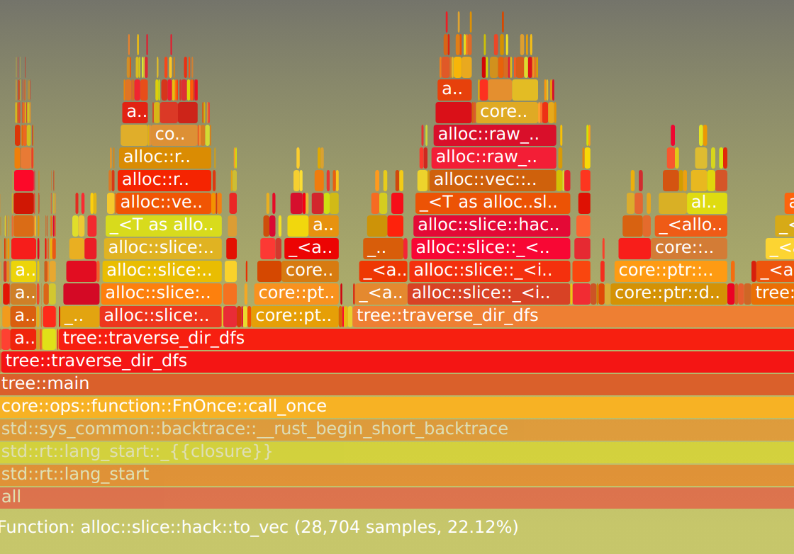
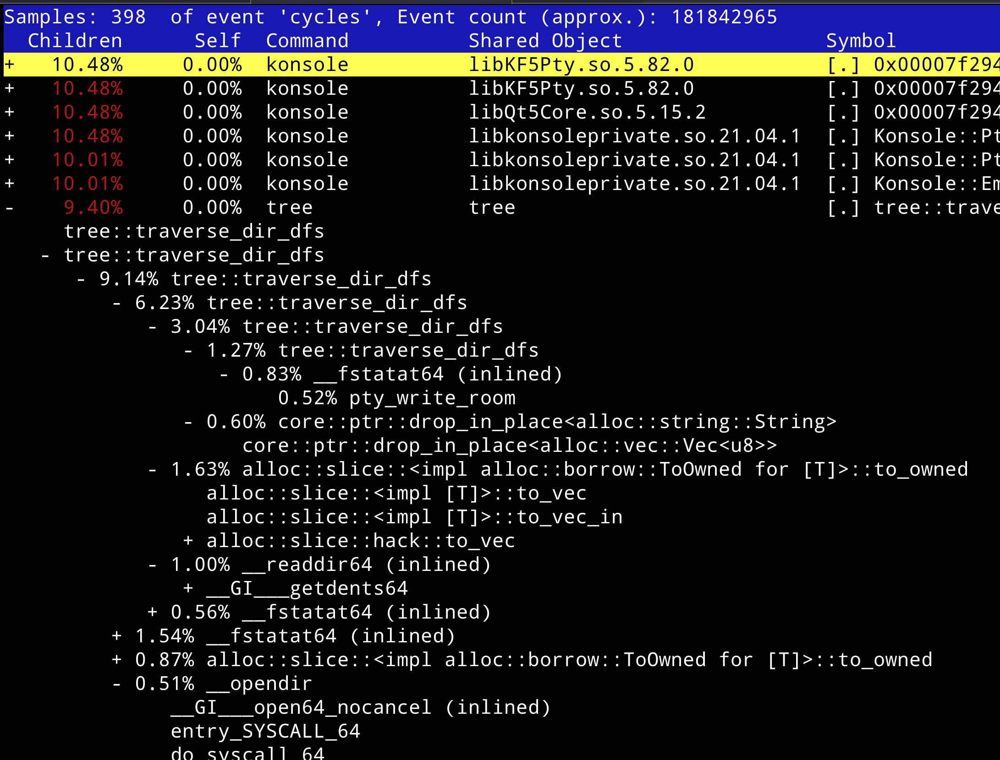
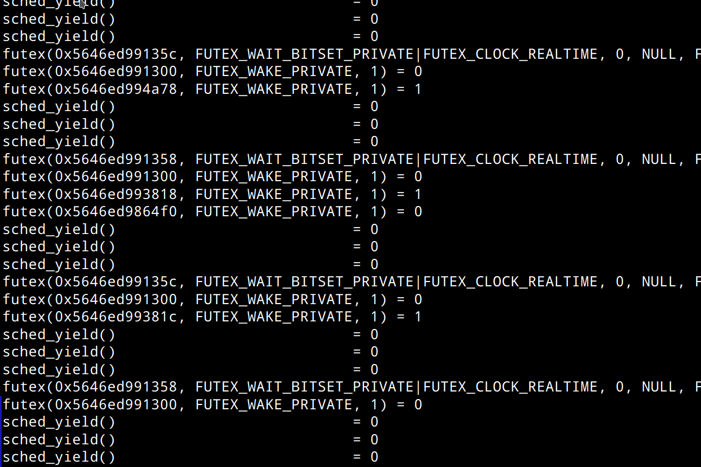

# [调试/动态分析/性能分析工具](2021/07/debug_and_dynamic_analyzing_tools.md)

相比静态分析工具例如 clippy/ra，动态分析工具则需要程序运行才能进行分析，例如官方的 bench, test

§ 为什么需要动态分析



以上是某个 Rust 程序**动态分析**生成的火焰图，通过火焰图可以很清晰的看到程序的性能瓶颈在频繁 alloc 分配内存

借助动态分析不仅能发现程序性能瓶颈，还能调试运行时的内存错误，也可以生成函数调用树让团队新成员能快速读懂项目代码

## 目录 - 动态分析工具

1. 常用调试工具和内存检测工具:
首先通过一个 segfault 案例，介绍常用调试工具如何检测该案例的内存错误:
- coredumpctl
- valgrind
- gdb
- lldb/vscode-lldb/Intellij-Rust

2. 火焰图/函数调用树等动态分析工具(profile)
- cargo-miri
- KCachegrind
- pref
- gprof/uftrace
- strace
- sudo pstack/gdb $PID

待验证可行性的方案: ebpf, cargo-flamegraph

3. 最后通过上述工具再分析几个内存错误案例:
- SIGABRT/double-free
- SIGABRT/free-dylib-mem

## segfault 案例和常用调试工具

以下是我重写 ls 命令的部分源码(以下简称`ls 应用`)，完整源码在[这个代码仓库](https://github.com/pymongo/linux_commands_rewritten_in_rust/blob/main/examples/sigsegv_opendir_open_null.rs)

```rust
fn main() {
    let dir = unsafe { libc::opendir(input_filename.as_ptr().cast()) };
    loop {
        let dir_entry = unsafe { libc::readdir(dir) };
        if dir_entry.is_null() {
            break;
        }
    }
}
```

跟原版 ls 命令一样，输入参数是一个文件夹时能列出文件夹内所有文件名

但当 ls 应用的参数不是文件夹时，就会 segfault 内存段错误:

```
> cargo r --bin ls -- Cargo.toml 
    Finished dev [unoptimized + debuginfo] target(s) in 0.00s
     Running `target/debug/ls Cargo.toml`
Segmentation fault (core dumped)
```

### coredumpctl

#### systemd-coredump 配置

首先查看系统配置文件 `/proc/config.gz` 看看是否已开启 coredump 记录功能

```
> zcat /proc/config.gz | grep CONFIG_COREDUMP
CONFIG_COREDUMP=y
```

由于 `/proc/config.gz` 是 *gzip* 二进制格式而非文本格式，所以要用 `zcat` 而非 `cat` 去打印

再看修改 coredumpctl 配置文件 `/etc/systemd/coredump.conf`

把默认的 coredump 日志大小限制调到 20G 以上: `ExternalSizeMax=20G`

然后重启: `sudo systemctl restart systemd-coredump`

#### 查看最后一条 coredump 记录

通过 `coredumpctl list` 找到最后一条 coredump 记录，也就是刚刚发生的 segfault 错误记录

> Tue 2021-07-06 11:20:43 CST 358976 1000 1001 SIGSEGV present  /home/w/repos/my_repos/linux_commands_rewritten_in_rust/target/debug/ls  30.6K

注意用户 id 1000 前面的 358976 表示进程的 PID，用作 `coredumpctl info` 查询

> coredumpctl info 358976

```
           PID: 358976 (segfault_opendi)
// ...
  Command Line: ./target/debug/ls
// ...
       Storage: /var/lib/systemd/coredump/core.segfault_opendi.1000.d464328302f146f99ed984edc6503ca0.358976.1625541643000000.zst (present)
// ...
```

也可以选择用 gdb 解析 segfault 的 coredump 文件:

`coredumpctl gdb 358976` 或者 `coredumpctl debug 358976`

参考: [core dump - wiki](https://wiki.archlinux.org/title/Core_dump)

### valgrind 检查内存错误

> valgrind --leak-check=full ./target/debug/ls

```
// ...
==356638== Process terminating with default action of signal 11 (SIGSEGV): dumping core
==356638==  Access not within mapped region at address 0x4
==356638==    at 0x497D904: readdir (in /usr/lib/libc-2.33.so)
==356638==    by 0x11B64D: ls::main (ls.rs:15)
// ...
```

### gdb 调试分析错误原因

§ gdb 打开 ls 应用的可执行文件:

> gdb ./target/debug/ls

§ gdb 通过 `l` 或 `list` 命令打印可执行文件的代码:

> (gdb) l

§ gdb运行 ls 应用且传入 `Cargo.toml` 文件名作为入参:

> (gdb) run Cargo.toml

```

Starting program: /home/w/repos/my_repos/linux_commands_rewritten_in_rust/target/debug/ls Cargo.toml
[Thread debugging using libthread_db enabled]
Using host libthread_db library "/usr/lib/libthread_db.so.1".

Program received signal SIGSEGV, Segmentation fault.
0x00007ffff7e5a904 in readdir64 () from /usr/lib/libc.so.6
```

§ 查看 segfault 发生时的栈帧

> (gdb) backtrace

```
#0  0x00007ffff7e5a904 in readdir64 () from /usr/lib/libc.so.6
#1  0x0000555555568952 in ls::main () at src/bin/ls.rs:15
```

此时已经找到出问题的系统调用函数是 `readdir64`，上一个栈帧在 `ls.rs` 的 15 行

$ 查看问题代码的附近几行

> (gdb) list 15

§ 查看问题栈帧的局部变量

- `info variables` 能打印全局或 static 变量
- `info locals` 打印当前栈帧的局部变量
- `info args` 打印当前栈帧的入参

> (gdb) frame 1 # select frame 1
> 
> (gdb) info locals

```

(gdb) frame 1
#1  0x0000555555569317 in ls::main () at src/bin/ls.rs:20
20              let dir_entry = unsafe { libc::readdir(dir) };
(gdb) info locals
dir = 0x0
// ...

```

此时发现 main 栈帧的 `dir = 0x0` 是空指针，导致 readdir 系统调用 segfault

#### 分析错误原因

```rust
let dir = unsafe { libc::opendir(input_filename.as_ptr().cast()) };
loop {
    let dir_entry = unsafe { libc::readdir(dir) };
    // ...
}
```

问题出在没有判断 `opendir` 系统调用是否成功，系统调用失败要么返回 NULL 要么返回 -1

如果 `opendir` 系统调用传入的文件类型不是 directory，就会调用失败

因此 Bug 解决方法是 **检查上游的 opendir 创建的 dir 变量是否为 NULL**

#### 解决 segfault

只需要在加上 dir 是否为 NULL 的代码，如果为 NULL 则打印系统调用的错误信息

```rust
if dir.is_null() {
    unsafe { libc::perror(input_filename.as_ptr().cast()); }
    return;
}
```

再次测试 ls 应用读取非文件夹类型的文件

```
> cargo r --bin ls -- Cargo.toml 
    Finished dev [unoptimized + debuginfo] target(s) in 0.00s
     Running `target/debug/ls Cargo.toml`
Cargo.toml: Not a directory
```

此时程序没有发生段错误，并且打印了错误信息 `Cargo.toml: Not a directory`

关于修复 ls 应用 segfault 的代码改动[在这个 commit](https://github.com/pymongo/linux_commands_rewritten_in_rust/commit/b5f92f85ab1949e04ac713ad079d4359760e1cd1)

参考 gnu.org 的官方教程: <https://www.gnu.org/software/gcc/bugs/segfault.html>

### lldb 调试

lldb 调试和 gdb 几乎一样，只是个别命令不同

> (lldb) thread backtrace # gdb is `backtrace`

```
error: need to add support for DW_TAG_base_type '()' encoded with DW_ATE = 0x7, bit_size = 0
* thread #1, name = 'ls', stop reason = signal SIGSEGV: invalid address (fault address: 0x4)
  * frame #0: 0x00007ffff7e5a904 libc.so.6`readdir + 52
    frame #1: 0x0000555555568952 ls`ls::main::h5885f3e1b9feb06f at ls.rs:15:34
// ...
```

> (lldb) frame select 1 # gdb is `frame 1`

```
frame #1: 0x0000555555569317 ls`ls::main::h5885f3e1b9feb06f at ls.rs:15:34
   12       
   13       let dir = unsafe { libc::opendir(input_filename.as_ptr().cast()) };
   14       loop {
-> 15           let dir_entry = unsafe { libc::readdir(dir) };
   16           if dir_entry.is_null() {
   17               // directory_entries iterator end
   18               break;
```

§ lldb 变量打印上 `frame variable` 等于 gdb 的 `info args` 加上 `info locals`

`(gdb) info args` 等于 `(lldb) frame variable --no-args`

除了 **primitive types**, lldb 还可以打印 String 类型变量的值，但是无法得知 `Vec<String>` 类型变量的值

### vscode-lldb 调试

不打任何断点运行程序时，会指向以下代码

> 7FFFF7E5A904: 0F B1 57 04                cmpxchgl %edx, 0x4(%rdi)

此时应当关注 vscode 左侧 Debug 侧边栏的 `CALL STACK` 菜单 (也就 gdb backtrace)

call stack 菜单会告诉 readdir 当前汇编代码的上一帧(也就是 backtrace 第二个栈帧)是 main 函数的 15 行

点击 main 栈帧，相当于 `(gdb) frame 1`，就能跳转到出问题的源码所在行了

在 main 栈帧 下再通过 variable 菜单发现 readdir 传入的 dir 变量值为 NULL 导致段错误

### Intellij-Rust 调试

Debug 运行直接能跳转到问题代码的所在行，并提示 `libc::readdir(dir)` 的 dir 变量的值为 NULL

---

## 动态分析工具

§ dmesg 查看 segfault 记录

`sudo dmesg` 能查看最近几十条内核消息，发生 segfault 后能看到这样的消息:

### cargo-miri 检查 unsafe 代码

可惜 miri 现在似乎还不支持 FFI 调用函数的检查

```
[w@ww linux_commands_rewritten_in_rust]$ cargo miri run --example sigabrt_free_dylib_data
   Compiling linux_commands_rewritten_in_rust v0.1.0 (/home/w/repos/my_repos/linux_commands_rewritten_in_rust)
    Finished dev [unoptimized + debuginfo] target(s) in 0.00s
     Running `/home/w/.rustup/toolchains/nightly-x86_64-unknown-linux-gnu/bin/cargo-miri target/miri/x86_64-unknown-linux-gnu/debug/examples/sigabrt_free_dylib_data`
error: unsupported operation: can't call foreign function: sqlite3_libversion
 --> examples/sigabrt_free_dylib_data.rs:5:19
  |
5 |         let ptr = sqlite3_libversion() as *mut i8;
  |                   ^^^^^^^^^^^^^^^^^^^^ can't call foreign function: sqlite3_libversion
```

### KCachegrind

> valgrind --tool=callgrind ./target/debug/tree

通过 valgrind 生成 callgrind.out.887505 数据( 887505 是 PID )，再通过 KCachegrind 打开进行可视化


参考: https://users.rust-lang.org/t/is-it-possible-to-print-the-callgraph-of-a-cargo-workspace/50369/6

### perf

perf/pstack/bpf 这些工具应该都在 ***linux-tools*** 这个包里面

#### 检查 perf 配置

首先通过 `perf record` 测试下 perf 的配置能否读取系统事件，如果返回 Error 则修改以下配置文件

在 /etc/sysctl.d/sysctl.conf 中永久修改 perf 配置:

> kernel.perf_event_paranoid = -1

然后重启 sysctl 进程重新加载配置:

> sudo systemctl restart systemd-sysctl.service

再次确认 kernel 的 perf_event_paranoid 状态是否修改成功

> cat /proc/sys/kernel/perf_event_paranoid

#### perf call-graph

用 perf-record 记录 Rust 程序的调用信息:

> perf record -a --call-graph dwarf ./target/debug/tree

Rust 程序运行结束后，会在当前目录生成 perf.data 数据文件

perf-report 会默认打开当前目录的 perf.data 文件，也可以通过 -i 参数制定数据文件

用 perf-report 解析 Rust 程序的函数调用树，会进入一个用 curses 写的类似 htop 的命令行 UI 界面:

> perf report --call-graph



可以选中 tree::main 的函数符号按下回车，选择 `zoom into tree thread` 来展示 main 函数的子函数调用树

主要浏览方法是通过上下左右方向键移动光标，再通过**+**按键展开或折叠光标所在行的函数调用树

在作者的电脑上，Clion 默认的 profiler(性能探测器)就用的 perf

#### perf top -p $PID

输出结果大致如下，可以用来调试 **.await 卡死例如死锁问题**

如果死锁发生的时候会

```
Samples: 3K of event 'cycles', 4000 Hz, Event count (approx.): 680017058 lost: 0/0 drop: 0/0
Overhead  Shared Object       Symbol
   9.13%  libc-2.33.so        [.] __memmove_avx_unaligned_erms                                                    
   0.65%  my_app              [.] core::sync::atomic::atomic_load
   0.61%  my_app              [.] __rust_probestack              
   0.54%  my_app              [.] core::ptr::mut_ptr::<impl *mut T>::guaranteed_eq                                ▒
   0.54%  my_app              [.] <core::slice::iter::Iter<T> as core::iter::traits::iterator::Iterator>::next    ▒
   0.53%  my_app              [.] core::ptr::const_ptr::<impl *const T>::is_null                                  ▒
   0.51%  libc-2.33.so        [.] malloc                         
   0.37%  [kernel]            [k] native_write_msr               
```

### 能调试运行中进程的 perf 子命令

- perf stat -p $PID
- perf top -p $PID
- perf trace -p $PID
- perf ftrace -p $PID # need root

### strace

`strace -p $PID` 跟 `perf trace -p $PID` 一样

strace 可以实时打印 attach 的进程系统调用的入参和返回值



以下是一个分布式系统进程中，跟其它三个分布式节点的通信协程之间的调度

```
sched_yield()                           = 0
sched_yield()                           = 0
sched_yield()                           = 0
futex(0x5646ed99135c, FUTEX_WAIT_BITSET_PRIVATE|FUTEX_CLOCK_REALTIME, 0, NULL, FUTEX_BITSET_MATCH_ANY) = 0
futex(0x5646ed991300, FUTEX_WAKE_PRIVATE, 1) = 0
futex(0x5646ed994a78, FUTEX_WAKE_PRIVATE, 1) = 1
sched_yield()                           = 0
sched_yield()                           = 0
sched_yield()                           = 0
futex(0x5646ed991358, FUTEX_WAIT_BITSET_PRIVATE|FUTEX_CLOCK_REALTIME, 0, NULL, FUTEX_BITSET_MATCH_ANY) = 0
futex(0x5646ed991300, FUTEX_WAKE_PRIVATE, 1) = 0
futex(0x5646ed994a7c, FUTEX_WAKE_PRIVATE, 1) = 1
sched_yield()                           = 0
sched_yield()                           = 0
sched_yield()                           = 0
```

其中 futex() 系统调用功能是 fast user-space locking，常结合 sched_yield 系统调用使用

### pstack/gdb $PID

strace/ptrace/pstack 的原理都是 (gdb) attach PID 且需要 root 权限

#### pstack

pstack 实际上在 debian 上是个 bash 脚本，但在 arch/manjaro 上只有一个叫 pstack 的 aur 包

而且 aur 那个 pstack 有 Bug 启动就报错: `pstack: Input/output error`

我[参考这篇文章](http://www.man6.org/blog/Linux/Manjaro%E6%97%A0%E6%B3%95%E4%BD%BF%E7%94%A8pstack.md)
才明白原来 aur 那个 pstack 是 C 源码编译的并非正统的 pstack bash 脚本

所以我把 ubuntu/centos 的 /usr/bin/pstack 脚本抄过来就能在自己 arch 系统上运行了

pstack 输出的内容跟 (gdb) attach $PID 的 bt 差不多

```
[ww w]$ sudo strace -p 1278031
#0  0x00007fe3d667e8ca in __futex_abstimed_wait_common64 () from /usr/lib/libpthread.so.0
#1  0x00007fe3d6678574 in pthread_cond_timedwait@@GLIBC_2.3.2 () from /usr/lib/libpthread.so.0
#2  0x00005631d0913432 in rocksdb::port::CondVar::TimedWait (this=0x5631d3ec0fb8, abs_time_us=1631501994205256) at
rocksdb/port/port_posix.cc:124
#3  0x00005631d08ac5bb in rocksdb::InstrumentedCondVar::TimedWaitInternal (this=0x5631d3ec0fb8, abs_time_us=1631501
994205256) at rocksdb/monitoring/instrumented_mutex.cc:70
#4  0x00005631d08ac54e in rocksdb::InstrumentedCondVar::TimedWait (this=0x5631d3ec0fb8, abs_time_us=163150199420525
6) at rocksdb/monitoring/instrumented_mutex.cc:59
#5  0x00005631d0766e27 in rocksdb::Timer::Run (this=0x5631d3ec0f70) at rocksdb/util/timer.h:239
#6  0x00005631d076d5b9 in std::__invoke_impl<void, void (rocksdb::Timer::*)(), rocksdb::Timer*> (__f=@0x5631d3eeaf3
0: (void (rocksdb::Timer::*)(rocksdb::Timer * const)) 0x5631d0766c14 <rocksdb::Timer::Run()>, __t=@0x5631d3eeaf28:
0x5631d3ec0f70) at /usr/include/c++/11.1.0/bits/invoke.h:74
#7  0x00005631d076d4fb in std::__invoke<void (rocksdb::Timer::*)(), rocksdb::Timer*> (__fn=@0x5631d3eeaf30: (void (
rocksdb::Timer::*)(rocksdb::Timer * const)) 0x5631d0766c14 <rocksdb::Timer::Run()>) at /usr/include/c++/11.1.0/bits
/invoke.h:96
#8  0x00005631d076d46b in std::thread::_Invoker<std::tuple<void (rocksdb::Timer::*)(), rocksdb::Timer*> >::_M_invok
e<0ul, 1ul> (this=0x5631d3eeaf28) at /usr/include/c++/11.1.0/bits/std_thread.h:253
#9  0x00005631d076d424 in std::thread::_Invoker<std::tuple<void (rocksdb::Timer::*)(), rocksdb::Timer*> >::operator
() (this=0x5631d3eeaf28) at /usr/include/c++/11.1.0/bits/std_thread.h:260
#10 0x00005631d076d408 in std::thread::_State_impl<std::thread::_Invoker<std::tuple<void (rocksdb::Timer::*)(), roc
ksdb::Timer*> > >::_M_run (this=0x5631d3eeaf20) at /usr/include/c++/11.1.0/bits/std_thread.h:211
#11 0x00007fe3d67783c4 in std::execute_native_thread_routine (__p=0x5631d3eeaf20) at /build/gcc/src/gcc/libstdc++-v
3/src/c++11/thread.cc:82
#12 0x00007fe3d6672259 in start_thread () from /usr/lib/libpthread.so.0
```

### gprof/uftrace

gprof 通过源码注入一些记录函数调用的代码，记录数据会比 perf 准确很多

gcc/clang 加上 `-pg` 参数，会在运行程序结束后生成监控数据文件 `mon.out`

然后 gprof 对 mon.out 文件进行分析，可惜 Rust 的 -Zinstrument-mcount 只是部分支持 -pg

为了支持数据通过火焰图格式可视化，安装 utftrace 的同时也把火焰图装了:

> yay -S uftrace-git flamegraph-git

跟 grpof/KCachegrind 类似，也是要收集数据，数据可视化分两步走

首先 Rust 编译程序时要加上类似 gcc 的 -pg 的参数:

> rustc -g -Z instrument-mcount main.rs

或者用 cargo 编译构建项目

```
[target.x86_64-unknown-linux-gnu]
# rustflags = [
#     "-Z",
#     "instrument-mcount",
#     "-C",
#     "passes=ee-instrument<post-inline>",
# ]
```

> RUSTFLAGS="-Zinstrument-mcount" cargo +nightly build

或者用 gccrs 或 gcc 后端进行编译

> gccrs -g -pg main.rs

然后 uftrace 开始记录数据:

uftrace record ./main

本文篇幅有限只介绍 uftrace 通过火焰图进行可视化的方式

用 perf 采集火焰图数据也类似

```
# perf record -g 是必须的 debuginfo, -F 是采样频率越高效果越好但是负担更大 默认 4000hz
perf record -F 10000 -g -- ./exe
perf script > out.perf
./FlameGraph/stackcollapse-perf.pl out.perf | ./FlameGraph/flamegraph.pl > flamegraph.svg
```

- **块的长度（宽度）**：代表了该函数在采样中占用的时间（或样本数）。一个块越长，表示该函数在程序运行期间耗费的时间越多，或者说在采样中出现得越频繁。这意味着它可能是性能瓶颈的所在。
- **块的颜色**：在很多火焰图工具中，颜色并不表示调用的次数，而是用来区分不同的函数或不同的代码路径。有些工具会根据函数的自身CPU使用时间或其整个调用栈的CPU使用时间来给出颜色渐变，但这并不是普遍规则。颜色深浅通常是为了视觉效果，帮助用户区分不同的堆栈层级或函数。
- **堆叠的块（堆栈）**：火焰图中的每一个“层”代表堆栈中的一个函数调用。顶部的函数是正在执行的函数，而它下面的函数则是它的调用者。这样可以很容易看出哪些函数是由哪些其他函数调用的。

> uftrace dump --flame-graph | flamegraph > ~/temp/uftrace_flamegraph.svg && google-chrome-stable ~/temp/uftrace_flamegraph.svg

uftrace 记录参数:

- --no-libcall: uftrace 可以加上 --no-libcall 参数不记录系统调用
- --nest-libcall: 例如 new() 函数记录上内置的 malloc()
- --kernel(need sudo): trace kernel function
- --no-event: 不记录线程调度

#### uftrace coredump 解决
我一开始以为是版本问题，从最新版切换到写本文的v0.10依然 `free(): invalid size`

可能是我交易所ws应用deflate还是libz调用导致触发bug

uftrace record 加上参数 -e --no-libcall 就解决了

> uftrace record -e --no-libcall

<https://github.com/namhyung/uftrace/issues/744>

§ cargo-flamegraph

cargo-flamegraph 需要系统已装 perf ，能将 perf 数据渲染成火焰图

§ ebpf

ebpf 分析 Rust 程序应该是可行的，笔者还没试过

---

熟悉上述工具后，可以接下来看几个内存错误的案例

## SIGABRT/double-free 案例分享

以下是 tree 命令深度优先搜索遍历文件夹的代码(省略部分无关代码，[完整源码链接在这](https://github.com/pymongo/linux_commands_rewritten_in_rust/blob/main/examples/sigabrt_closedir_wrong.rs))

```rust
unsafe fn traverse_dir_dfs(dirp: *mut libc::DIR, indent: usize) {
    loop {
        let dir_entry = libc::readdir(dirp);
        if dir_entry.is_null() {
            let _sigabrt_line = std::env::current_dir().unwrap();
            return;
        }
        // ...
        if is_dir {
            let dirp_inner_dir = libc::opendir(filename_cstr);
            libc::chdir(filename_cstr);
            traverse_dir_dfs(dirp_inner_dir, indent + 4);
            libc::chdir("..\0".as_ptr().cast());
            libc::closedir(dirp);
        }
    }
}
```

这段代码运行时会报错:

```
malloc(): unsorted double linked list corrupted

Process finished with exit code 134 (interrupted by signal 6: SIGABRT)
```

通过 gdb 调试能知道 `std::env::current_dir()` 调用报错了，但错误原因未知

### 经验: SIGABRT 可能原因

通过上述段错误的分析，我们知道 SIGSEGV 可能的原因是例如 `readdir(NULL)` 解引用空指针

根据作者开发经验，SIGABRT 的可能原因是 **double free**

### valgrind 检查 double free

顺着 double-free 的思路，通过 valgrind 内存检查发现，`libc::closedir(dirp)` 出现 InvalidFree/DoubleFree 的内存问题

### 分析 double free 原因

再细看源码，递归调用前创建的是子文件夹的指针，递归回溯时却把当前文件夹指针给 close 掉了

这就意味着，一旦某个目录有 2 个以上的子文件夹，那么当前的文件夹指针可能会被 free 两次

进而将问题的规模简化成成以下三行代码:

```rust
let dirp = libc::opendir("/home\0".as_ptr().cast());
libc::closedir(dirp);
libc::closedir(dirp);
```

### double free 的通用解决方法

C 语言编程习惯: free 某个指针后必须把指针设为 NULL

```rust
let mut dirp = libc::opendir("/home\0".as_ptr().cast());
libc::closedir(dirp);
dirp = std::ptr::null_mut();
libc::closedir(dirp);
dirp = std::ptr::null_mut();
```

在「单线程应用」中，这种解决方法是可行的，

第一次 free 后 dirp 指针被成 NULL，第二次 free 时传入 dirp 则什么事都不会发生

因为大部分的 C/Java 函数第一行都会判断输入是否空指针 `if (ptr == null) return`

### 为什么有时 double free 没报错

有个问题困惑了我: 
- 为什么连续写几行 closedir 进程会提前 SIGABRT?
- 为什么循环中多次 closedir 进程还能正常退出?
- 为什么循环中多次 closedir 调用 `std::env::current_dir()` 时就 SIGABRT?

原因是 double free 不一定能及时被发现，可能立即让进程异常中止，也可能要等下次 malloc 时才会报错

正因为 `current_dir()` 用了 Vec 申请堆内存，内存分配器发现进程内存已经 corrupted 掉了所以中止进程

我摘抄了 *Beginning Linux Programming* 对这一现象的解释:

> one reason malloc failed is the memory structures have been corrupted, When this happens, the program may not terminate immediately

## SIGABRT/free-dylib-mem 案例分享

假设我想打印 sqlite 的版本，sqlite 版本信息以静态字符串的形式存储在 `/usr/lib/libsqlite3.so`

```rust
#[link(name = "sqlite3")]
extern "C" {
    pub fn sqlite3_libversion() -> *const libc::c_char;
}

fn main() {
    unsafe {
        let ptr = sqlite3_libversion() as *mut i8;
        let version = String::from_raw_parts(ptr.cast(), "3.23.0\0".len(), "3.23.0\0".len());
        println!("found sqlite3 version={}", version);
    }
}
```

结果上述代码一运行就发生内存错误 SIGABRT 异常中止，通过 gdb 调试发现报错前一个栈帧在 unsafe 代码块的析构流程内

由于代码中只有 version 是 String 类型需要调用 drop 自动析构，所以就把问题锁定在 String 的析构错误上

根据操作系统进程内存管理相关知识，当 Rust 的进程想要释放不属于 Rust 进程而是属于 libsqlite3.so 动态链接库的内存时就会 SIGABRT

解决方法是通过 `std::mem::forget` 阻止 String 的析构函数调用，这也是 `mem::forget` API 最常用的应用场景

## 更多的内存错误调试案例

可以关注作者的 linux_commands_rewritten_in_rust 项目的 src/examples 文件夹

examples 目录下几乎都是各种内存错误的常见例子，也是作者踩过坑的各种内存 Bug

项目链接: <https://github.com/pymongo/linux_commands_rewritten_in_rust/>
