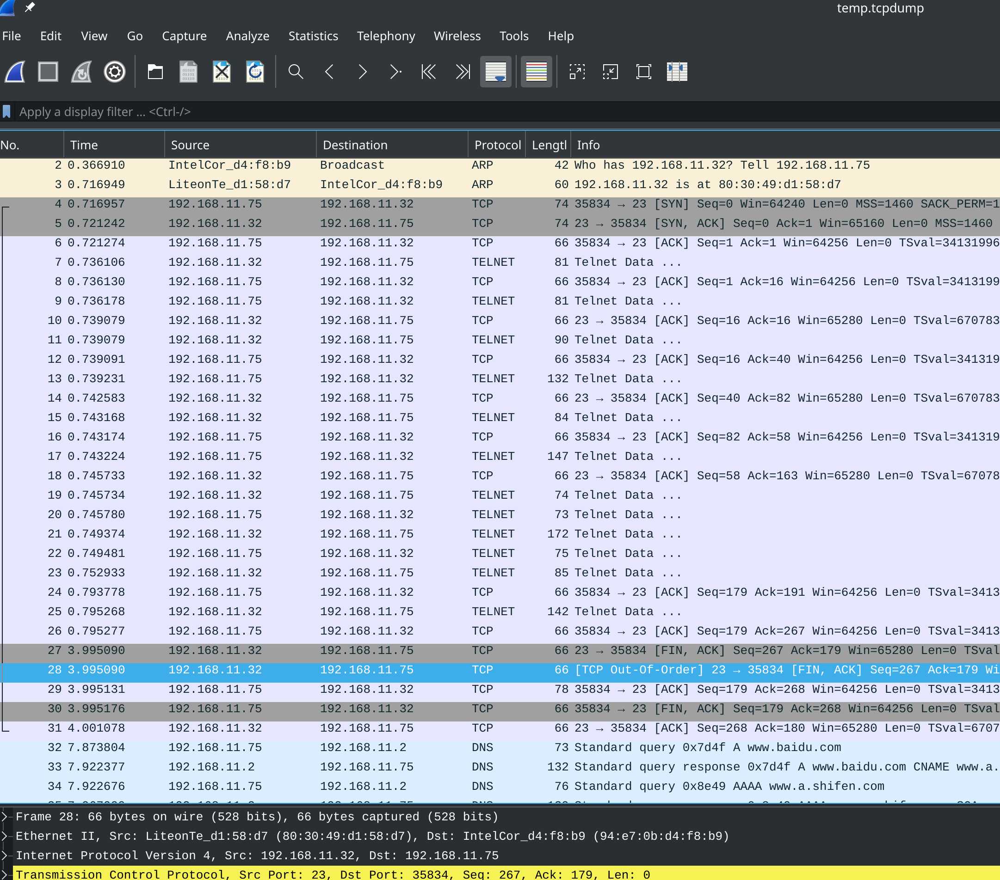
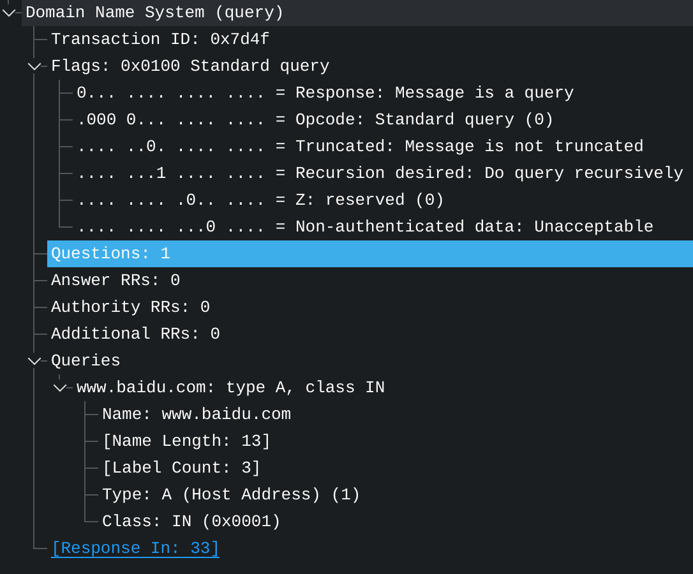
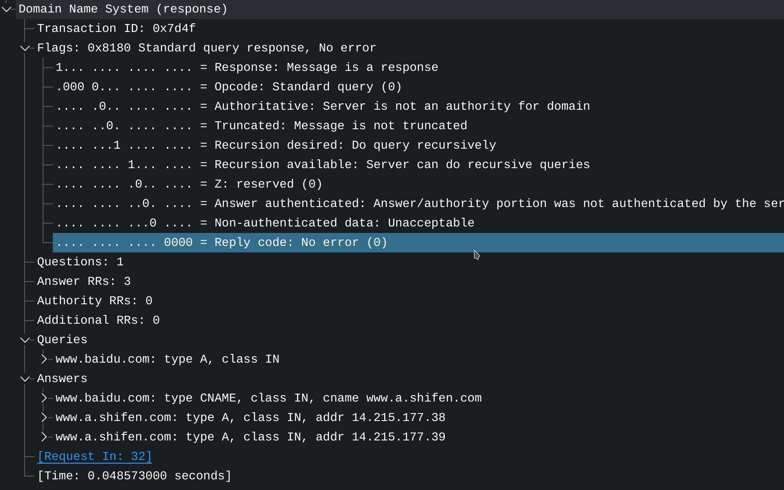

# [高性能服务器读书笔记 1](2021/07/linux_high_performance_server_programming_1.md)

## 读书足迹

- 2021/07/28: 021-039
- 2021/07/29: 040-046
- 2021/07/30: 047-169
- 2021/07/31: 170-181
- 2021/08/01: 182-

## TCP/IP 四层模型和 OSI 七层模型

OSI: physics, data_link, network, transports, session, present, application

TCP/IP:
- network_access(osi_physics+osi_data_link): ARP, RARP
- internet(osi_network): ICMP, IP
- transports(osi_transports): TCP, UDP, SCTP
- application(osi_session+osi_present+osi_application): ping, telnet, RTMP

从应用层往上就是「用户态/用户空间」，也就 socket

TCP/IP 数据链路/网络接口层 实现了 网卡驱动，网卡驱动为上层协议提供了统一的接口

### network_access 层 ARP 作用

ARP 协议作用是 IP 地址和设备 MAC 地址(物理地址) 的互相转换

ARP 非常重要，上层协议虽然通过 IP 寻找对方主机，但最终也是要经过 ARP 才能对方主机的 物理地址/MAC 地址

RARP(Reverse Address Resolve Protocol) 则比较少用仅用于无盘设备，是用来解决无存储的联网设备，例如主板可以选择 boot from the internet

这些设备没有硬盘没法存储记住自己的 IP 地址，需要通过网卡上的 MAC 地址查询自身的 IP 地址

### internet 层

#### WAN/LAN

TCP/IP 的网络层实现数据包的选路和转发

Wide Area Network 通常通过众多分级的路由器来连接分散的主机或 LAN(Local Area Network)

因此通信的两台主机不一定是直连的，而是通过多个中间节点/路由器进行连接

!> 网络层的任务就是选择这些中间节点来确定两台主机之间的通信路径

同时网络层对上层隐藏了网络拓扑连接的细节，因此在传输和应用层看来两台主机是"直连"的

#### IP next hop

根据数据包的目的地 IP 地址来决定如何投递它

如果不能直接发到目标主机，IP 协议就会为数据包寻找合适的下一跳路由器(next hop)，并交付给下一跳路由器转发

不断重复上述过程(hop by hop)直到发送成功或发送失败而「丢包」

#### ICMP

RFC 792, Internet Control Message Protocol，这是对 IP 协议的补充，主要用于检测网络连接

稍微介绍下 struct icmphdr 的 type 字段的几个可选值

type(message type) 大致可以分为两类:
1. 一类是差错报文，用来回应网络错误，例如 ICMP_DEST_UNREACH(目标不可到达) 和 ICMP_REDIRECT
2. 另一类则是查询报文，用来查询网络信息，例如 ICMP_ECHO

netinet/ip_icmp.h:
- #define ICMP_DEST_UNREACH	3	/* Destination Unreachable	*/
- #define ICMP_REDIRECT		5	/* Redirect (change route)	*/
- #define ICMP_ECHO		8	/* Echo Request			*/

严格来说 ICMP 并非网络层协议，因为 ICMP 依赖同层的 IP，而一般的网络协议都是上层协议依赖下层协议

##### icmphdr.checksum - CRC

CRC = Cyclic Redundancy Check 循环冗余检查来检测报文传输过程中有没有损坏

### transports 层

为应用层封装了一条端到端的逻辑链路，负责数据的收发和链路的超时重传

#### TCP

基于 stream，可靠性体现在通过超时重传、数据确认等方式确保数据包能正确地发送到目的地

TCP 双方必须先三次握手建立连接，并在 kernel 中为该连接维持一些必要的数据结构: 例如连接状态，读写缓冲区，诸多定时器

TCP 通信结束时双方必须四次挥手断开连接 以释放 TCP 连接占用的内核资源

TCP 基于 stream 意味着流数据没有边界/长度限制

#### UDP

UDP 数据包每次发送都要指明接收端地址，如果数据在中途丢失或接收端发现数据错误而丢弃，UDP 只是简单的通知发送端发送失败

接收端必须根据 UDP 包中数据长度一次性将 UDP 数据包读完否则数据将被截断

因此需要应用程序自己处理数据确认、超时重传等逻辑

### application 层

#### OSPF

OSPF(Open Shortest Path First): 开放最短路径优先

一种用于路由更新协议(找最短路径?)，双方路由器互相告诉各自的路由信息

---

## TCP segment

Reference: [TCP 的那些事](https://coolshell.cn/articles/11564.html)

OSI Data Link 层往上的数据叫 frame，network 层的数据叫 package，transpor 层往上的数据叫 segment

用户态应用数据会先打到 TCP segment 再打到 IP Packet 再打到 Ethernet frame

TCP 层的包是没有 IP 地址，只有发送端端口和接收端端口的信息

上层协议通过封装来使用下层协议的信息(在下层协议数据包的基础上加上当前层协议的一些信息)

数据包封装简介:
- 应用层: 应用程序数据
- 传输层(segment): TCP 头部 + 应用程序数据
- 网络层(packet): IP 头部 + (TCP 头部 + 应用程序数据)
- 网卡层(frame)  : Ethernet 头部 + IP 头部 + TCP 头部 + 应用程序数据 + Ethernet 尾部

当发送端应用程序调用 send 或 write 系统调用往 TCP socket 写数据时

内核中的 TCP 模块会先把数据复制到与该连接对应的内核发送缓冲区中，

然后 TCP 模块调用(传递 TCP 头部和发送缓冲区的数据) IP 模块提供的服务

与 TCP 不同的是 UDP 不会将发送的数据在内核中存一份副本，无论发送成功或失败内核缓冲区的发送数据都会丢弃

## ethernet frame

数据链路层主要用 ethernet frame，除了 ethernet 还有 token ring frame

用 ifconfig 或 ip 或 getifaddrs()系统调用 或 `cat /proc/net/dev` 可以查看 WiFi 网卡设备的 mac 地址，例如 `wlp4s0 ... ether 94:e7:0b:d4:f8:b9`

ethernet frame:
- dest_mac_addr: 6 bytes
- src_mac_addr: 6 bytes
- type: 2 bytes: eg. 0x0800 is IP, 0x0806 is ARP
- data: 46~1500(MTU) bytes
- CRC: 4 bytes

如果要发送的数据(data 部分)超过 MTU，则可能需要分片(fragment)传输

CRC 4 bytes 为帧的其它部分进行「循环冗余校验」

同样的，IP packet 也有 2 byte 用来区分 TCP, UDP

TCP/UDP 也有 2 byte 用来区分端口号

### ip link 或 ifconfig 查看 MTU

MTU(Max Transmit Unit) 在以太网是 1500，以下是我台式机( WiFi 主板 )通过 ip link 命令查看网络设备信息

```
[w@ww ~]$ ip link
1: lo: <LOOPBACK,UP,LOWER_UP> mtu 65536 qdisc noqueue state UNKNOWN mode DEFAULT group default qlen 1000
    link/loopback 00:00:00:00:00:00 brd 00:00:00:00:00:00
2: enp5s0: <NO-CARRIER,BROADCAST,MULTICAST,UP> mtu 1500 qdisc fq_codel state DOWN mode DEFAULT group default qlen 1000
    link/ether f0:2f:74:da:2a:1d brd ff:ff:ff:ff:ff:ff
3: wlp4s0: <BROADCAST,MULTICAST,UP,LOWER_UP> mtu 1500 qdisc noqueue state UP mode DORMANT group default qlen 1000
    link/ether 94:e7:0b:d4:f8:b9 brd ff:ff:ff:ff:ff:ff
```

如果是笔记本就只有 lo 和 wlp4s0 两个设备

#### loopback device

Linux 系统必有一个 lookback 网卡设备，这是一个虚拟的特殊设备

让计算机查看自身网络连接状况的设备，例如网线拔掉了就能借助 loopback device 去发现网线已被拔掉

lo device 还有一个作用是 `ping 127.0.0.1` 时走的是 lo 设备而非其它设备

### demultiplexing(分用)

各层协议依次处理本层负责的头部数据，最终将数据帧交给应用程序的过程

---

## ARP

主机向所在网络「广播」一个 ARP 请求，只有被请求的目标机器才会应答

ARP 数据包报文组成:

- Ethernet header(14 bytes) == src_mac_addr + dest_mac_addr + type(IP/ARP)
- 硬件类型(2 bytes): 表示物理地址的类型，一般是 1 表示 MAC 地址
- 协议类型(2 bytes): 一般是 0x800 表示 IP 地址
- 硬件地址长度(1 byte): 对于 MAC 地址而言是 6 
- 协议地址长度(1 byte)
- 操作(2 bytes): arp_request=1, arp_response=2
- 发送端 MAC 地址
- 发送端 IP
- 接收端 MAC 地址
- 接收端 IP
- Ethernet footer(4 bytes) == CRC

`arp -a` 可以查看 arp 高速缓存的瞬时数值

## 「实验_1」tcpdump 观察 arp 数据包

我方 IP 是 192.168.11.75，对方 IP 是 192.168.11.32，路由器 IP 是 192.168.11.2

1. arp -a 确认当前 arp 高速缓存没有目标机器的 IP

当 arp 缓存没有对方 IP 信息时，建立 TCP 连接前会「给对方发一个 ARP 请求」

如果之前 arp 缓存中已经有对方机器的 IP 则建立 TCP 连接前不会向对方发 ARP 请求而是从缓存中获取对方物理地址

请用 arp --delete 删掉以继续实验: `sudo arp --delete w-manjaro`

```
[w@ww Downloads]$ arp -a
? (172.17.0.3) at 02:42:ac:11:00:03 [ether] on docker0
? (172.17.0.2) at 02:42:ac:11:00:02 [ether] on docker0
w-manjaro (192.168.11.32) at 80:30:49:d1:58:d7 [ether] on wlp4s0
RT-AC86U-46E0 (192.168.11.2) at d4:5d:64:0b:46:e0 [ether] on wlp4s0
[w@ww Downloads]$ sudo arp --delete 192.168.11.32
[w@ww Downloads]$ arp -a
? (172.17.0.3) at 02:42:ac:11:00:03 [ether] on docker0
? (172.17.0.2) at 02:42:ac:11:00:02 [ether] on docker0
RT-AC86U-46E0 (192.168.11.2) at d4:5d:64:0b:46:e0 [ether] on wlp4s0
```

2. 对方机器开启 telnetd 服务器方便建立 TCP 连接

> sudo systemctl start telnet.socket

通过 /etc/services 得知 telnetl 服务器的 TCP 端口是 23

3. tcpdump capture network data

```
[w@ww ~]$ sudo tcpdump -v host 192.168.11.32
tcpdump: listening on wlp4s0, link-type EN10MB (Ethernet), snapshot length 262144 bytes

09:33:03.705817 ARP, Ethernet (len 6), IPv4 (len 4), Request who-has w-manjaro tell ww, length 28
09:33:04.120607 ARP, Ethernet (len 6), IPv4 (len 4), Reply w-manjaro is-at 80:30:49:d1:58:d7 (oui Unknown), length 46
```

§ tcpdump -X 参数查看每个数据包每个 byte 的数据

sudo tcpdump -v -X -c 10 host 192.168.11.32

- -X 参数查看数据包详细每个 byte 的数据
- -v 参数表示 verbose
- -c 参数表示只 capture 10 个数据包
- host 参数表示只限定捕获跟 192.168.11.32 通信的数据包

ARP request 长度是 28 bytes，但是 response 长度 46 说明 ARP 数据包可以在必要的 28 bytes 数据后多携带一些自定义数据(在我这个例子上全是 0 用来填充)

注意 ARP 两个数据包第二行的 2~4 列是 ARP 数据包的目的地 MAC 地址

!> 发送的时候目的地 MAC 地址是 0 或 ff:ff:ff:ff:ff:ff 这是「以太网的广播地址」，会广播到网段上所有设备

这个 ARP 广播请求的过程，就像大学上课时老师吼一嗓子点名，ARP 请求问张三是谁，张三看自己工牌是张三就喊到!

```
[w@ww ~]$ sudo tcpdump -v -X -c 10 host 192.168.11.32
tcpdump: listening on wlp4s0, link-type EN10MB (Ethernet), snapshot length 262144 bytes
17:47:14.961212 ARP, Ethernet (len 6), IPv4 (len 4), Request who-has w-manjaro tell ww, length 28
        0x0000:  0001 0800 0604 0001 94e7 0bd4 f8b9 c0a8  ................
        0x0010:  0b4b 0000 0000 0000 c0a8 0b20            .K..........
17:47:15.009992 ARP, Ethernet (len 6), IPv4 (len 4), Reply w-manjaro is-at 80:30:49:d1:58:d7 (oui Unknown), length 46
        0x0000:  0001 0800 0604 0002 8030 49d1 58d7 c0a8  .........0I.X...
        0x0010:  0b20 94e7 0bd4 f8b9 c0a8 0b4b 0000 0000  ...........K....
        0x0020:  0000 0000 0000 0000 0000 0000 0000       ..............
17:47:15.009998 IP (tos 0x0, ttl 64, id 7992, offset 0, flags [DF], proto TCP (6), length 60)
    ww.35830 > w-manjaro.telnet: Flags [S], cksum 0x97ea (incorrect -> 0xe913), seq 3361835326, win 64240, options [mss 1460,sackOK,TS val 340253258 ecr 0,nop,wscale 7], length 0
        0x0000:  4500 003c 1f38 4000 4006 83c8 c0a8 0b4b  E..<.8@.@......K
        0x0010:  c0a8 0b20 8bf6 0017 c861 893e 0000 0000  .........a.>....
        0x0020:  a002 faf0 97ea 0000 0204 05b4 0402 080a  ................
        0x0030:  1447 da4a 0000 0000 0103 0307            .G.J........
17:47:15.013448 IP (tos 0x0, ttl 64, id 0, offset 0, flags [DF], proto TCP (6), length 60)
    w-manjaro.telnet > ww.35830: Flags [S.], cksum 0x5990 (correct), seq 808395009, ack 3361835327, win 65160, options [mss 1460,sackOK,TS val 669717183 ecr 340253258,nop,wscale 7], length 0
        0x0000:  4500 003c 0000 4000 4006 a300 c0a8 0b20  E..<..@.@.......
        0x0010:  c0a8 0b4b 0017 8bf6 302f 2101 c861 893f  ...K....0/!..a.?
        0x0020:  a012 fe88 5990 0000 0204 05b4 0402 080a  ....Y...........
        0x0030:  27eb 12bf 1447 da4a 0103 0307            '....G.J....
17:47:15.013468 IP (tos 0x0, ttl 64, id 7993, offset 0, flags [DF], proto TCP (6), length 52)
    ww.35830 > w-manjaro.telnet: Flags [.], cksum 0x97e2 (incorrect -> 0x84bb), ack 1, win 502, options [nop,nop,TS val 340253310 ecr 669717183], length 0
        0x0000:  4500 0034 1f39 4000 4006 83cf c0a8 0b4b  E..4.9@.@......K
        0x0010:  c0a8 0b20 8bf6 0017 c861 893f 302f 2102  .........a.?0/!.
        0x0020:  8010 01f6 97e2 0000 0101 080a 1447 da7e  .............G.~
        0x0030:  27eb 12bf      
```

tcpdump 还能加上 -w $output_filename 参数将抓包数据导出成文件再用 wireshark 等图形界面工具分析

> sudo tcpdump -v -X -c 40 -w temp.tcpdump host 192.168.11.32 or host 192.168.11.2



---

## DNS

DNS 消息数据包的定义在 [RFC 1035](https://www.ietf.org/rfc/rfc1035.txt) 的章节 4. MESSAGES

### flags: u16, 用来标记一对 DNS request/response

flags 部分包含:
- OR: 1 bit, 0 is request, 1 is response
- opcode: 4 bit, 定义查询和应答类型，0 表示标准查询，1 表示反向查询「通过 IP 地址获取 hostname」，2 表示请求服务器状态
- AA: 1 bit, 授权应答标志
- TC: 1 bit truncate flag, 仅当 DNS 用 UDP 通信时使用，因为 UDP 有长度 512 限制
- RD: 递归查询标志，例如路由器自身的 DNS 服务无法知道百度的 IP 则向客户端返回路由器知道的其它 DNS 服务器
- RA: 仅用于 response，表示 DNS 服务端支持递归查询
- zero: 3 bit for padding,
- rcode: 4 bit, 常用 0 表示无错误和 3 域名不存在

flags 部分后面的四个字段:
- questions: 一般是 1 表示一次查询/回复一个域名
- answer RRs(应答资源记录数): request is 0, response usually >= 2
- Authority RR(resource records)s: 0
- Additional RRs: 0

### type of queries
- A(1): get IP by hostname
- CNAME(5): get alias hostname by hostname
- PTR(12): reverse query, get hostname by IP

### DNS cache and TTL

32 bit time to live 表示查询记录可以被客户端缓存多久(缓存有效期)

### /etc/resolv.conf

看 host/nslookup 命令的 man 文档都会提到相关的系统文件，在 man 文档的 FILE 章节

`/etc/resolv.conf` 存放了设备当前的 DNS 服务器，一般就是路由器的 IP 地址

## 「实验_2」wireshark 观察 DNS 数据包

在用 tcpdump 抓包 DNS 时，可以加上 `port domain` 等同于 `port 53` 也就是只抓 DNS 的数据包

> dns query/request example



> dns response example



```
18:18:13.082128 IP ww.45735 > RT-AC86U-ADF8.domain: 15145+ A? www.baidu.com. (31)
18:18:13.087184 IP RT-AC86U-ADF8.domain > ww.45735: 15145 3/0/0 CNAME www.a.shifen.com., A 14.215.177.39, A 14.215.177.38 (93)
```

请求中 `15145+ A?` 表示 flags_u16 是 15145，+ 表示递归 DNS 查询(如果路由器查不到就递归去另一个 DNS 服务器查)，`A?` 表示 A 类查询

应答中 `3/0/0 CNAME www.a.shifen.com., A 14.215.177.39` 3/0/0表示 answer RPs 是三个

其中第一个 `CNAME www.a.shifen.com` 表示百度域名的别名是 `www.a.shifen.com`，`A 14.215.177.39` 表示百度域名其中一个 IP 地址

tcpdump 抓包中 DNS 请求末尾的 (31) 和应答末尾的 (93) 表示数据包长度，因为 DNS 数据包的域名是变长 variant 的，所以 DNS 数据包长度不一样很正常
