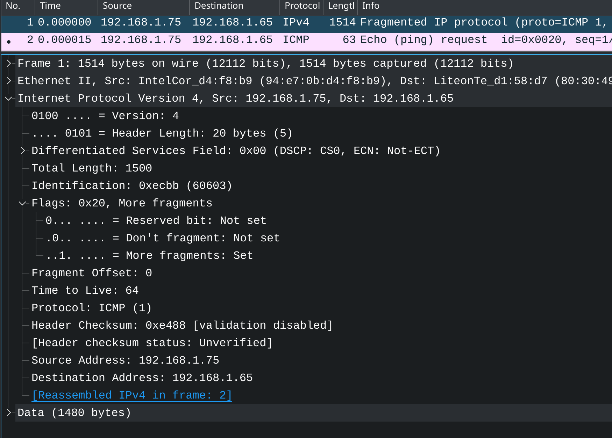
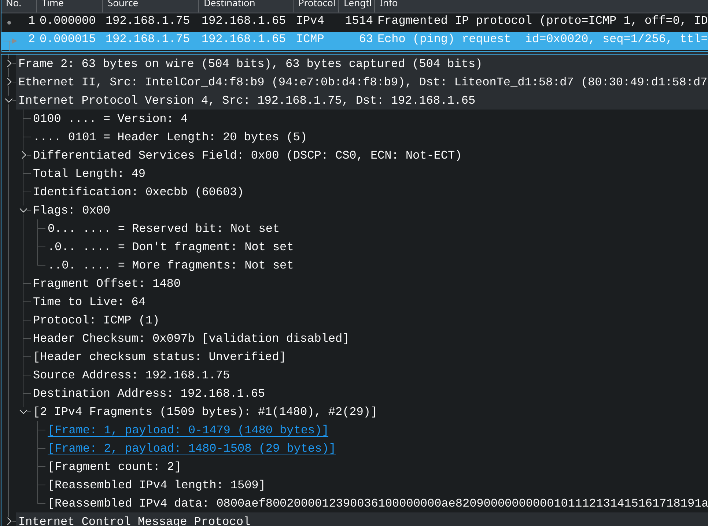

# [高性能服务器读书笔记 2](2021/07/linux_high_performance_server_programming_2.md)

## IP 协议简介

- IP 头部信息，src, dest, 指导 IP 分片和重组以及指定通信行为
- IP 数据包的路由和转发
- 无状态/无上下文: 无法处理乱序或重复的数据包

如果超时或 checksum 没通过则接收端会返回一个 ICMP 差错报文给发送端

### 何为乱序

例如第 N+1 个数据包到达后，第 N 个数据包还没到达

## IPv4 Header

- version : 4_bit, 4 or 6(IPv6)
- header_length: 4_bit, len's unit is u32, max is 15 * 4 = 60 bytes
- type_of_service/differentiated_services: 8_bit: 最小延时，最大吞吐量，最高可靠性和最小费用等设置，FTP 需要最大吞吐，SSH 需要最小延时
- total_length: u16, 由于 MTU 限制长度超过 MTU 需要分片传输
- ID: 数据包序号，初始值系统随机生成，每发一个数据包就+1 「同一个数据包所有分片都具有相同 ID」
- flags: DF==don't fragment; more_fragment 用于分片，同一个数据包除了最后一个分片的 more_fragment 是 0，其余分片都是 1
- fragment_offset: 可以暂时简单理解成 fragment 索引，类似数组下标
- TTL: 数据包到达接收端前「允许的最大路由跳(hop)数」，通常是 64，「用来避免路由拓扑图中有环，数据包陷入死循环」
- protocl: 可选值在 /etc/protocols，似乎是 socket 系统调用的一个参数
- header_checksum: u16, 使用 CRC 算法检测 IP 头部数据是否损坏
- src_ipv4: u32
- dest_ipv4: u32
- option: 变长可选字段，用于 记录路由(traceroute)、记时间戳等等功能

但是现在的 traceroute 命令用的是 UDP+ICMP 实现了更可靠的 路由记录，并没有完全用 IP 数据包的 option 字段

### IP 数据包分片

例如 ICMP 数据包长度 1501，则第二个分片中不会包含 ICMP 的头部信息，因为 内核 IP 模块重组分片时只需要一份 ICMP 头部信息

> sudo tcpdump -i lo -c 10 -w temp/tcpdump_icmp_1 icmp

由于 ping 127.0.0.1 会通过 lo 设备发数据包，但注意 lo 设备的 MTU 是 65536，所以 ping 127.0.0.1 -s 1501 看不出分片传输

## 「实验_3」观察 ping 数据包分段

1. sudo tcpdump icmp -c 6 -w temp/tcpdump_icmp_2

2. ping -s 1501 192.168.1.65

-s 参数表示设置 ping 数据包长度，设置成 1501 则一定会比 WiFi 的 MTU 长

### 实验记录

做完实验后，通过 fragment 2 的截图很好的理解了 fragment_offset 字段的含义

