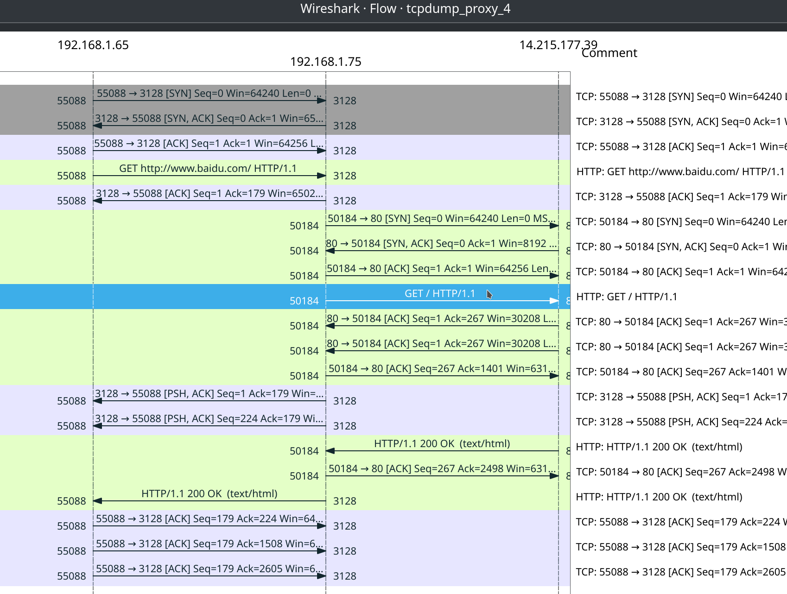
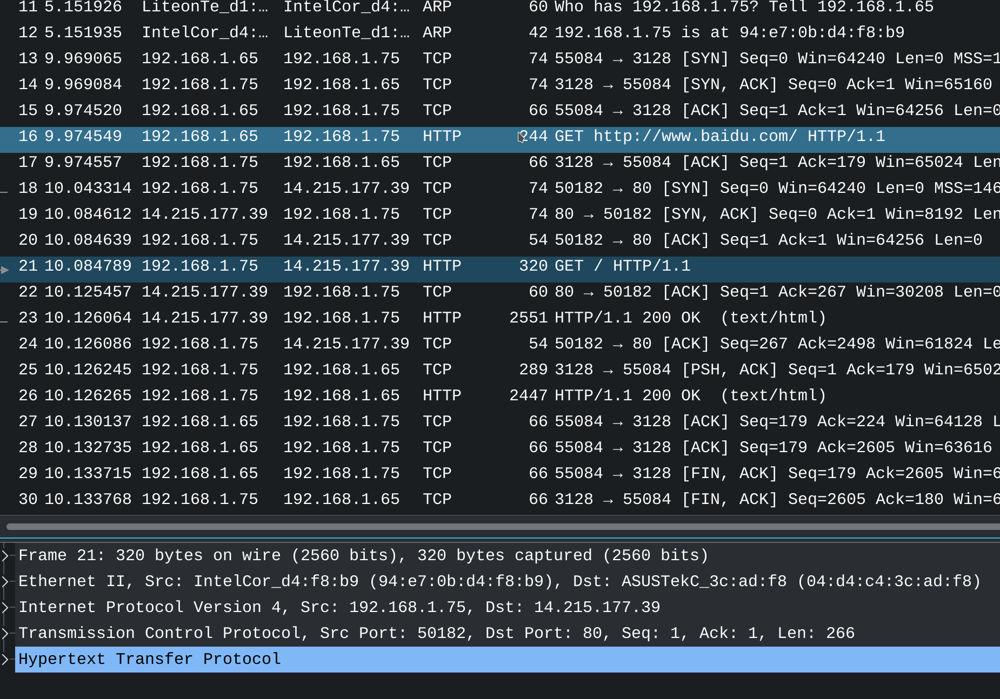

# [高性能服务器读书笔记 3](2021/07/linux_high_performance_server_programming_3.md)

## 正向代理/反向代理/透明代理

- 正向代理: request google.com <-> shadowsocks_client(1080) <-> proxy_server <-> google.com
- 反向代理: 客户端无需设置，服务端 nginx 把请求转发给相应处理的服务去处理
- 透明代理: 只能设置在网关/路由器上

## 「实验_4」squid 代理服务器

tcpdump 记录方和 squid 代理服务器都在 192.168.1.75

§ 1. \[192.168.1.75]$ sudo systemctl start squid

§ 2. fuser 查看 squid 代理服务器端口 3128 的占用情况

```
[192.168.1.75]$ sudo fuser 3128/tcp
3128/tcp:            10176
```

§ 3. \[192.168.1.65]$ http_proxy=192.168.1.75:3128 wget www.baidu.com

wget 可以加上 `--header="Connection:close"` header 参数告诉服务器处理完 HTTP 请求后主动关闭 TCP 连接

!> 默认的 Connection header 是 keep-alive 也就是请求处理完不会关闭 TCP 连接

### 实验记录





#### 代理前后 HTTP 请求的 header 变化

代理前有 Proxy-Connection 代理后去掉了

代理后新增 header:
- Via: 1.1 ww(squid/4.16)
- X-Forwarded-For: 192.168.1.65

## cookie

HTTP 由于无状态，需要借助 Cookie (客户端往后的每一次请求都带上 Cookie) 实现状态上下文

让服务端区分具体是哪一个客户端，实现自动登陆等效果
