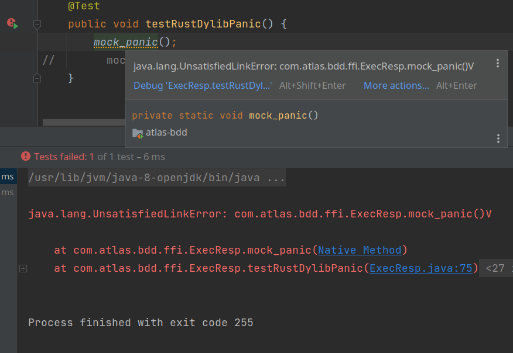
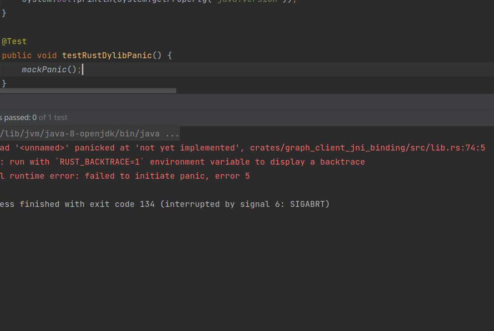
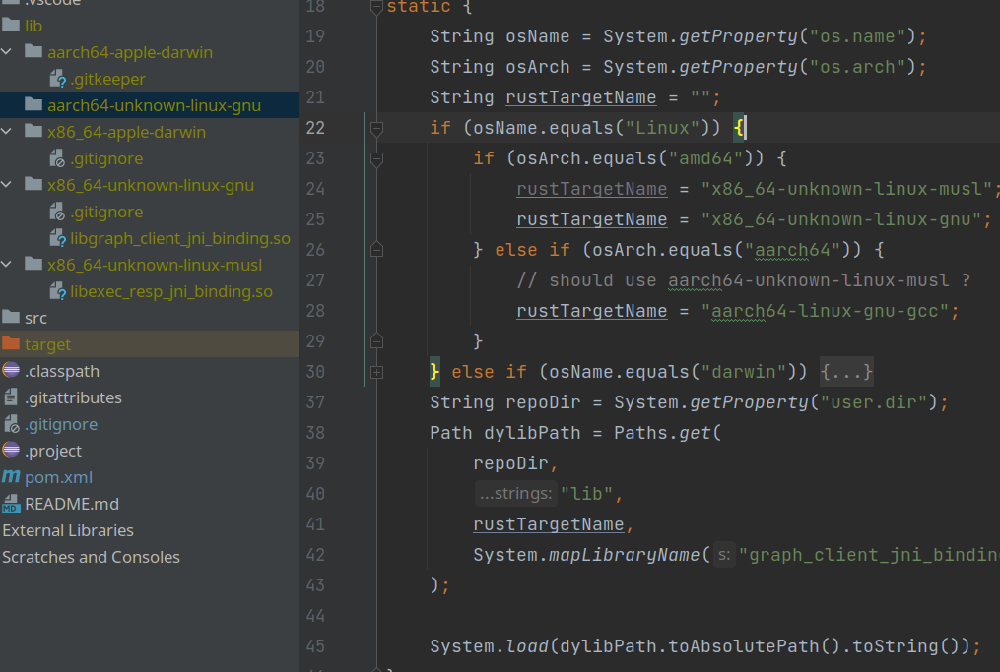
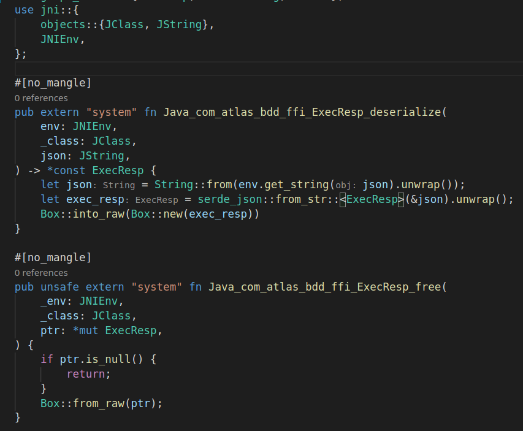

# [Java JNI 学习笔记](/2022/01/jni.md)

## Rust 必须用【驼峰命名】函数

否则报错 java.lang.UnsatisfiedLinkError



## panic 时 Java 会 SIGABRT 异常退出



## 若要同时支持 x86 和 ARM, Rust 要额外编译一个 so

让 Java 根据 getProperty("os.arch") 去加载不同路径的 so 文件

```java
private static native void mockPanic();

static {
    String osName = System.getProperty("os.name");
    String osArch = System.getProperty("os.arch");
    String rustTargetName = "";
    if (osName.equals("Linux")) {
        if (osArch.equals("amd64")) {
            rustTargetName = "x86_64-unknown-linux-musl";
            rustTargetName = "x86_64-unknown-linux-gnu";
        } else if (osArch.equals("aarch64")) {
            // should use aarch64-unknown-linux-musl ?
            rustTargetName = "aarch64-linux-gnu-gcc";
        }
    } else if (osName.equals("darwin")) {
        if (osArch.equals("amd64")) {
            rustTargetName = "x86_64-apple-darwin";
        } else if (osArch.equals("aarch64")) {
            rustTargetName = "aarch64-apple-darwin";
        }
    }
    String repoDir = System.getProperty("user.dir");
    Path dylibPath = Paths.get(
        repoDir,
        "lib",
        rustTargetName,
        System.mapLibraryName("graph_client_jni_binding")
    );

    System.load(dylibPath.toAbsolutePath().toString());
}
```



```
lib/
├── aarch64-apple-darwin
├── aarch64-unknown-linux-gnu
├── x86_64-apple-darwin
├── x86_64-unknown-linux-gnu
│   └── libgraph_client_jni_binding.so
└── x86_64-unknown-linux-musl
    └── libexec_resp_jni_binding.so
```

### 编译 x86 musl cdylib

> RUSTFLAGS="-C target-feature=-crt-static" cargo b --target x86_64-unknown-linux-musl

### 编译 ARM cdylib

sudo pacman -S aarch64-linux-gnu-gcc

> CARGO_TARGET_AARCH64_UNKNOWN_LINUX_GNU_LINKER=aarch64-linux-gnu-gcc cargo b --target aarch64-unknown-linux-gnu

理论上 ARM 用 musl 好点，避免高版本 glibc 编译出来低版本系统用不了

ARM 的 musl 的包在 aur 本人也没有精力有限就没有去试

## 不透明指针用 long

Java 用 long 映射 Rust 的 *mut T 或者 *const T

记得 Java 这边要让 Rust 去析构，可用 RAII design pattern try-with-resource 去实现


