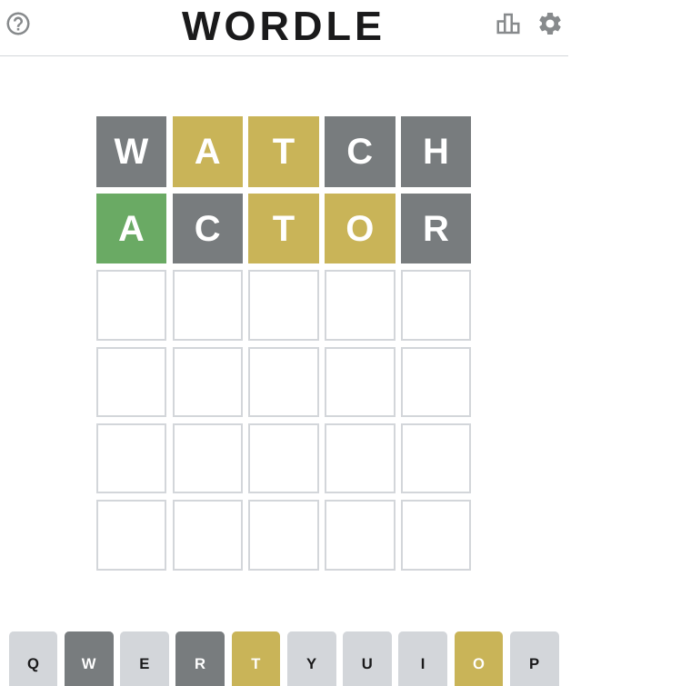

# [wordle](2022/02/wordle.md)

recently I read a lot wordle on my twitter

wordle is a word game to test your vocabulary on english, japaneses...

everyday a guess a new 5 letters word ~~with unique letters~~, you has 6 times to try

wordle start with type a random word then click enter

---

## start with random word



I type random word `watch`, 
and `a` and `t` is yellow color means the answer contains `a` and `t`

Then I guess `actor`, `a` is green color means the 1st letter of answer is `a`

so I try to find a word start with `a` and contains one `t` and one `o`

---

## 3th guess

```rust
#[test]
fn _3th_guess() {
    let start = std::time::Instant::now();
    'out: for line_str in std::fs::read_to_string("/usr/share/dict/words").unwrap().lines() {
        if line_str.len() != 5 {
            continue;
        }
        let line = line_str.as_bytes();
        if line[0] != b'a' {
            continue;
        }
        for contains in [b't', b'o'] {
            if line.iter().filter(|x| **x == contains).count() != 1 {
                continue 'out;
            }
        }
        dbg!(line_str);
    }
    dbg!(start.elapsed());
}
```

guess: abort

answer: a,o,t is correct position, answer not contains b and r

---

## 4th guess

```rust
#[test]
fn _4th_guess() {
    let start = std::time::Instant::now();
    'out: for line_str in std::fs::read_to_string("/usr/share/dict/words").unwrap().lines() {
        if line_str.len() != 5 {
            continue;
        }
        let line = line_str.as_bytes();
        if line[0] != b'a' {
            continue;
        }
        if line[2] != b'o' {
            continue;
        }
        if line[4] != b't' {
            continue;
        }
        for contains in [b'w', b'c', b'h', b'r', b'b'] {
            if line.contains(&contains) {
                continue 'out;
            }
        }
        dbg!(line_str);
    }
    dbg!(start.elapsed());
}
```

```
[src/main.rs:47] line_str = "adopt"
[src/main.rs:47] line_str = "afoot"
[src/main.rs:47] line_str = "aloft"
[src/main.rs:47] line_str = "alout"
[src/main.rs:47] line_str = "apout"
[src/main.rs:47] line_str = "ayont"
```

4th guess: adopt

answer: not contains d and p

5th guess: afoot

answer: contains f

final the answer is aloft, oh my first wordle try success
