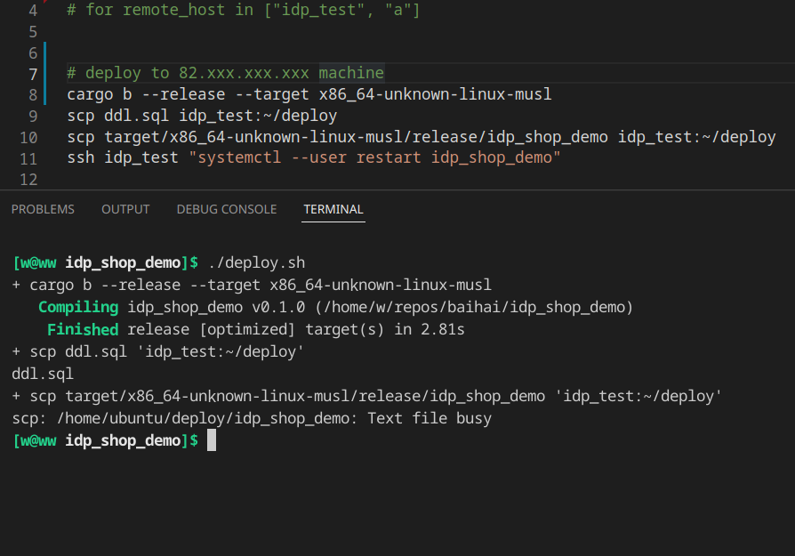

# [scp 报错 file busy](/2022/03/errno_26_text_file_busy.md)

我理解 systemd 服务运行后会把可执行文件加载到内存了，在本机可以更换运行中服务的可执行文件，然后 restart 下服务就完成更新部署

不太理解从远程访问(例如 scp)想要替换运行中服务的可执行文件就报错 errno ETXTBSY 26 Text file busy

导致我用 gitlab CI/CD 还得先 stop 远程运行中的服务才能 scp 再重启

https://twitter.com/ospopen/status/1504318339317112836
