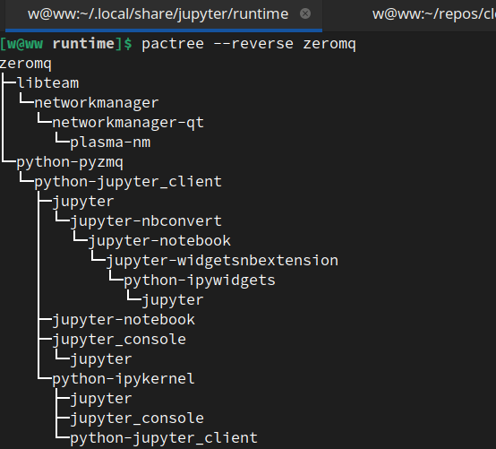

sddadadaadfddadddddaddddsadfasfsdfasdfsdaffdaf
# [pactree](/2022/03/pacman_pactree.md)

pactree --reverse 跟 cargo tree --invert 类似，不过想知道 yum/dnf/apt 这样的包管理有没有同样好用的工具



[我的 tweet](https://twitter.com/ospopen/status/1498620612398710787)

```
一直想过 Linux 包管理有没有像 cargo tree 那样可视化依赖树的工具(如图 2)，
或者有没有类似 rust-analyzer 的 ra_ap_project_model 和 cargo 这样的 API 分析依赖关系

今天才了解到 pactree 命令就可以可视化 Linux 包依赖树(如图 1)
```
