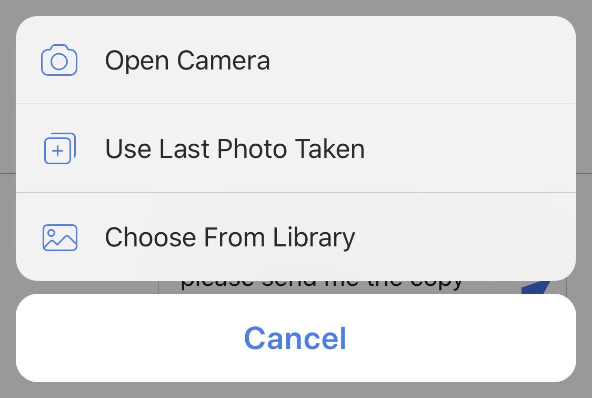
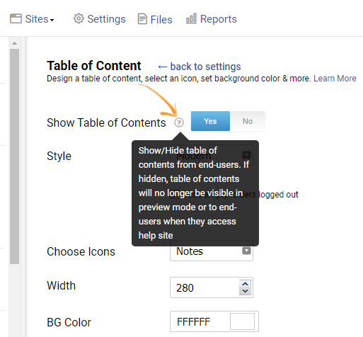
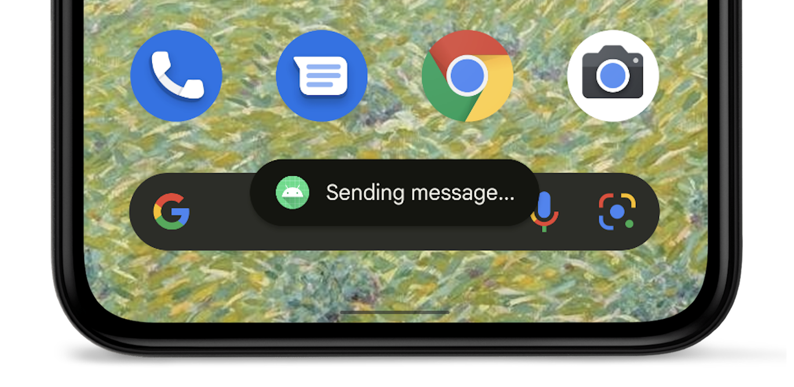

# [UI 组件术语](/2022/03/ui_widgets.md)

记录一些 UI 组件的图片以及对应的术语，方便跟产品经理沟通

## IOS action sheet

貌似安卓手机用 USB 连接电脑时的弹窗(选择连接方式 MTP/只充电/文件传输)也是 action sheet

## tooltip

就一个小圆圈 i 或者小圆圈问号，鼠标放上去(hover)之后就冒出黑底白字的提示

## toast

移动端底部的黑底白字的提示

## breadcrumb navigation

面包屑多级菜单导航栏就像选外卖地址 `中国 > 北京 > 朝阳区`，具体参考 ant desgin

## modal

ant-design 组件库中的弹窗

## alert

bootstrap 组件库的 banner 提示，例如登陆成功就提示

## message

alert 跟 message 很像区别在于 message 是弹窗，alert 是在父组件顶部展示横幅
