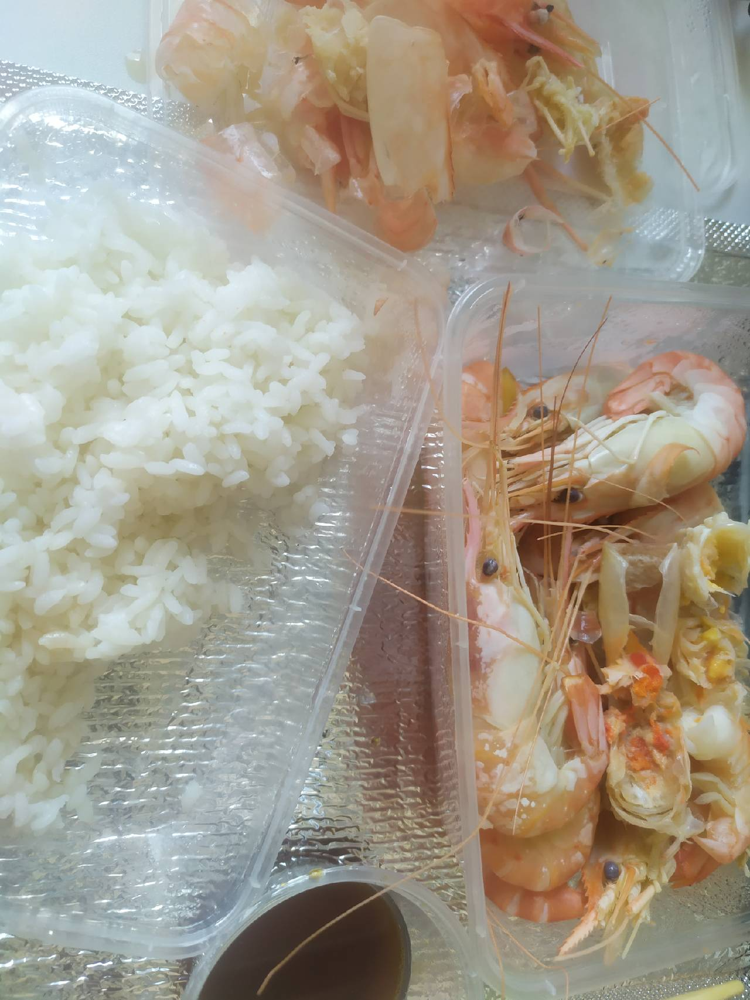
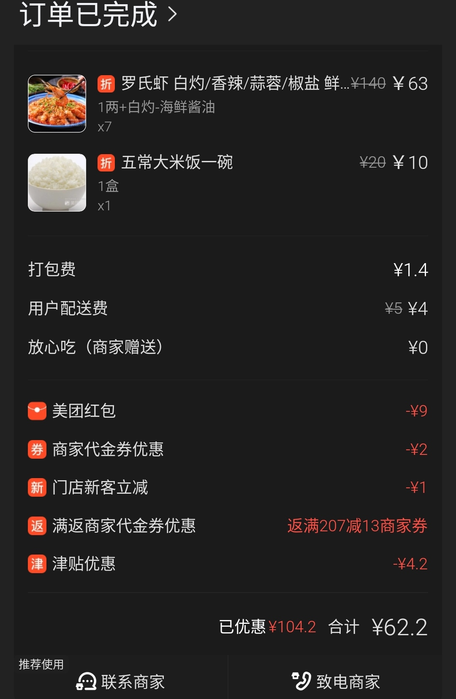

# [养生壶白灼虾](/2022/05/cook_shrimp_at_home.md)

---

最近在家办公两周多都是点外卖(多户合租做饭挺麻烦的)，
想着便宜的外卖可能是料理包，贵点的三十多一份虾仁炒蛋都少于四个虾仁

先尝试外卖的虾，消费六十光米饭都要十块，虾也不多就十来只，
还不如美团买菜买死虾自己煮(活虾太贵了要八十/斤)

考虑无限期居家不如就买 养生壶+电饭煲 足以做饭，煮虾煮面煮菜都行

---

我只不过客观评价了他家米饭太贵(二十一碗)虾性价比也不高，商家立马打电话求我删评价影响他店铺(所以评价就只能五星好评加微信返红包?)

自来水煮的米饭也卖二十，我用矿泉水淘米更好的米也没那么贵

养生壶就那种透明的烧水壶只不过功能多可以定时煮汤煮面都行

煮菜/虾蘸酱油就能吃了，厨具成本 300
