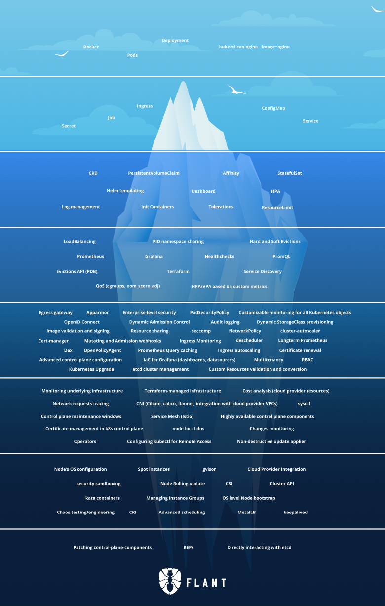

# [kubenetes iceberg](/2022/05/kubenetes_iceberg.md)

最近推特上看到这个 k8s 冰山理论的图，我想我目前对 k8s 的理解就只有第二层，就刚接触一点点 configmap 之类的

主要有个障碍是公司的应用给客户的私有 k8s 集群部署的时候都是通过公司固定那 1-2 个云原生工程师去干，
我这一直没法接触过深的 k8s 内容

感叹到要想学习 operator 等概念只能在自己的 minikube 上面去学习了
